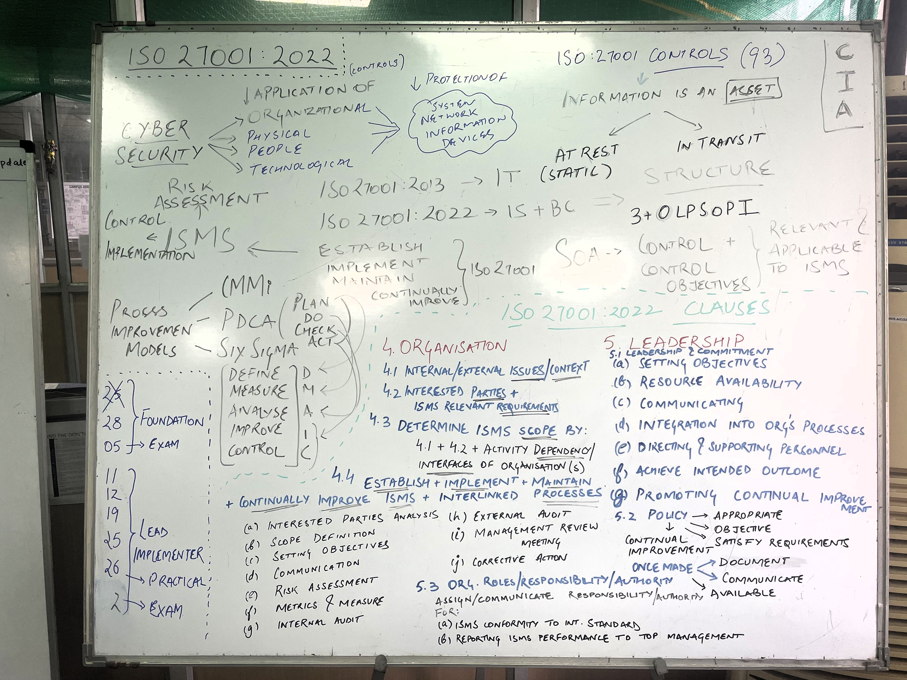
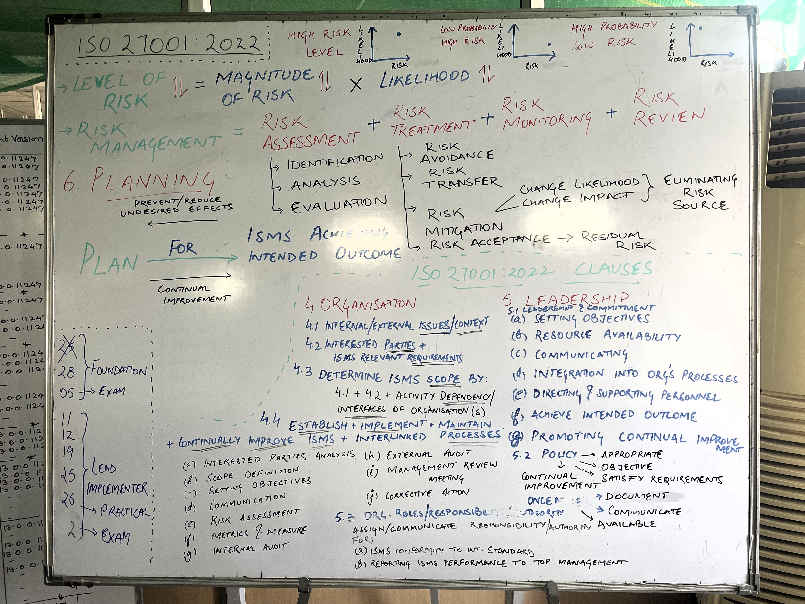
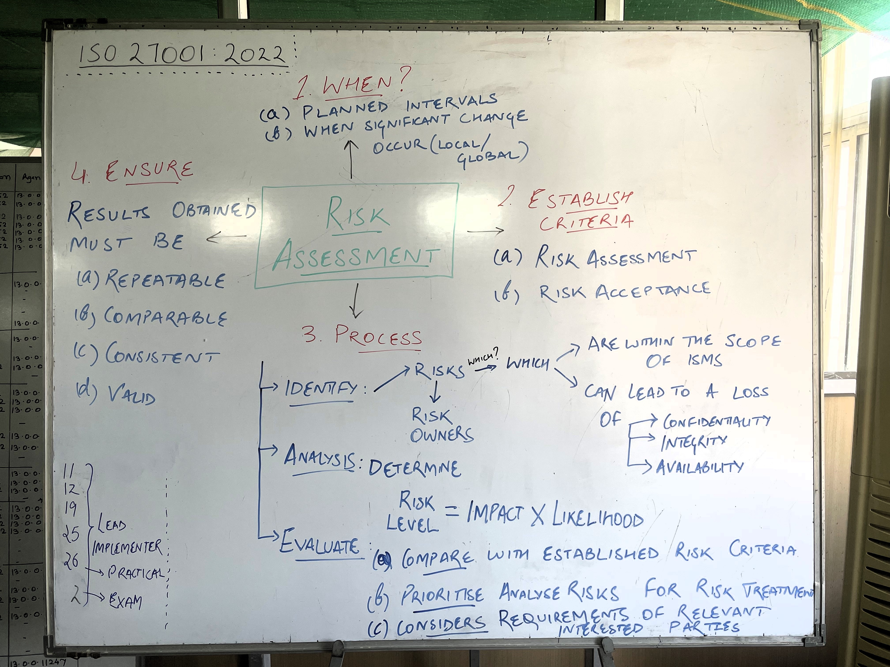
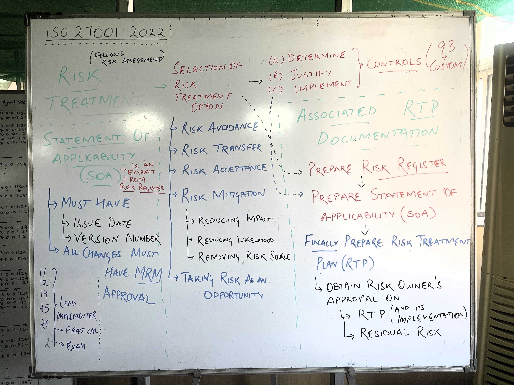
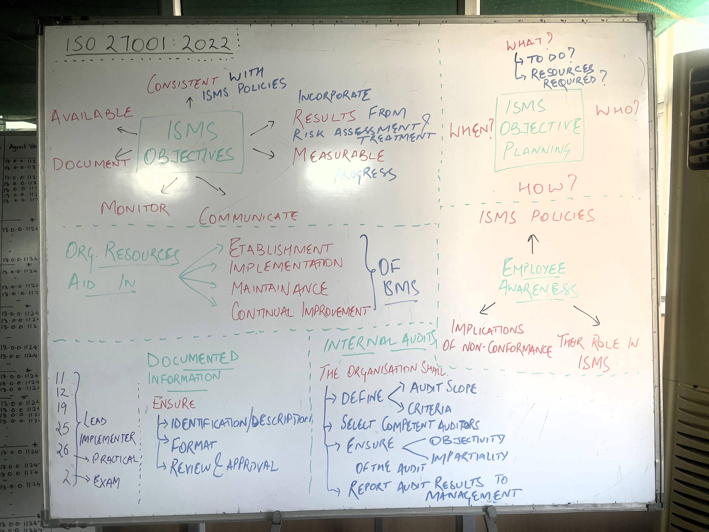
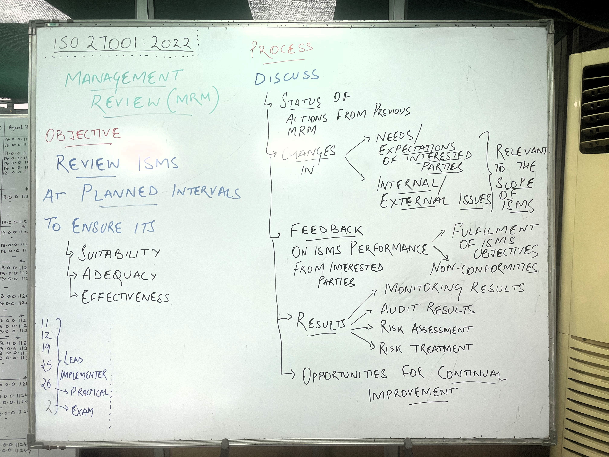

# ISO 27001:2022

- [Official Standard](ISO_IEC-27001.%202022%20-%20Official%20Standard.pdf)

## Certification Notes

- [Certification Notes](certificationNotes/ISO27001%202022_Certification%20Notes.pdf)

## PECB Guides

- Brochures
   - [Foundation](PECB/iso-iec-27001-foundation-en.pdf)
   - [Lead Implementer](PECB/iso-iec-27001-lead-implementer-en.pdf)
- Candidate Handbooks
   - [Foundation](PECB/PECB_Rules%20for%20Foundation%20Exam.pdf)
   - [Lead Implementer](PECB/pecb-candidate-handbook-iso-27001-lead-implementer.pdf)
- [Online Exam Guide](PECB/Preparing-for-your-PECB-Online-Exam-Guide.pdf)

## Official PECB Courseware

- [Corporate Profile](PECB/Official%20Courseware/01_PECB-Corporate-Profile.pdf)
- [Digital Experience Instructions](PECB/Official%20Courseware/Digital-Experience-Instructions-EN.PDF)
- Word Files
   - [Cover Page](PECB/Official%20Courseware/01a_27001-2022FD_Cover%20Page_V7.0.DOCX)
   - [Index](PECB/Official%20Courseware/01b_27001-2022FD_Index_V7.0.DOCX)
   - [Exercises - Worksheet](PECB/Official%20Courseware/02_27001-2022FD_Exercises%20Worksheet_V7.0.DOCX)
   - [Exercises - Correction Key](PECB/Official%20Courseware/02_27001-2022FD_Exercises%20Worksheet_V7.0.DOCX)
   - [Quizzes - Worksheet](PECB/Official%20Courseware/04_27001-2022FD_Quizzes%20Worksheet_V7.0.DOCX)
   - [Quizzes - Correction Key](PECB/Official%20Courseware/05_27001-2022FD_Quizzes%20Correction%20Key_V7.0.DOCX)
- Slides
   - [Day 01](PECB/Official%20Courseware/ISO-IEC%2027001-2022%20Foundation%20EN%20v.7.0%20-%20Day%201.pdf)
   - [Day 02](PECB/Official%20Courseware/ISO-IEC%2027001-2022%20Foundation%20EN%20v.7.0%20-%20Day%202.pdf)
- Video Tutorials (Lead Implementer ONLY)
  -  <a href="#S1">Section 1</a>
  -  <a href="#S2">Section 2</a>
  -  <a href="#S3">Section 3</a>
  -  <a href="#S4">Section 4</a>
  -  <a href="#S5">Section 5</a>
  -  <a href="#S6">Section 6</a>
  -  <a href="#S7">Section 7</a>
  -  <a href="#S8">Section 8</a>
  -  <a href="#S9">Section 9</a>
  -  <a href="#S10">Section 10</a>
  -  <a href="#S11">Section 11</a>
  -  <a href="#S12">Section 12</a>
  -  <a href="#S13">Section 13</a>
  -  <a href="#S14">Section 14</a>
  -  <a href="#S15">Section 15</a>
  -  <a href="#S16">Section 16</a>
  -  <a href="#S17">Section 17</a>
  -  <a href="#S18">Section 18</a>
  -  <a href="#S19">Section 19</a>
  -  <a href="#S20">Section 20</a>
  -  <a href="#S21">Section 21</a>
  -  <a href="#S22">Section 22</a>
  -  <a href="#S23">Section 23</a>
  -  <a href="#S24">Section 24</a>
  -  <a href="#S25">Section 25</a>
  -  <a href="#S26">Section 26</a>
  -  <a href="#S27">Section 27</a>

## Practice Tests

- Foundation Exam
   - [150 Q&A](practiceTests/ISO-27001-Foundation-Practice-Tests-150-Questions-And-Explanations-Based-On-The-ISO-27001-Foundation-Exam-Erik-Rorstrom.pdf)
   - [Mock Exam/ 10 Mins](practiceTests/mockExam10mins.pdf)
   - [LI QB]([practiceTests/mockExam10mins.pdf](https://www.actual4test.com/exam/ISO-IEC-27001-Lead-Implementer-questions#))

## Whiteboard Notes

## Question Bank - Foundation Exam - MCQ Type

### Question 1
*Anything that has value to the organization is known as?*

- a) CISO
- b) **Asset**
- c) Network
- d) Money

**Correct Answer:** b) Asset

*Explanation:* Anything that has value to the organization is considered an **asset**. Information is also considered an asset that drives business in today's networked environment.

Assets can include:
*   Software such as Windows and Oracle
*   Paper documents such as contracts and telephone lists
*   Supporting utilities such as VOIP, telephone, and backup power supply
*   Hardware such as servers, laptops, and PDAs
*   People such as HR managers and network engineers
*   Information such as voice messages

Utilities themselves do not carry information, but they support devices that do. Information can be static (e.g., stored on a hard disk) or being transmitted (e.g., via email). Whatever form the information takes, it must always be protected.

Access to assets should be authorized and restricted based on business and security requirements. An inventory of assets, including their owners, should be developed and maintained. The term ‘owner’ refers to the individual or entity with management responsibility for controlling the asset's security, use, development, and maintenance. The owner approves the risk level and the controls selected for protecting that asset.

---

### Question 2
*Property of being accessible and usable on demand by an authorized entity:*

- a) Confidentiality
- b) Integrity
- c) Accountability
- d) **Availability**

**Correct Answer:** d) Availability

*Explanation:* The property of being accessible and usable on demand by an authorized entity is **availability**.

Availability is one of the three types of protection for information security, the others being confidentiality and integrity.
*   **Confidentiality** ensures that information is only accessed by those with a "need to know" and "need to do".
*   **Integrity** refers to the "accuracy" and "completeness" of information. It means that data cannot be modified in an unauthorized or undetected manner.
*   **Availability** means that systems are accessible to authorised users when needed. This includes ensuring that computing systems that process information and the communication channels through which the information is sent are working correctly.

These three aspects are vital for business survival, as is the identification of information security requirements.

---

### Question 3
*Set of interrelated or interacting elements of an organization to establish policies and objectives and processes to achieve those objectives:*

- a) ISMS objective
- b) Policy statement
- c) **Management System**
- d) Statement of Applicability

**Correct Answer:** c) Management System (References/1)

*Explanation:* Based on the standard:

*   **a) ISMS objective:** An ISMS (Information Security Management System) objective is a desired outcome or goal related to information security that an organisation sets for itself. Objectives should be consistent with the information security policy, measurable, and take into account applicable requirements as well as results from risk assessment and risk treatment. **While ISMS objectives are a crucial component of the ISMS, they are not the entire set of interrelated or interacting elements themselves**. Objectives are what an ISMS aims to achieve.

*   **b) Policy statement**: A policy statement, specifically an information security policy, provides a framework for setting information security objectives and includes a commitment to satisfy requirements and to continually improve the ISMS. The policy is a documented information, communicated within the organization and available to interested parties. **A policy statement is an important part of a management system, but it does not encompass all the interacting elements needed to establish and achieve objectives**. It provides direction and commitment, but not the processes for implementation.

*   **c) Management System:** A management system is a framework of guidelines, policies, procedures, processes and associated resources aimed at ensuring an organisation meets its objectives. An ISMS is a type of management system that focuses specifically on information security. The ISMS includes processes and their interactions to establish, implement, maintain, and continually improve information security within an organization.  **This is the most accurate answer, as a management system is indeed a framework of interacting elements designed to achieve objectives through policies and processes**.

    *   Key components of a management system include:
        *   **Policies:** Providing the direction and framework.
        *   **Objectives:** Defining what the organization aims to achieve.
        *   **Processes:** The activities and procedures to reach the objectives.
        *   **Resources:** What is needed to implement the processes.
        *  **Interactions:** The relationships between the various processes and elements.
        *   **Continual Improvement:** Regular monitoring and adjustments to ensure effectiveness.
        *   **Documentation:**  To ensure consistency and clarity.

*  **d) Statement of Applicability (SOA):** The SOA is a documented statement describing the control objectives and controls that are relevant and applicable to the organisation's ISMS. It includes the necessary controls, justifications for their inclusion, whether they are implemented, and justification for excluding any Annex A controls. The SOA is derived from the risk treatment process. **The SOA is a key document within an ISMS, but it's a result of the ISMS processes, not the complete set of interacting elements itself**. The SOA reflects the implementation of controls but not the framework that defines how these controls are chosen and managed.

**Therefore, the most accurate answer is c) Management System, as this term most closely describes the set of interrelated or interacting elements designed to establish policies, objectives, and processes to achieve those objectives within an organisation.** The other options represent important components of the ISMS, but not the entire framework of interacting elements themselves.

---

### Question 4
*Non-fulfilment of a requirement is:*

- a) **Non-conformity**
- b) Non-repudiation
- c) Requirement
- d) Risk

**Correct Answer:** a) Non-conformity

*Explanation:* Non-fulfilment of a requirement is a **non-conformity**.

The standard describes nonconformity and its management within the context of an Information Security Management System (ISMS) as below:
*   When a nonconformity occurs, the organization must react to it, taking action to control and correct it and deal with the consequences.
*   The organization must evaluate the need for action to eliminate the causes of the nonconformity, reviewing the nonconformity, determining its causes, and determining if similar nonconformities exist or could potentially occur.
*   The organisation must implement any necessary actions, review the effectiveness of any corrective action taken, and make changes to the ISMS if necessary.
*   Corrective actions should be appropriate to the effects of the nonconformities encountered.
*   Documented information should be available as evidence of the nature of the nonconformities and any subsequent actions taken, and the results of any corrective action.
*   Auditors should confirm that the organisation responds by finding nonconformity and requiring corrective action when ISO/IEC 27001 and ISMS requirements are not satisfied.
*   Nonconformity and corrective action includes taking action to correct the situation, examine the cause, and determine if other occurrences exist or potentially exist elsewhere, so that action can be taken to prevent recurrence.
*   The organisation’s response should cover evaluation of the action taken to confirm that the intended result was achieved, and evaluation of the ISMS to determine if changes are warranted to avoid future occurrences of similar nonconformities.
*   Documentation of the nonconformity, corrective action, and the results should be created and controlled in accordance with the requirements of documented information.
*   Nonconformities should be managed with corrections and corrective actions.

Other terms in the question mentioned:
*   **Non-repudiation** In law, non-repudiation is a situation where a statement's author cannot successfully dispute its authorship or the validity of an associated contract. The term is often seen in a legal setting when the authenticity of a signature is being challenged. In such an instance, the authenticity is being "repudiated"
*  A **requirement** is a need or expectation that is stated, generally implied or obligatory. It may be a business, legal, security or other kind of requirement. 
*   A **risk** is the effect of uncertainty on objectives and can be positive or negative. Risk is often expressed in terms of a combination of the likelihood of an event and its consequences.

---

### Question 5
*Overall process of risk identification, risk analysis  and risk evaluation:*

- a) Risk Management
- b) Risk Analysis
- c) **Risk Assessment**
- d) Risk Treatment

**Correct Answer:** c) Risk Assessment

*Explanation:* The overall process of risk identification, risk analysis, and risk evaluation is known as **risk assessment**.

Here's a breakdown of the terms in the question, according to standard:

*   **Risk assessment** is the overall process of risk identification, risk analysis and risk evaluation.
    *   **Risk identification** is the process of finding, recognising and describing risks. It involves identifying risk sources, events, their causes and potential consequences. Risk identification can involve historical data, theoretical analysis, expert opinions, and stakeholder needs.
    *   **Risk analysis** is the process of understanding the nature of risk and determining its level. Risk analysis provides an input to risk evaluation and decisions on how risks should be treated. Risk analysis can be qualitative, semi-quantitative, or quantitative.
    *   **Risk evaluation** is the process of comparing the results of risk analysis with risk criteria to determine whether the risk and/or its magnitude is acceptable or tolerable. It assists in making decisions about risk treatment.
*   **Risk management** consists of coordinated activities to direct and control an organization with regard to risk. It encompasses risk assessment, risk treatment, risk monitoring, and risk review.
*  **Risk treatment** is the process of modifying risk. Risk treatment can involve avoiding the risk, taking or increasing risk to pursue an opportunity, removing the risk source, changing the likelihood or consequences, sharing the risk, or retaining the risk. Risk treatments that deal with negative consequences are sometimes referred to as “risk mitigation”, “risk elimination”, “risk prevention” and “risk reduction”. Risk treatment can also create new risks or modify existing risks.

Therefore, while risk analysis is a component of risk assessment, and risk management encompasses all of the processes, risk assessment is the correct answer to this question.

The standard also note the following points about risk assessment and its related processes:
*   Risk assessment should be a comparable and repeatable process.
*   Risk assessment should be performed at planned intervals or when significant changes occur.
*   The results of risk assessments should be consistent, valid and comparable.
*   Risk assessment should include the identification of risk owners.
*   Risk assessments must be documented.
*   The risk assessment process should be applied to identify risks associated with the loss of confidentiality, integrity and availability for information within the scope of the information security management system.
*  The risk assessment process should be used to identify risks that can create, enhance, prevent, degrade, accelerate, or delay the achievement of the organization's objectives, and should consider risks whether or not their source is under the control of the organization.
*   Risk assessments should be based on informed decisions.

In addition, the standard identifies a variety of standards and guides related to risk assessment including ISO 31000, IEC 31010, and ISO/IEC 27005.

---

### Question 6
*Person or group of people who directs and controls an organization at the highest level?*

- a) Steering Committee
- b) Board
- c) **Top Management**
- d) Management Representative

**Correct Answer:** c) Top Management

*Explanation:* The person or group of people who directs and controls an organisation at the highest level is **top management**. Top management has a crucial role in the implementation and maintenance of an Information Security Management System (ISMS).

Here’s a breakdown of the responsibilities and aspects of top management, as described in the sources:
*   **Leadership and Commitment**: Top management must demonstrate leadership and commitment to the ISMS by ensuring that information security policies and objectives are compatible with the organisation’s strategic direction. They should ensure that the ISMS requirements are integrated into the organisation’s processes, and that the necessary resources are available. They must also communicate the importance of effective information security and of conforming to ISMS requirements.
*   **Accountability and Authority**: Top management is responsible for assigning and communicating the responsibilities and authorities for roles relevant to information security. This includes ensuring that the ISMS conforms to the requirements of ISO/IEC 27001 and reporting on the performance of the ISMS. Top management also remains accountable for the satisfactory completion of activities assigned to the organisation.
*   **Integration of ISMS**: Top management must ensure the integration of the ISMS requirements into the organisation's processes. This means that information security should be considered in all areas of the business, not as a separate function.
*   **Resource Provision**: Top management has to ensure the availability of resources for an effective ISMS, assessing resource needs during management reviews, and setting objectives for continual improvement.
*   **Management Reviews**: Top management must review the ISMS at planned intervals to ensure its continuing suitability, adequacy and effectiveness. These reviews must include a consideration of actions from previous reviews, changes in the internal and external context, feedback on ISMS performance, results of risk assessments, and opportunities for improvement.
*   **Culture and Environment**: Top management is responsible for creating a culture and environment that encourages people to work actively towards the goals of ISO/IEC 27001.

While the term ‘Management Representative’ is used in the sources, it is noted that this is not a requirement of the ISO/IEC 27001:2022 standard, and that the responsibility for managing the ISMS can be assigned to an individual, shared by several individuals or assigned to a team. The sources also indicate that the individual or team managing the ISMS should have sufficient access to top management to keep them informed of the status and performance of the ISMS.

Therefore, the correct answer is **c. Top Management**.

---

### Question 7
*Processes and procedures for ensuring continued information security operations?*

- a) **Information Security Continuity**
- b) Business Continuity Plan
- c) Disaster Recovery Plan
- d) Business Impact Analysis

**Correct Answer:** a) Information Security Continuity (References/2)

*Explanation:* The question asks about processes and procedures for ensuring continued information security operations. Considering the options provided:

*   **a) Information Security Continuity** is a critical component that involves having processes, procedures and controls in place to ensure that information security is maintained during adverse situations. It requires a management structure that can prepare for and respond to disruptive events, nominating personnel to maintain security, and having plans for response and recovery. These plans must include how to maintain information security while managing a disruptive event. Also, it’s essential to verify that these implemented controls are valid and effective, testing their functionality, and ensuring they are reviewed and updated as necessary.
*   **b) Business Continuity Plan (BCP)** is a proactive plan designed to deliver service obligations during business disruptions. BCPs ensure business continuity and involve all business functions. This includes assessing BCP/DR scenarios to make sure that security controls are in place during disasters. The plan should be developed, implemented, and reviewed to restore the security of critical business processes following interruption or failure.
*   **c) Disaster Recovery Plan (DRP)** refers to the procedures designed to ensure that technology can recover from disruptions, as per business expectations.
*   **d) Business Impact Analysis (BIA)** relates specific risks and threats to their impact on key business issues. It is a starting point for business continuity planning and its results should guide the planning. The BIA process assesses impacts over time, identifies prioritized activities and assigns a recovery time objective (RTO). It also determines the necessary resources to support activities, such as ICT services, and defines the performance and capacity requirements of ICT systems and recovery point objectives (RPO).

While all four options are related to ensuring operational resilience, they have different roles. Options b, c, and d contribute to the broader goal of maintaining business operations during disruptions but not necessarily information security operations alone. Option a, **Information Security Continuity**, directly addresses maintaining security during adverse conditions, therefore, it is the most correct answer on its own.

**Therefore, the most correct answer is a) Information Security Continuity.**

---

### Question 8
*Which of the following is an evidence of commitment and leadership in regard to the ISMS?*

- a) **Promoting continual improvement**
- b) Testing employees' knowledge and skills
- c) Implementing corrective action
- d) Auditing the ISMS

**Correct Answer:** a) Promoting continual improvement

*Explanation:* Of the options you've provided, **promoting continual improvement** is the most direct evidence of commitment and leadership in regard to the Information Security Management System (ISMS).

Here's why, based on the standard:

*   **Leadership and Commitment:** Top management is required to demonstrate leadership and commitment with respect to the ISMS. This includes promoting continual improvement.
*   **Continual Improvement:** The standard explicitly states that top management should promote continual improvement as part of their leadership responsibilities. This demonstrates an active engagement in enhancing the ISMS over time.
*   **Management Review:** Top management is responsible for reviewing the ISMS at planned intervals to ensure its continuing suitability, adequacy, and effectiveness, and this includes identifying opportunities for continual improvement.
*   **Actions for Improvement**: The organisation is required to continually improve the suitability, adequacy, and effectiveness of the ISMS, taking actions based on audits, analysis of monitored events, and corrective actions.

While the other options are also important for an effective ISMS, they don't directly demonstrate leadership commitment in the same way:

*   **Testing employees' knowledge and skills** is a part of ensuring competence and awareness, but it is more about maintaining a baseline level of security rather than showing commitment from leadership.
*   **Implementing corrective action** is a necessary response to nonconformities, but it is more about addressing problems than showing proactive commitment to improvement.
*   **Auditing the ISMS** is a key part of the performance evaluation and provides information on whether the ISMS conforms to requirements and is effectively implemented. Although this is an important activity, it is not a direct demonstration of leadership commitment in the same way as actively promoting and implementing improvements.

Therefore, while all of these are important activities within an ISMS, **promoting continual improvement** is the one that specifically demonstrates leadership and commitment.

---

### Question 9
*What does the management review include?*

- a) **Fulfilment of Information Security Objectives**
- b) Detection of non-conformities
- c) Implementing corrective actions
- d) Discipline of non-complying employees

**Correct Answer:** a) Fulfilment of Information Security Objectives

*Explanation:* Based on the standard, the most appropriate single answer to your question about what a management review includes is: **Fulfilment of Information Security Objectives**.

Here's why:

*   **Fulfilment of Information Security Objectives:** The sources explicitly state that a management review includes "feedback on the information security performance, including trends in... fulfilment of information security objectives". This is a core component, ensuring that the ISMS is meeting its intended goals.
*   **Other Included Items**: While other options you provided are related to the ISMS, they are either components of, or are supported by, the information security objective. For example, detection of nonconformities and implementing corrective actions are parts of the feedback loop that informs the management of the ISMS, but the review is ultimately focused on whether the objectives are being met.

Here is more detail about what a management review includes:

*   **Status of Actions from Previous Reviews:** Reviews the progress of actions from prior meetings.
*   **Changes in Context:** Considers changes in external and internal issues relevant to the ISMS.
*  **Needs of Interested Parties**: Takes into account the needs and expectations of interested parties.
*   **Feedback on Information Security Performance:** Includes trends in nonconformities and corrective actions, monitoring and measurement results, audit results, and the fulfilment of information security objectives.
*   **Risk Assessment and Treatment:** Reviews the results of risk assessments and the status of the risk treatment plan.
*   **Opportunities for Continual Improvement:** Identifies opportunities for improvement of the ISMS.

Therefore, while detection of non-conformities and implementing corrective actions are part of the ISMS processes and are considered during a management review, the **fulfilment of information security objectives** is the most direct and central element of the management review according to the sources. The discipline of non-complying employees is not specifically mentioned as a direct component of a management review.

---

### Question 10
*An information security risk is?*

- a) The potential cause which may harm a system or an organisation
- b) The impact of a threat on Information Security
- c) **The potential of a loss or damage when a threat exploits a vulnerability**
- d) A weakness of an asset or a resource that can be exploited by one or more threats

**Correct Answer:** c) The potential of a loss or damage when a threat exploits a vulnerability

*Explanation:* Based on the standard, an information security risk is best defined as **the potential for loss or damage when a threat exploits a vulnerability**.

Here's a more detailed breakdown:

*   **Risk Defined:** A risk is the effect of uncertainty on objectives. It is the potential for something to go wrong, and it includes the possibility of both positive and negative outcomes. In the context of information security, it is the potential for loss or damage.
*   **Risk Components:** Information security risk arises from the interaction of several components:
    *   **Threat:**  A threat is anything that can harm an information asset, and can be man-made or a natural event.
    *   **Vulnerability:** A vulnerability is a weakness that can be exploited to harm an information asset.
    *   **Impact**: The potential consequences that would result if a risk were to materialize.
*   **How Risk Occurs:** A risk materializes when a threat exploits a vulnerability, leading to a potential negative impact, such as loss of confidentiality, integrity, or availability of information.
*   **Risk Assessment:**  Risk assessment involves several steps, which include identifying the risks, analysing potential consequences and the likelihood of those consequences and then evaluating the results against risk criteria.
*   **Risk Treatment**: After risks have been assessed, actions are taken to modify the risk by selecting appropriate options and implementing necessary controls.

Let's consider the options you provided, based on the sources:

*   **"The potential cause which may harm a system or an organisation"** This describes a **threat**, not a risk itself. A threat is a potential source of harm, but it does not represent the overall risk.
*   **"The impact of a threat on information security"** While impact is a component of risk, it is not the full definition of a risk. A risk includes both the likelihood of an event and its impact.
*   **"A weakness of an asset or a resource that can be exploited by one or more threats"** This is the definition of a **vulnerability**.  A vulnerability is a weakness that a threat can exploit, but the risk is what happens if the vulnerability is exploited.

Therefore, the most accurate definition of an information security risk is:  **the potential of a loss or damage when a threat exploits a vulnerability.** This captures the combined effect of a threat exploiting a vulnerability and leading to a potential negative consequence, which is at the core of understanding information security risk.

---

### Question 11
*Top management must assign and communicate?*

- a) **Responsibilities and Roles for Information Security**
- b) Corrective Action to Security Team Members
- c) ISMS review tasks to the System Administrator
- d) Non-Conformities found during Audit

**Correct Answer:** a) Responsibilities and Roles for Information Security

*Explanation:* Based on the standard, top management must assign and communicate **responsibilities and roles for information security**.

Here's a breakdown of why this is the most accurate answer, with references to the sources:

*   **Responsibilities and Authorities:** Top management is explicitly required to ensure that the responsibilities and authorities for roles relevant to information security are assigned and communicated. This includes assigning the responsibility and authority for ensuring the ISMS conforms to the requirements of the standard and for reporting on the performance of the ISMS to top management.

*   **Communication of Roles:** The sources emphasize that these responsibilities and authorities must not only be assigned but also communicated. This ensures that all individuals involved in the ISMS understand their roles and obligations. Top management should ensure the responsibilities and authorities are communicated in accordance with the requirements of the communication clause (7.4).

*  **Not just one person**: The role of ensuring the management system conforms to the requirements of ISO/IEC 27001 can be assigned to an individual, shared by several individuals or assigned to a team.

Let's examine the other options you provided and why they are not the primary responsibility that top management must assign and communicate, according to the sources:

*   **Corrective action to security team members**: While corrective actions are a part of the ISMS, the assignment of these actions to specific team members is a downstream activity that may follow an audit or non-conformity detection. The top management's primary responsibility is to establish the overall ISMS and to assign roles and responsibilities, not to assign specific corrective actions to individual team members. The sources do state that when a nonconformity occurs, the organisation shall react to it, take actions to control and correct it, and deal with the consequences. The organisation should evaluate the need for action to eliminate the causes of nonconformity. This is a process that would be followed based on the identification of non-conformities, and not something that would be assigned on a regular basis by the top management.

*   **ISMS review tasks to the system administrator**: While system administrators may be involved in ISMS activities, assigning specific review tasks is more of a delegation of duties. Top management's key action is to ensure that there is a person, or team, responsible for the ISMS itself. Top management has to also ensure that the ISMS achieves its intended outcome, by supporting the implementation of all information security management processes and in particular, through requesting and reviewing reports on the status and effectiveness of the ISMS. The management review itself is driven by top management, not by a system administrator.

*   **Non-conformities found during audit**: Top management must ensure that the responsibilities for implementation of the ISMS are assigned to roles, and that top management is accountable for these responsibilities. Top management also needs to make sure that the performance reporting is conducted in accordance with the requirements of the management review. However, while the management review will take into account non-conformities found during audits, top management do not need to directly assign and communicate these.

In summary, while all of the other options are related to the operation of an ISMS, the most direct and fundamental requirement for top management is to **assign and communicate responsibilities and roles for information security.** This sets the foundation for the rest of the ISMS processes.

---

### Question 12
*Which of the following is part of the Risk Treatment Plan?*

- a) Which controls to implement
- b) What are the resources to implement the security controls
- c) What are the deadlines of the security controls implementation
- d) **All of the Above**

**Correct Answer:** d) All of the Above

*Explanation:* Based on the provided sources, the most accurate answer is **all of the above** are part of a risk treatment plan.

Here's why, with a detailed breakdown:

*   **Risk Treatment Plan Components:** A risk treatment plan is a crucial document that outlines how an organisation will modify identified risks. It includes:
    *   **The risk being addressed**:  The specific risk that the plan is designed to mitigate, and its level according to the assessment.
    *  **Actions to treat the risk**: The actions proposed to modify the risk, which includes selecting appropriate controls to implement.
    *   **Responsibilities:** Clearly defines who is in charge of implementing the proposed actions.
    *   **Resources**: Outlines the necessary resources (e.g., budget, personnel, tools) required to implement the controls.
    *   **Timeframe:** Specifies the deadlines for the implementation of the risk treatment actions and controls.
    *  **Implementation Status:** Indicates whether the necessary controls are implemented or not.
    *  **Expected Benefits**: Explains the reasons for selection of treatment options, including the benefits to be gained.
   *  **Performance Measures:** Includes performance measures and constraints.
    * **Reporting and Monitoring:** Includes a method of reporting and monitoring the implementation of the plan.
*   **Controls Selection:** The risk treatment plan includes the selection of appropriate information security risk treatment options, taking into account risk assessment results. This involves determining **which controls to implement**. The risk treatment plan should be formulated from the outputs of the risk assessment. The chosen controls should be compared with those in Annex A of the standard, in order to verify that no necessary controls have been omitted.
*  **Resource Allocation**: A risk treatment plan includes the resources needed for the plan's implementation, such as finances, personnel, and technology. This includes determining **what are the resources to implement the security controls**.
*   **Deadlines for Implementation:** The plan includes defined timeframes and schedules for implementing the selected controls and actions. This answers **what are the deadlines of the security controls implementation**. The risk treatment plan should also link to or include the implementation status of necessary controls.
*  **Approval of Risk Owners**: The risk treatment plan needs to be approved by the risk owners, who are also responsible for accepting the residual risk after the plan is implemented.

Therefore, all of the options you listed — **which controls to implement, what are the resources to implement the security controls, and what are the deadlines of the security controls implementation** — are indeed essential components of a comprehensive risk treatment plan as defined in the sources.

---

### Question 13
*Which of the following is a statement of a top level information security policy?*

- a) **Ensure that information is accessible only to those authorised to have access to it**
- b) Install anti malware on all organisation computers
- c) Encrypt sensitive data transiting in the company network
- d) Do not allow teleworking

**Correct Answer:** a) Ensure that information is accessible only to those authorised to have access to it

*Explanation:* Based on the provided sources and our conversation history, the statement that best represents a top-level information security policy is: **ensure that information is accessible only to those authorised to have access to it**.

Here's a breakdown of why this is the most accurate answer, with references to the sources:

*   **Top-Level Policy Characteristics:** A top-level information security policy should be broad, setting the overall direction and principles for information security within the organisation. It should outline the organisation's commitment to information security and provide a framework for setting more specific security objectives. It is not meant to be overly detailed or technical. The sources also note that the policy should be appropriate to the purpose of the organisation and not too generic. It should also include a commitment to satisfying applicable legal and regulatory requirements and a commitment to continual improvement.

*   **"Ensure that information is accessible only to those authorised to have access to it"**: This statement aligns with the core principle of **confidentiality**, which is a key element of information security. It is a high-level statement of intent that sets the direction for access controls and related security measures, without getting into the specifics. It defines a broad objective that can be further broken down into more detailed policies and controls. A top-level policy like this would normally be supported by more specific topic-based policies, such as a policy on access control.

Let's examine the other options you provided and why they are more likely to be specific controls or topic-specific policies, rather than top-level information security policies:

*   **"Install anti-malware on all organisation computers"**: This is a specific **technical control** that would be part of a more detailed policy or procedure, likely under the area of malware protection. It's an action that supports the overall goal of information security, but it's too specific to be a top-level policy statement. Top-level policies are more about "what" and "why", while specific controls are about "how". The sources indicate that a high-level policy should be supported by topic-specific policies that mandate the implementation of information security controls.

*  **"Encrypt sensitive data transiting in the company network"**: This statement, while important, refers to a specific **technical security measure** related to network security and cryptography. It is a control that would be part of a more detailed policy on data protection or network security. A top-level policy would not specify a particular method of protecting the data; instead, it would specify the overall need to protect it. The use of cryptography is a control that an organisation can adopt, but not necessarily one that they must adopt, so it would not be something that should be included in a top level policy statement.

*   **"Do not allow teleworking"**: This is a specific **rule** that an organisation might implement as part of their security measures, likely covered by a mobile device and teleworking policy. This type of statement is too narrow and restrictive to be a top-level policy. It limits the operational practices of the organisation, and doesn't define a security goal or objective. The sources suggest that a topic-specific policy on teleworking should exist if it is allowed, and if not, then that would be part of overall security requirements.

In summary, a top-level information security policy is meant to be a guiding principle that sets the tone for all information security activities within the organisation, as well as being appropriate for the purpose of the organisation. While the other options are relevant to information security, they are specific controls, rules or practices, rather than high-level strategic statements. Therefore, the statement **"ensure that information is accessible only to those authorised to have access to it"** best represents a top-level information security policy.

---

### Question 14
*Complete the Sentence: An information security incident is a security ____ that have a significant probability of compromising information security.*

- a) Breach
- b) Vulnerability
- c) Threat
- d) **Event**

**Correct Answer:** d) Event

*Explanation:* Based on the standard, the most accurate completion of the sentence is: An information security incident is a security **event** that has a significant probability of compromising information security.

Here's why, with a detailed explanation drawing from the sources:

*   **Information Security Event vs. Incident:** The sources make a clear distinction between security events and security incidents. A security event is any **observable occurrence** in a system or network, which could potentially indicate a breach or a problem. This can include a wide range of occurrences, such as:
    *   Ineffective information security controls
    *   Human errors
    *   A virus detected on a system
    *   Breaches of physical security
    *   Passwords being exposed
    *   Hardware or software malfunctions
    *   Uncontrolled system changes
    *   Unauthorised access
    *   Non-compliance with policies or legal requirements

    An information security incident, on the other hand, is a security event that is determined to **have a significant probability of compromising information security**. In other words, not all security events are classified as incidents; only those that meet specific criteria. An organisation must assess the events and decide if they are to be categorised as incidents.

*   **Why "event" is the correct choice:** The completed sentence is "An information security incident is a security **event** that has a significant probability of compromising information security." This wording reflects the hierarchical relationship described in the sources, where an incident is a type of security event, not a breach, vulnerability, or threat. The assessment of security events is an essential step in determining if an incident has occurred.

*   **Why other options are not the best fit**:
    *   **Breach:** A breach is a specific type of incident where security has been violated. A security event that has a high probability of causing a breach would be considered an incident. So "breach" is not the best fit.
    *   **Vulnerability:** A vulnerability is a weakness in a system that can be exploited by a threat. While a vulnerability can lead to an incident, it is not the incident itself. So, "vulnerability" is not the best fit.
    *   **Threat:** A threat is something that can cause harm to an asset, such as a virus or a hacker. It is the cause, not the event. So, "threat" is not the best fit.

Therefore, based on the definitions and distinctions made in the sources, the most accurate completion of the sentence is: An information security incident is a security **event** that has a significant probability of compromising information security.

---

### Question 15
*Which of the following has non-conformities as an output?*

- a) Risk Assessment
- b) Risk Identification
- c) **Internal Audit**
- d) All of the Above

**Correct Answer:** c) Internal Audit

*Explanation:* Based on the standard, the most accurate answer is **internal audit** has nonconformities as an output.

Here's a detailed breakdown:

*   **Internal Audit and Nonconformities**:  An internal audit is a systematic process to evaluate whether an organisation's ISMS conforms to its own requirements and those of the ISO/IEC 27001 standard, and whether it is effectively implemented and maintained. One of the primary outputs of an internal audit is the identification of nonconformities. A **nonconformity is the non-fulfilment of a requirement**. The internal audit process is specifically designed to detect potential nonconformities within the ISMS.  The audit report, which includes the nonconformities found, is communicated to top management.

*   **Risk Assessment and Nonconformities**: Risk assessment is a process of identifying, analysing and evaluating risks to an organisation's information assets. While risk assessment is a critical process within the ISMS, its primary outputs are related to risk identification, analysis, evaluation and treatment. **It does not directly produce nonconformities as an output**. However, risk assessments can reveal weaknesses in controls or identify areas where the ISMS might not be operating effectively, which could then be flagged as a nonconformity during an audit.

*   **Risk Identification and Nonconformities**: Risk identification is a part of the risk assessment process and focuses on finding, recognising and describing risks. Like the broader risk assessment process, risk identification does not directly produce nonconformities as its output. Instead, it generates a list of potential risks that need to be further analysed and evaluated before risk treatment options are determined.

*   **Why the other options are not the primary source of nonconformities**:
    *   **Risk assessment and risk identification** are key processes in the ISMS, but their output is about the level, type, and treatment of risks, not nonconformities in the ISMS. These processes inform the risk treatment plan and the Statement of Applicability. They can identify areas of weakness that could eventually lead to nonconformities, but this is indirect. The sources indicate that if large numbers of necessary controls have been omitted, that is indicative of a weak risk identification process.
    *   **All the above** is incorrect because risk assessment and risk identification do not directly produce nonconformities.

* **Corrective Action for Nonconformities**: Nonconformities identified by internal audits must be addressed through corrective actions. This process involves reacting to the nonconformity, determining its cause, implementing actions to eliminate recurrence, and reviewing the effectiveness of those actions. The result of any corrective actions taken must be documented.

Therefore, while risk assessment and risk identification are crucial for an ISMS, it is the **internal audit process** that has nonconformities as a direct output.

---

### Question 16
*Which of the following is part of risk assessment?*

- a) **Assign an owner to the risk**
- b) Treat the risk
- c) Transfer the risk
- d) Mitigate the risk

**Correct Answer:** a) Assign an owner to the risk

*Explanation:* The question asks which of the provided options is part of risk assessment. According to the sources, the risk assessment process involves several key steps.

*   **Risk assessment** is the overall process of identifying, analysing, and evaluating risks.
    *   **Risk identification** is the process of finding, recognising, and describing risks, involving the identification of risk sources, events, their causes, and their potential consequences. This can include historical data, theoretical analysis, informed and expert opinions, and stakeholders' needs.
    *   **Risk analysis** is the process of understanding the nature of risk and determining its level. This includes assessing the potential consequences and the likelihood of the risk occurring.
    *  **Risk evaluation** involves comparing the results of risk analysis with risk criteria to determine if the risk is acceptable. This process assists in decisions about risk treatment.
*   **Risk treatment** is the process of modifying risk and can involve avoiding the risk, removing the source, changing the likelihood or consequences, or sharing or retaining the risk.

Looking at the provided options:

*   **a) Assign an owner to the risk**: Assigning risk owners is a key part of the **risk assessment** process. Risk owners are accountable for the management of the risks.
*   **b) Treat the risk**: Risk treatment is a separate step that follows risk assessment.
*   **c) Transfer the risk**: Transferring risk is a risk treatment option, not a step in risk assessment.
*   **d) Mitigate the risk**: Mitigating risk is a risk treatment option, which is a way of dealing with an identified risk.

Therefore, the most correct answer is **a) Assign an owner to the risk** as this is a component of the risk assessment process.

---

### Question 17
*Which responsibility and authority the top management is required to assign?*

- a) Auditing the ISMS at regular intervals
- b) **Ensuring the ISMS conforms to ISO 27001 requirements**
- c) Implementing information security controls
- d) Documenting all ISMS activities

**Correct Answer:** b) Ensuring the ISMS conforms to ISO 27001 requirements

*Explanation:* The question asks what responsibility and authority top management is required to assign. According to the standard, top management has specific obligations regarding the Information Security Management System (ISMS).

Here's an analysis of the options:

*   **a) Auditing the ISMS at regular intervals**: While internal audits are a crucial part of an ISMS, the responsibility for *conducting* these audits is not what top management is specifically required to assign. Top management is responsible for ensuring that an audit programme exists, but not for the actual execution of audits.
*   **b) Ensuring the ISMS conforms to ISO 27001 requirements**: Top management *is* required to assign the responsibility and authority for ensuring that the ISMS conforms to the requirements of the ISO/IEC 27001 standard. This is a core requirement of the standard, as it ensures that the ISMS is properly implemented and maintained.
*   **c) Implementing information security controls**: Although the implementation of information security controls is a critical part of the ISMS, top management is not directly required to assign the *implementation* responsibility. This is typically delegated to other roles within the organisation. Top management's role is to ensure that necessary resources are provided and that the ISMS is effective.
*   **d) Documenting all ISMS activities**: Documenting ISMS activities is essential, but top management is not required to assign the responsibility for *all* documentation. Top management has the responsibility for ensuring that documented information is created and controlled, but the actual documentation activities may be delegated.

Therefore, the most correct answer is **b) Ensuring the ISMS conforms to ISO 27001 requirements**. Top management must delegate the responsibility and authority to someone to ensure that the ISMS is compliant with the standard. This includes making sure all requirements of the standard are met.

---

### Question 18
*Which of the following is part of ISMS Scope?*

- a) Number of Computers
- b) Capabilities of IT Department
- c) **Locations of Information**
- d) Business Processes of the Organisation

**Correct Answer:** c) Locations of Information

*Explanation:* The question asks what is included in the scope of an Information Security Management System (ISMS). According to the standard, the scope of an ISMS defines its boundaries and applicability within an organisation. It is important to consider several factors when defining the scope of an ISMS.

Analysing the given options:

*   **a) Number of Computers**: While the number of computers might be relevant to an IT asset inventory, it does not define the scope of the ISMS itself. The scope is about what areas of the business are covered by the ISMS, not about specific assets.
*   **b) Capabilities of IT Department**: The capabilities of the IT department are more about resources and competencies, and not about the boundaries of the ISMS.
*   **c) Locations of Information**: The location of information is a relevant consideration when defining the scope of the ISMS. The scope should clarify the physical and informational boundaries of the ISMS. This can include the physical address or region where information is processed or stored and the types of assets at each location.
*   **d) Business Processes of the Organisation**: The business processes are a core element of the ISMS scope. The ISMS scope is applicable to all the departments wherever information is processed, either manually or electronically. The scope should define which departments or functions are included.

Therefore, the most correct answer is **c) Locations of Information** because it directly relates to defining the boundaries of where the ISMS applies. While business processes are also important, the question asks for "part of the ISMS scope," making locations a more direct and definitive answer. The scope must also consider the interfaces and dependencies between the organisation's activities and those of other parties.

---

### Question 19
*Information Security objectives should be?*

- a) Identifiable
- b) Time Bound
- c) Simple
- d) **Measurable**

**Correct Answer:** d) Measurable

*Explanation:* The question asks what characteristic information security objectives should have. According to the standard, information security objectives are a crucial part of an Information Security Management System (ISMS) and must adhere to specific criteria.

Analysing the provided options:

*   **a) Identifiable**: While it is important to be able to identify what the information security objectives are, this is not one of the core characteristics of the objectives themselves. Objectives should be clear but that's part of what makes them measurable, not an objective in itself.
*   **b) Time Bound**: Although time frames are important when planning how to achieve objectives, being time bound is not a characteristic of the objectives themselves. Instead, it is part of the plan for achieving those objectives. When planning to achieve information security objectives, the organisation should determine what will be done, what resources will be required, who will be responsible and when it will be completed.
*   **c) Simple**: While it is beneficial for objectives to be clear and easy to understand, simplicity is not a core requirement of information security objectives. Instead, policies should be simple and easy to understand.
*  **d) Measurable**: Information security objectives should be measurable, if practicable. This means there should be a way to determine if the objective has been achieved. If it is not feasible to measure an objective, this needs to be noted. The objectives should also be monitored, updated as appropriate, and available as documented information.

Therefore, the most correct answer is **d) Measurable**. Information security objectives must be measurable so that progress towards them can be tracked, and their fulfilment can be verified.

---

### Question 20
*Which of the following is not required to be documented according to ISO 27001?*

- a) Scope of the ISMS
- b) Information Security Policies and Objectives
- c) **Resources required by the ISMS**
- d) Statement of Applicability

**Correct Answer:** c) Resources required by the ISMS

*Explanation:* The question asks which of the listed items is not required to be documented according to ISO 27001. The standard specifies several requirements for documented information within an Information Security Management System (ISMS).

Here's an analysis of each option:

*   **a) Scope of the ISMS**: The scope of the ISMS *is* required to be documented. The organisation must determine the boundaries and applicability of the ISMS, and this scope must be available as documented information. The scope can be limited to parts of the organisation or cover the whole organisation and should consider internal and external issues, the needs of interested parties and interfaces between the organisation's activities and the activities of others.
*   **b) Information Security Policies and Objectives**: The information security policy *is* required to be documented. It must include a framework for setting information security objectives. The policy should also be available as documented information, communicated within the organisation, and available to interested parties. Information security objectives themselves also have to be documented.
*   **c) Resources required by the ISMS**: While the standard requires that the organisation determines and provides the resources needed for the ISMS, it does *not* explicitly require that the specific resources themselves be documented, though records of the resources that the organisation needs can be collected through documented information. Top management must ensure that the resources needed for the ISMS are available. There is also a requirement to evaluate resource needs.
*   **d) Statement of Applicability**: A Statement of Applicability (SoA) *is* a mandatory document in ISO 27001. The SoA includes the necessary controls, justification for their inclusion, whether the controls are implemented or not and the justification for excluding any controls from Annex A.

Therefore, the correct answer is **c) Resources required by the ISMS**. Although the provision of resources is a requirement, the standard does not specifically mandate that the resources themselves be documented. The other options are all explicitly required to be documented according to ISO 27001.

---

### Question 21
*Which of the following is required by ISO/IEC 27001 in regard to employees?*

- a) All employees should be ISO 27001 Foundation Certified
- b) **Keeping records as evidence of competence of all employees**
- c) Only IT Employees should be ISO/IEC 27001 Foundation certified
- d) Employees should attend a training on ISO/IEC 27001

**Correct Answer:** b) Keeping records as evidence of competence of all employees

*Explanation:* The question asks what ISO/IEC 27001 requires in regard to employees. According to the standard, ISO/IEC 27001 places several requirements on organisations regarding their personnel, focusing on competence, awareness, and responsibilities.

Here's an analysis of each option:

*   **a) All employees should be ISO 27001 Foundation Certified**: ISO/IEC 27001 does **not** require all employees to be ISO 27001 Foundation certified. While the standard emphasises the importance of competence and training, it does not mandate that all employees must hold a specific certification. The ISO/IEC 27001 Foundation certification is designed to demonstrate an individual's understanding of the principles of information security and the requirements for an ISMS. It is intended for managers, consultants and professionals involved in information security.
*   **b) Keeping records as evidence of competence of all employees**: ISO/IEC 27001 *does* require that organisations retain documented information as evidence of the competence of personnel whose work affects information security. The organisation needs to determine the necessary competence of these personnel, ensure they are competent, take action to acquire competence and evaluate the effectiveness of those actions.
*   **c) Only IT Employees should be ISO/IEC 27001 Foundation certified**: The standard does not specify that only IT employees should be certified. The standard is applicable to any department and any industry. The focus is on ensuring that all personnel, in any department, whose work affects information security are competent.
*   **d) Employees should attend a training on ISO/IEC 27001**: While ISO/IEC 27001 does not explicitly mandate that employees attend training *on* ISO/IEC 27001, it does require that personnel receive appropriate information security awareness, education, and training. This training should include regular updates on the organisation's information security policy and procedures. The training should be relevant to their job functions.

Therefore, the most correct answer is **b) Keeping records as evidence of competence of all employees**. ISO/IEC 27001 mandates the organisation to maintain documented evidence of employee competence, ensuring that those who impact information security are adequately skilled and knowledgeable.

---

### Question 22
*Which of the following is an output of the ISMS internal audit?*

- a) **Observations**
- b) Reviewed Risks
- c) Threat
- d) Vulnerabilities

**Correct Answer:** a) Observations

*Explanation:* The correct option is **a) Observations**.

Here's why:

*   **Internal audits** are conducted to assess whether an organisation's Information Security Management System (ISMS) conforms to requirements and is effectively implemented.
*   During audits, information is gathered through various methods, including **observations**, interviews and review of documents. This information is verified and recorded as audit evidence.
*   The results of an internal audit are reported to the relevant management and can include nonconformities and corrective actions.
*   While audits may consider risks and vulnerabilities in an ISMS, these are not outputs of the audit itself, but rather components of the ISMS that are being examined.
*   The output of an internal audit is an audit report which contains findings based on gathered evidence which can include observations.

Therefore, while risk and vulnerability information might be considered during the audit process, **observations** are a key output of the ISMS internal audit.

---

### Question 23
*Complete the sentence: Helping employees understand their role and the impact they have on the ISMS is a form of ? which is part of the support that top management should demonstrate to the ISMS*

- a) Communication
- b) Competencies
- c) **Awareness**
- d) Resources

**Correct Answer:** c) Awareness

*Explanation:* The correct answer is **c) Awareness**.

Here's why:

*   **Top management** is responsible for demonstrating leadership and commitment to the ISMS. This includes ensuring that employees understand their roles and impact on the ISMS.

*   **Awareness** programs are designed to ensure that individuals understand the information security policy, their contribution to the ISMS, and the implications of not conforming to ISMS requirements. **Helping employees understand their role and the impact they have on the ISMS is a key part of awareness training**.

*   While **communication** is also a crucial part of ISMS, it is a broader term that encompasses the mechanisms for conveying information, while **awareness** is specifically focused on making sure individuals understand their security responsibilities. 

*   **Competencies** refer to the necessary skills and knowledge of individuals performing work under the organization’s control that can affect information security. While competence is important for the ISMS, it is separate from the general understanding of roles and responsibilities that awareness seeks to achieve.

*   **Resources** refer to the people, infrastructure, technology, information and finances needed to establish, implement, maintain and improve the ISMS. Resources enable the ISMS to function effectively but are distinct from training and education.

Therefore, helping employees understand their role and the impact they have on the ISMS is most accurately described as a form of **awareness**, which is a key part of the support that top management should demonstrate to the ISMS.

---

### Question 24
*What action about a non-conformity is required?*

- a) Report who is responsible for the non-conformity
- b) Make sure the non-conformity doesn't happen again
- c) **Corrective Action**
- d) Record impact of the non-conformity

**Correct Answer:** c) Corrective Action

*Explanation:* The correct answer is **c) Corrective Action**.

When a nonconformity occurs, the organisation must react and take action to control and correct it, and deal with the consequences. The organisation must then evaluate the need for action to eliminate the causes of the nonconformity, in order that it does not recur or occur elsewhere.

This involves:
*   Reviewing the nonconformity.
*   Determining the causes of the nonconformity.
*   Determining if similar nonconformities exist, or could potentially occur.
*   Implementing any action needed.
*   Reviewing the effectiveness of any corrective action taken.
*   Making changes to the information security management system if necessary.

Corrective actions should be appropriate to the effects of the nonconformities encountered. Documented information must be available as evidence of the nature of the nonconformities and any subsequent actions taken, as well as the results of any corrective action.

The organisation should also confirm that the nonconformity and corrective action includes taking action to correct the situation, examine the cause and determine if other occurrences exist or potentially exist elsewhere so that action can be taken to prevent recurrence. The organisation's response should cover evaluation of the action taken to confirm that the intended result was achieved, and evaluation of the ISMS to determine if changes are warranted to avoid future occurrences of similar nonconformities.

---

### Question 25
*Which of the following should appear in the risk treatment plan?*

- a) When is the audit of the risk treatment plan scheduled
- b) **Who is responsible to implement the controls**
- c) Who should review the risk treatment plan
- d) The residual risk after the treatment

**Correct Answer:** b) Who is responsible to implement the controls

*Explanation:* The correct answer is **b) Who is responsible to implement the controls**.

A risk treatment plan should include:
*   **The risk that is being addressed** and its level according to the assessment.
*   **The actions proposed to treat the risk**.
*   **Who is in charge of implementing the actions**.
*   Resources (budget).
*   Timeframe for implementation.

Additionally, the risk treatment plan should include or link to:
* The risk(s) that the plan addresses
* Necessary control(s)
* How the necessary controls are expected to modify the risk so that the risk acceptance criteria are met
* The risk owners
* Selected risk treatment option(s)
* The implementation status of necessary controls
* The reasons for selection of treatment options, including expected benefits to be gained
* Proposed actions including responsible individuals, timeframes, and schedule
* Resource requirements including contingencies
* Performance measures and constraints
* Reporting and monitoring

While the residual risk is related to the risk treatment process, it is not explicitly included in the risk treatment plan itself. The residual risk is the remaining risk after treatment actions are applied and needs to be evaluated similarly to the initial process to see if it falls into the acceptable category. If it does not, new treatment should be decided.

---

### Question 26
*What does restricting alteration of information to only authorised persons refer to?*

- a) Availability
- b) Non repudiation
- c) Confidentiality
- d) **Integrity**

**Correct Answer:** d) Integrity

*Explanation:* Restricting alteration of information to only authorised persons refers to **integrity**. 

*   **Integrity** ensures the accuracy and completeness of data throughout its lifecycle, and that data cannot be modified in an unauthorised or undetected manner.
*   The other options are not correct:
    *   **Availability** means making systems available to authorised users when they need it.
     *   **Confidentiality** means that information is not disclosed to unauthorised individuals.
    *   **Non-repudiation** is not explicitly defined in the sources.

---

### Question 27
*Regarding resources, ISO/ IEC 27001 requires organisations to ensure?*

- a) **They are available to operate the ISMS without interruption**
- b) Annual budget is allocated to the ISMS
- c) Providing 24hr support
- d) They are cost effective

**Correct Answer:** a) They are available to operate the ISMS without interruption

*Explanation:* The correct answer is **a) They are available to operate the ISMS without interruption**.

While the other options might be helpful for a well-resourced ISMS, they are not explicitly required by the ISO/IEC 27001 standard.

Here's why:
*   **ISO/IEC 27001 mandates that organisations determine and provide the resources** needed for the establishment, implementation, maintenance, and continual improvement of the ISMS. These resources include people, skills, infrastructure, technology, information, and finances.
*   Auditors are tasked with confirming that the organisation anticipates, determines, and allocates the necessary resources for the ISMS.
*   The standard does not specify that resources must be available without interruption, that an annual budget is allocated, that 24hr support must be provided or that they be cost effective, though these might be necessary to ensure the ISMS functions effectively.

Therefore, while options b), c) and d) could contribute to a robust ISMS, option a) best reflects the core requirement of the standard regarding resource availability for operating the ISMS.

---

### Question 28
*What is NOT a risk treatment option*

- a) Acceptance
- b) Mitigation
- c) Transfer
- d) **Ignore**

**Correct Answer:** d) Ignore

*Explanation:* The correct answer is **d) Ignore**.

According to the sources, risk treatment options include:
*   **Avoiding** the risk
*   **Controlling** the risk and reducing the risk level, which is also referred to as **mitigation**
*   **Transferring** the risk
*   **Accepting** the risk
*   A combination of the above options

The sources do not include "ignore" as a valid risk treatment option.

---

### Question 29
*ISO 27001 requires that companies continually improve*

- a) The work environment of IT security employees
- b) **The effectiveness of the Information Security Management System**
- c) The quality of manufactures products
- d) The business processes

**Correct Answer:** b) The effectiveness of the Information Security Management System

*Explanation:* The correct answer is **b) The effectiveness of the Information Security Management System**.

ISO/IEC 27001 requires that organisations **continually improve** the suitability, adequacy, and effectiveness of the ISMS. This means that the organisation should be working to enhance the ISMS, making it better at achieving its objectives, and ensuring that it remains appropriate for the organisation's needs.

The standard does not explicitly require organisations to continually improve:
*   The work environment of IT security employees
*   The quality of manufactured products
*   The business processes

While these other options may be related to or impacted by the ISMS, they are not the specific focus of the continual improvement requirement in ISO/IEC 27001.

The focus of continual improvement within ISO 27001 is on enhancing the ISMS itself through activities such as:
*   Taking actions to address risks and opportunities.
*   Establishing objectives.
*   Upgrading operational controls.
*   Analysing and evaluating performance.
*   Conducting internal audits and management reviews.
*   Detecting nonconformities and implementing corrective actions.
*   Periodically evaluating and reviewing the ISMS to identify opportunities for improvement.

---

### Question 30
*What is true about an Information Security Management System?*

- a) A set of policies, procedures and practices
- b) Uses Risk Management process
- c) A systematic approach
- d) **All of the above**

**Correct Answer:** d) All of the above

*Explanation:* The correct answer is **d) All of the above**.

Here's why:
*   An Information Security Management System (ISMS) is indeed **a set of policies, procedures, and practices**. These elements provide a framework for managing and protecting an organisation's information assets.
*   An ISMS **uses a risk management process**. This involves identifying, assessing, and treating risks to information security. Risk management is central to the operation of an ISMS, ensuring that controls are implemented appropriately to address identified threats.
*   An ISMS is a **systematic approach**. It is a structured framework for managing information security, and it is not ad-hoc or haphazard. The ISMS is designed to be a part of an organisation's overall management system. It follows a plan-do-check-act cycle, or other improvement models, to ensure that the ISMS is continually being improved.

Therefore, all of the options are true about an Information Security Management System. It is a structured framework comprised of policies, procedures and practices that follows a systematic approach based on a risk management process.

---

### Question 31
*Employees working within the ISMS should be aware of?*

- a) The budget allocated to the ISMS
- b) The required certifications to do their job
- c) **The implications of not conforming to the ISMS requirements**
- d) The date of internal audit

**Correct Answer:** c) The implications of not conforming to the ISMS requirements

*Explanation:* The correct answer is **c) The implications of not conforming to the ISMS requirements**.

According to the sources, personnel working under the organisation's control should be aware of:
*   **The information security policy**.
*   Their contribution to the effectiveness of the information security management system (ISMS), including the benefits of improved information security performance.
*   **The implications of not conforming with the information security management system requirements**.

The sources do not state that employees working within the ISMS should be specifically aware of:
*   The budget allocated to the ISMS.
*   The required certifications to do their job.
*   The date of the internal audit.

While these may be relevant to some employees or to the overall management of the ISMS, they are not explicitly mentioned as awareness requirements in the standard.

Therefore, the most appropriate answer, based on the information in the sources, is that employees working within the ISMS should be aware of the implications of not conforming to the ISMS requirements.

---

### Question 32
*The policies for information security need to be reviewed at planned intervals, or if significant changes occur, to ensure their continuing?*

- a) Suitability
- b) Adequacy
- c) Effectiveness
- d) **All of the above**

**Correct Answer:** d) All of the above

*Explanation:* The correct answer is **d) All of the above**.

According to the sources, the policies for information security should be reviewed at planned intervals or when significant changes occur to ensure their continuing:
*   **Suitability**: This means that the policies should still be appropriate for the organisation's purpose and context. They should align with the organisation's goals and risk appetite.
*   **Adequacy**: This refers to whether the policies are comprehensive enough to address the organisation's information security needs. The policies should cover all relevant areas and provide sufficient guidance.
*   **Effectiveness**: This means that the policies should be achieving their intended outcomes. They should be effective in protecting the organisation's information assets and mitigating risks.

The review process should take into account changes to:
*   The business environment.
*   Legal requirements.
*   Technology.
*   The internal organisation.

The review should also include assessing opportunities for improvement.

Therefore, the policies for information security need to be reviewed to ensure that they remain suitable, adequate, and effective, making "All of the above" the correct option.

---

### Question 33
*What is a vulnerability?*

- a) A potential cause which may harm a system or an organisation
- b) **A weakness of an asset or a resource that can be exploited by one or more threats**
- c) The potential of a loss or damage when a threat exploits a vulnerability
- d) The probability of the happening of a bad event

**Correct Answer:** b) A weakness of an asset or a resource that can be exploited by one or more threats

*Explanation:* The correct answer is **b) A weakness of an asset or a resource that can be exploited by one or more threats**.

Here's why:
*   A **vulnerability** is defined as a weakness that can be used to harm an information asset.
*   A **threat** is defined as anything that can harm an information asset.
*   A **risk** is defined as the effect of uncertainty on objectives.
*   Risk is also defined as the likelihood of something happening.

Therefore, a vulnerability is a weakness that a threat can exploit, which can then result in risk or impact to the organisation.

Let's look at why the other options are not correct:
*   Option a) "A potential cause which may harm a system or an organisation" is the definition of a **threat**.
*   Option c) "The potential of a loss or damage when a threat exploits a vulnerability" describes the **impact** of a risk, or a security event.
*  Option d) "The probability of the happening of a bad event" refers to the **likelihood** of an event, which is also a key component of **risk**.

In summary, a **vulnerability** is a specific weakness that a **threat** can exploit, leading to a potential **risk** with a certain **impact** and **likelihood**.

---

### Question 34
*Information must be classified in terms of all the following except one*

- a) Legal Requirements
- b) Value
- c) Criticality
- d) **Complexity**

**Correct Answer:** d) Complexity

*Explanation:* The correct answer is **d) Complexity**.

According to the sources, information needs to be classified taking into consideration:
*   **Legal requirements**
*   **Value** of the information
*   **Criticality** and sensitivity to unauthorized disclosure or modification.
*   The level of protection needed to ensure the **confidentiality, integrity, and availability** of information.
*   Relevant **interested party requirements**

The sources do not mention **complexity** as a factor for classifying information.

Therefore, while legal requirements, value, and criticality are all valid criteria for information classification, complexity is not. Hence, complexity is the exception.

---

### Question 35
*The organisation should provide metrics for the ISMS performance regarding?*

- a) The number of risks
- b) The IT security employees turnover
- c) The increase of threats
- d) **The compliance with the standard**

**Correct Answer:** d) The compliance with the standard

*Explanation:* The correct answer is **d) The compliance with the standard**.

Here's why:
*   The organisation is required to **monitor, measure, analyse and evaluate** its information security performance and the effectiveness of the ISMS. This includes determining what needs to be monitored and measured, the methods for doing so, and when the results should be analysed and evaluated.
*   The sources state that the organisation should evaluate its information security performance. This performance can be measured against the **organisation's objectives**, the effectiveness of its **controls**, the degree to which **risks are being addressed** and its **compliance with the standard**.
*  **Metrics should be used to drive continual improvement** of the ISMS.

The sources also provide examples of what can be monitored and measured which include:
*   Information security events and how many of them became information security incidents.
*   The accomplishment of information security objectives.
*   Reported security vulnerabilities.

While the number of risks, IT security employees turnover, and increase of threats are all potentially relevant to the ISMS, they are not explicitly stated as the primary focus for metrics of ISMS performance.

Therefore, the most suitable option is that the organisation should provide metrics for the ISMS performance regarding **compliance with the standard**, as well as considering whether the ISMS is meeting its objectives and addressing identified risks.

---

### Question 36
*What is NOT true about ISO/IEC 27001 Internal Audit?*

- a) Performed at planned intervals
- b) Auditors should be independent
- c) Audit program should be documented
- d) **Audit should be performed by internal auditors**

**Correct Answer:** d) Audit should be performed by internal auditors

*Explanation:* The correct answer is **d) Audit should be performed by internal auditors**.

Here's why:
*   **Internal audits must be conducted at planned intervals**. The internal audit programme should consider the importance of the processes concerned and the results of previous audits.
*   **Auditors should be objective and impartial**. Auditors should be independent from the activities being audited.
*   **An audit programme should be planned, established, implemented, and maintained**. This programme should include the frequency, methods, responsibilities, planning requirements and reporting of audits. Documented information must be available as evidence of the implementation of the audit programme and the audit results.
*   While the standard requires internal audits, it does not specify that they **must** be performed by internal personnel. Internal audits can also be managed by **external persons acting on the organization's behalf**. The selection of persons responsible for managing the internal audit programme and the auditors who conduct the internal audits must meet competence requirements and guidelines.

Therefore, while the other options are true of an ISO/IEC 27001 internal audit, it is **not** a requirement that the audit is performed by internal auditors, as external personnel may also be used.

---

### Question 37
*What is a control of compliance in the Annex A of the ISO 27001 standard?*

- a) Privacy & Protection of Personally Identifiable Information
- b) Intellectual Property Rights
- c) Protection of Records
- d) All of the above

**Correct Answer:** d) All of the above

*Explanation:* The correct answer is **d) All of the above**.

Here's why:
*   The standard indicates that **Annex A of the ISO/IEC 27001:2022 standard contains a list of possible information security controls**. These controls are not exhaustive, and organisations may identify controls from any source.
*   The controls are grouped into four categories: **Organisational, People, Physical and Technological controls**.
*   The sources list **Privacy and Protection of Personally Identifiable Information (PII)**, **Intellectual Property Rights**, and **Protection of Records** as specific controls within Annex A of the standard. These are all part of the Organisational controls.
*   **Privacy and Protection of Personally Identifiable Information (PII)** is a control that requires the organisation to identify and meet the requirements regarding the preservation of privacy and protection of PII according to applicable laws, regulations and contractual requirements.
*   **Intellectual Property Rights** is a control that requires the organisation to implement appropriate procedures to protect intellectual property rights. These rights can include software or document copyrights, design rights, trademarks, patents and source code licenses.
*   **Protection of Records** is a control that requires records to be protected from loss, destruction, falsification, unauthorised access and unauthorised release. 'Records' are documented individual events or transactions that evidence business activity.

Therefore, all of the options - Privacy & Protection of Personally Identifiable Information, Intellectual Property Rights, and Protection of Records - are controls related to compliance found within Annex A of the ISO 27001 standard.

---

### Question 38
*When determining the scope of the ISMS which of the following need to be considered?*

- a) Organisational Roles & Responsibilities
- b) Leadership and Commitment
- c) Threats and Vulnerabilities
- d) **External and Internal Issues**

**Correct Answer:** d) External and Internal Issues

*Explanation:* The correct answer is **d) External and Internal Issues**.

Here's why:

*   When determining the scope of the Information Security Management System (ISMS), the organisation **must** consider **external and internal issues** that are relevant to its purpose and that affect its ability to achieve the intended outcomes of the ISMS.
*   The organisation must also consider the **requirements of relevant interested parties**.
*   Additionally, the **interfaces and dependencies** between the organisation's activities and those performed by other organisations should be taken into account when determining the scope.

Let's look at why the other options are not correct:
*   **Organisational Roles & Responsibilities** are important for the implementation and maintenance of the ISMS, and these should be defined and communicated. However, they are not specifically required when defining the scope of the ISMS.
*  **Leadership and Commitment** from top management are also crucial for the success of the ISMS. However, this is a separate aspect of the standard and not a direct factor in determining the ISMS scope.
*  **Threats and Vulnerabilities** are key factors in the risk assessment process. While risk assessment is a crucial element of the ISMS, it is not a direct factor to consider when defining the scope of the ISMS. **The risk assessment process is informed by the scope**, but the scope is not directly determined by the threats and vulnerabilities themselves.

In summary, **external and internal issues**, the **requirements of interested parties**, and **interfaces and dependencies** are the factors that should be directly considered when determining the scope of the ISMS.

---

### Question 39
*What does the organisation need to consider when determining the ISMS scope?*

- a) The Internal Issues
- b) The requirements of Interested Parties
- c) The External Issues
- d) **All of the above**

**Correct Answer:** d) All of the above.

*Explanation:* The correct answer is **d) All of the above**.

Here's why:

*   When defining the scope of the Information Security Management System (ISMS), the organisation is required to consider **both external and internal issues** that are relevant to its purpose and that could affect its ability to achieve the intended outcomes of the ISMS.
*   The organisation must also take into account the **requirements of relevant interested parties**. These requirements may include legal, regulatory, and contractual obligations.
*   The organisation should also consider the **interfaces and dependencies between its activities and those performed by other organisations**, such as suppliers and subcontractors.
*   These considerations help to define the boundaries and applicability of the ISMS, ensuring that all relevant areas are included within its scope.

Therefore, the ISMS scope should be determined based on:

*   **Internal issues**, such as the organisation's governance, structure, policies, capabilities, and culture.
*   **External issues**, such as the legal, regulatory, cultural, social, financial, technological, economic, and competitive environments.
*  **The requirements of interested parties**, including legal authorities, clients, contractors, employees, and other stakeholders.

By considering all of these factors, the organisation can establish a scope that is appropriate for its context and that effectively addresses its information security risks.

---

### Question 40
*What is the purpose of ISO 27001?*

- a) **Providing the requirements of the ISMS development and operation**
- b) Providing guidelines on information security risk management
- c) Providing information security management system measurement
- d) Providing guidelines for Information Security Management Systems Auditing

**Correct Answer:** a) Providing the requirements of the ISMS development and operation

*Explanation:* The correct answer is **a) Providing the requirements of the ISMS development and operation**.

Here's why:

*   **ISO/IEC 27001** is the standard that **specifies the requirements for establishing, implementing, maintaining, and continually improving an information security management system (ISMS)**. It provides a framework for organisations to manage their information security effectively.
*   The standard outlines what an organisation must do to set up and operate its ISMS. It **provides requirements** for the scope of the ISMS, policies, risk assessments, risk treatment, objectives, and other aspects of managing information security.
*  The **ISO 27000 family of standards** has multiple documents, each serving a different purpose:
    *   **ISO/IEC 27002** provides guidelines for implementing the controls in Annex A.
    *   **ISO/IEC 27003** provides general guidance for the implementation of an ISMS.
    *  **ISO/IEC 27004** offers advice on monitoring and measuring ISMS performance.
    *   **ISO/IEC 27005** provides guidance on risk management.
    *   **ISO/IEC 27007** provides guidelines for auditing an ISMS.

Let's look at why the other options are not correct:
*   Option b) "Providing guidelines on information security risk management" - While risk management is a key part of ISO 27001, the standard itself **provides requirements for how risk management should be approached, not just guidelines**. ISO/IEC 27005 is the standard that provides guidelines on information security risk management.
*   Option c) "Providing information security management system measurement" - ISO 27001 does **specify that an ISMS's performance needs to be measured**, but it does not provide detailed guidelines for that. **ISO/IEC 27004** provides advice on how organisations can monitor and measure the performance of their ISMS.
*   Option d) "Providing guidelines for Information Security Management Systems Auditing" - While ISO 27001 does require internal audits, it does not provide specific guidelines for auditing the ISMS. **ISO/IEC 27007** provides guidelines for auditing an ISMS.

In summary, while other standards in the ISO 27000 family provide guidance, ISO 27001 itself is focused on **setting the requirements for establishing and operating the ISMS**.

---

### Question 41
*Which of the following is an external issue that can affect the scope of ISMS?*

- a) Risk Appetite
- b) **Government Regulations**
- c) Processes and Practices
- d) All of the above

**Correct Answer:** b) Government Regulations

*Explanation:* The correct answer is **b) Government Regulations**.

Here's why:

*   When determining the scope of an Information Security Management System (ISMS), an organisation must consider both **external and internal issues** that are relevant to its purpose and that affect its ability to achieve the intended outcomes of its ISMS.
*   **External issues** refer to factors outside the organisation that can impact its ISMS. These can include:
    *   **Government regulations** and legislation.
    *   The social and cultural context.
    *   The financial, economic, and political landscape.
    *   Competition and market forces.
    *   Trends in information security.

Let's look at why the other options are not correct:

*   **a) Risk Appetite**: Risk appetite is an **internal** factor that influences how much risk an organisation is willing to take. It's a part of the organisation's internal context rather than an external issue.
*   **c) Processes and Practices**: These are also **internal** aspects of an organisation. They describe how the organisation operates and are part of the internal context of the ISMS.

Therefore, of the options provided, **government regulations** is the only one that is an external issue that can affect the scope of an ISMS.

---

### Question 42
*Which item is part of the ISMS Policy?*

- a) Password Management
- b) Access Control
- c) **The Commitment of Top Management to improve the ISMS**
- d) Risk Management

**Correct Answer:** c) The Commitment of Top Management to improve the ISMS

*Explanation:* The correct answer is (c) The Commitment of Top Management to improve the ISMS.

An information security policy should include a commitment to the continual improvement of the information security management system.

Other elements of an information security policy include:
*   It should be appropriate to the purpose of the organisation.
*   It should include information security objectives or provide a framework for setting them.
*   It should include a commitment to satisfy applicable requirements related to information security.
*   It should be available as documented information.
*   It should be communicated within the organisation.
*   It should be available to interested parties, as appropriate.

While password management and access control are important aspects of an ISMS, they are typically addressed in topic-specific policies, which support the overarching information security policy. Risk management is a key process within the ISMS, but is not specifically part of the ISMS policy itself.

---

### Question 43
*A Risk Owner is the one who?*

- a) Mitigates the Risk
- b) Identified the Risk
- c) **Is accountable and has the authority to manage the Risk**
- d) Accepts the Risk

**Correct Answer:** c) Is accountable and has the authority to manage the Risk

*Explanation:* The correct answer is (c) Is accountable and has the authority to manage the Risk.

A risk owner is the individual or entity that has the accountability and authority to manage an identified risk.

The sources also indicate:
*   Risk owners are responsible for approving the risk treatment plan and accepting the residual risk.
*   Risk owners should be identified for each risk.
*   Risk owners should have the authority to manage their identified risk.
*   Minutes should be available for discussion with Risk Owners and selection of controls.

While a risk owner plays a key role in the risk management process, they do not necessarily identify the risk or perform the mitigation themselves. The risk owner is responsible for ensuring the risk is appropriately managed.

---

### Question 44
*Interested Parties who can affect the scope of the ISMS are?*

- a) Stakeholders who can affect the ISMS Operation
- b) The ones that are affected by the ISMS activities
- c) Government Agencies or Regulators who can have special requirements related to the ISMS
- d) **All the above**

**Correct Answer:** d) All the above

*Explanation:* The correct answer is (d) All the above.

Interested parties, also referred to as stakeholders, are defined as a person or organization that can affect, be affected by, or perceive themselves to be affected by a decision or activity.

The sources indicate that interested parties can include:
*   **Those who can affect the ISMS**: This includes stakeholders who can influence the operation of the ISMS.
*   **Those affected by the ISMS**: This includes parties who are impacted by the ISMS activities.
*   **Government agencies or regulators**: These parties can have specific requirements related to the ISMS.

Therefore, the scope of an ISMS needs to take into account all of the above mentioned parties. The requirements of these interested parties can include legal and regulatory requirements and contractual obligations.

---

### Question 45
*An antivirus software protects information from being corrupted by malware. It is ensuring the?*

- a) Availability of Information
- b) Confidentiality of Information
- c) **Integrity of Information**
- d) All the above

**Correct Answer:** c) Integrity of Information

*Explanation:* The correct answer is (c) **Integrity of Information**.

Here's why:
*   **Integrity** refers to maintaining the accuracy and completeness of data throughout its lifecycle, ensuring that data cannot be modified in an unauthorised or undetected manner. Anti-virus software protects against malware, which can corrupt or alter data. By preventing malware infections, anti-virus software helps maintain the integrity of information.

*   **Confidentiality** means ensuring that information is not disclosed to unauthorised individuals. While malware can sometimes be used to steal data, the primary function of anti-virus software is to prevent corruption, rather than to prevent disclosure.

*   **Availability** refers to ensuring that information is available to authorised users when needed. Although some malware attacks can disrupt systems, impacting availability, this is not the primary focus of anti-virus software which is to detect and destroy malware before it damages data.

*   While anti-virus software can indirectly contribute to the confidentiality and availability of information by protecting against malware, it is most directly associated with preserving the **integrity** of information.

---

### Question 46
*Which of the following is required to be included in the Statement of Applicability?*

- a) Information Security Policy
- b) **Justification for excluding any of the Annex A controls**
- c) Identified Risks
- d) Availability of IT Security Staff

**Correct Answer:** b) Justification for excluding any of the Annex A controls

*Explanation:* The correct answer is (b) **Justification for excluding any of the Annex A controls**.

The Statement of Applicability (SoA) is a key document within an Information Security Management System (ISMS) that maps how an organisation implements its ISMS. According to the sources, the SoA should include:
*   **All necessary controls** determined through the risk treatment process.
*   Whether each necessary control is **implemented or not**.
*   **Justification for including** the necessary controls, which may be based on legal, contractual, risk, or best practice requirements.
*   **Justification for excluding** any of the Annex A controls.

The SoA is derived from the risk register and the risk treatment plan. The controls included in the SoA can be from Annex A of ISO/IEC 27001, other standards, or custom controls designed by the organisation.

While the information security policy is a critical element of the ISMS, it is not part of the SoA. Identified risks are part of the risk register, which informs the SoA, but not part of the SoA itself. The availability of IT security staff is a resource consideration for implementing the ISMS, but not a component of the SoA.

---

### Question 46
*The documentation of internal and external issues is?*

- a) **Not Required**
- b) Required
- c) Required for Internal Issues but not for the External ones
- d) Required for External Issues but not for the Internal ones

**Correct Answer:** a) Not Required

*Explanation:* The correct answer is (a) **Not Required**.

According to the sources, there is no explicit requirement for **documented information** concerning external and internal issues. While the organisation must determine these issues, there is no requirement to formally document them.

However, it is important to note:

*   **Demonstrating Conformance**: Even though documenting the issues is not mandatory, the organisation must demonstrate that it has determined the relevant external and internal issues. The organisation can demonstrate this in a variety of ways, such as through minutes of meetings, management explanations, or by showing that the knowledge of these issues is reflected in other areas of the ISMS.
*   **Context is Key**: Understanding the external and internal issues is crucial because it informs the scope of the ISMS, the information security policy, and the risk assessment and treatment processes.
*   **Auditing**: Auditors will not demand to see documented information regarding external and internal issues, but the organisation must be able to demonstrate it has determined these issues. Failure to do so would be a nonconformity.
*   **Use in Other Areas**: The knowledge gained from assessing external and internal issues will likely be used throughout the ISMS. Evidence of conformance can be found in other documented information related to scope, policy, risk assessment and risk treatment.

Therefore, while an organisation must understand its external and internal issues, it is not required to document them specifically. However, the impact of these issues should be evident in other areas of the ISMS.

---

### Question 47
*What is Residual Risk?*

- a) Accepted Risk after Evaluation
- b) **Remaining Risk after Treatment**
- c) Probability of Risk Reoccurence
- d) Remaining Risk after Risk Assessment

**Correct Answer:** b) Remaining Risk after Treatment

*Explanation:* The correct answer is (b) **Remaining Risk after Treatment**.

Here's why:
*   **Residual risk** is defined as the risk that remains after risk treatment actions have been applied. It's the level of risk that an organisation is left with after it has implemented controls and other measures to mitigate its initial risks.

*   The sources explain that after implementing risk treatments, the **residual risk needs to be evaluated** to see if it falls within the acceptable risk criteria. If the residual risk is not acceptable, the organisation should consider new treatment options.

Let's consider the other options:
*   **Accepted risk after evaluation**: While risk evaluation is a step in the overall risk management process, it does not define residual risk. Risk evaluation is a process of comparing the results of risk analysis with risk criteria to determine whether the risk is acceptable or tolerable. Risk acceptance is the decision to accept a risk, for example, if the risk is within the acceptance criteria or if top management accepts the risk even if it is above the risk acceptance criteria.
*   **Probability of Risk Reoccurrence:** This is not the definition of residual risk. The probability, or likelihood, of a risk occurring is considered during the risk analysis phase, before risk treatment.
*   **Remaining Risk after Risk Assessment**: Risk assessment involves risk identification, analysis and evaluation. Residual risk is what remains after risk **treatment**, not after risk assessment.

Therefore, **residual risk** is specifically the risk that remains after risk treatment is applied, and the organisation must evaluate if that residual risk is acceptable.

---

### Question 48
*Internal & External Issues are reviewed and monitored?*

- a) Every six months
- b) Never
- c) Yearly
- d) **Regularly**

**Correct Answer:** d) Regularly

*Explanation:* The correct answer is (d) **Regularly**.

While the sources do not specify a fixed time period like six months or yearly for reviewing internal and external issues, they do indicate that these issues should be reviewed and monitored **regularly** and **whenever significant changes occur**.

Here's why:

*   **Dynamic Context:** The internal and external context of an organisation is not static. These issues can change due to various factors, such as: changes to the business strategy, the organisation’s technical environment, regulations, new business ventures, changes to products or services, and other external or internal events.
*   **ISMS Suitability:** The ISMS needs to remain suitable, adequate, and effective. Regular reviews of the context help ensure the ISMS continues to address the current challenges and opportunities.
*   **Management Review:** Changes in external and internal issues are specifically included as an input for management review. This review is conducted at planned intervals and is an opportunity to assess these issues and make adjustments to the ISMS as needed.
*   **Policy Updates:** Information security policies must be reviewed and updated when significant changes occur to the ISMS processes requiring a change in the policy. This is a reflection of the dynamic nature of the external and internal issues.
*   **Risk Assessment:** Significant changes can trigger a risk assessment, requiring a review of the context.
*   **Continual Improvement:** By regularly monitoring these issues, organisations can identify areas for improvement in their ISMS.

While the sources do not prescribe the exact frequency, the review of internal and external issues should occur on an ongoing basis in response to changes and as part of the management review process. Therefore, 'regularly' is the most suitable answer.

---

### Question 49
*Owners of a Company who may require a return on investment of the ISMS are an example of?*

- a) **Interested Parties**
- b) Top Management
- c) Business Partners
- d) Internal Auditors

**Correct Answer:** a) Interested Parties

*Explanation:* The correct answer is (a) **Interested Parties**.

Here's why:

*   **Interested parties** (also referred to as stakeholders) are defined as persons or organisations that can affect, be affected by, or perceive themselves to be affected by a decision or activity. **Owners of a company** who expect a return on their investment in the ISMS clearly fit this definition. They are affected by the performance of the ISMS and can influence the direction of the ISMS based on their needs and expectations.
*   The sources list examples of interested parties as:
    *   **Internal** organisational units, executive management, board of directors, employees.
     *   **External** legal authorities, clients/customers, contractors/suppliers, group companies, the public.
    *   **Other potential** interested parties can include legal and regulatory authorities, parent organizations, customers, trade and professional associations, community groups, non-governmental organizations, suppliers, neighbours, members of the organization and others working on behalf of the organization, and information security experts.
*   **Top management** is a specific type of internal interested party, but not all interested parties are top management. While top management is responsible for the ISMS, they do not include all interested parties. Top management is also responsible for ensuring the ISMS meets the needs of all the relevant interested parties.
*   **Business partners** are a type of external interested party, but the concept is not as broad as the category of interested parties.
*   **Internal auditors** are also a type of internal interested party who are responsible for evaluating the effectiveness of the ISMS, but this is also more specific than the broader category of interested parties. Internal auditors are responsible for conducting internal audits and reporting results to management.

Therefore, while owners of a company may also be part of the top management structure, and may also be business partners, their position as stakeholders who expect a return on investment of the ISMS falls within the scope of **interested parties** as defined by the sources.

---

### Question 50
*The policies for information security control in Annex A of ISO/IEC 27001 must be reviewed in order to?*

- a) Ensure that information security policy matches all identified risks
- b) Ensure that all information security controls of Annex A are covered
- c) **Check the effectiveness of information security policies and identify any improvements**
- d) To check the existence of non-conformities

**Correct Answer:** c) Check the effectiveness of information security policies and identify any improvements

*Explanation:* The correct answer is (c) **Check the effectiveness of information security policies and identify any improvements**.

Here's why:

*   The sources state that information security policies, including topic-specific policies, should be **reviewed at planned intervals and when significant changes occur**. This review is not simply a formality, but a process to ensure policies remain effective and up to date.
*   The primary goal of reviewing policies is to **assess their suitability, adequacy and effectiveness**. This involves examining whether the policies are still appropriate given changes in the business environment, legal requirements, technology, or the organisation itself.
*   The review also aims to **identify any opportunities for improvement**. This includes identifying weaknesses or gaps in the existing policies, or if the current implementation of controls is not working effectively. It ensures that policies are aligned with the organisation's needs, and that they remain relevant.

Let's consider why the other options are incorrect:

*   **a) Ensure that information security policy matches all identified risks**: While aligning the information security policy to identified risks is important, it is not the *sole* reason for reviewing the policies. Risk management is just one of the factors considered during the review. The review also covers the suitability and effectiveness of the policies given the context of the organisation. The Statement of Applicability (SoA) is the document that aligns risks with controls.
*   **b) Ensure that all information security controls of Annex A are covered**: The review of information security policies should consider all relevant controls, but it's not about *ensuring all controls in Annex A are covered*. The organisation should select and implement controls based on its risk assessment, and not all Annex A controls are mandatory. The selected controls are documented in the Statement of Applicability, and should be justified.
*   **d) To check the existence of non-conformities**: While the review process may reveal non-conformities, this is not the primary objective of the review itself. Nonconformities are identified through audits and other performance evaluations. The policy review is part of a proactive, continuous improvement process.

Therefore, the review of information security policies is a broader process, and aims to **check their effectiveness and identify opportunities for improvement**, encompassing the factors mentioned above, and also to reflect changes in the environment and business operations.

---

### Question 51
*What audit outcome should be used to identify an opportunity for improvement?*

- a) **Observation**
- b) Nonconformity
- c) Highrisk
- d) Moderate risk

**Correct Answer:** a) Observation

*Explanation:* The correct answer is **(a) Observation**.

Here's why, based on the sources:

*   **Observations** are a key element in identifying areas for improvement. The sources explain that audits should identify opportunities for improvement. In the context of the provided materials, an observation is a documented finding during an audit that does not represent a failure to meet a requirement, but does indicate an area where the organisation's processes could be enhanced.
*   **Nonconformities** indicate a failure to meet a requirement. While nonconformities require corrective action, they are primarily about addressing existing issues rather than identifying opportunities for improvement.
*   **Risk levels** such as "high" or "moderate" (as in options c and d) are classifications used in risk assessment to prioritise actions. While they can influence decisions about improvement, the risk level itself is not an audit outcome that directly pinpoints an opportunity for improvement.
*  The sources state that management reviews should include opportunities for continual improvement. The sources also state that internal audits should identify opportunities for improvement.
*   An independent review of the implementation of information security should be performed to find opportunities for improvement.
*   The organisation should conduct recurring activity to enhance measurable results of the suitability, adequacy and effectiveness of the ISMS.
* The information collected through monitoring and measurement has to be analysed and evaluated to see what can be improved.
*   Documented information from monitoring, measuring, analysis, and evaluation can be used to drive continual improvements of the ISMS.

Therefore, while nonconformities and risk levels are important aspects of an ISMS, it is the **observation** that is specifically used to identify an opportunity for improvement.

---

### Question 52
*Which benefit is gained from operating an Information Security Management System?*

- a) Reduces the number of information security incidents
- b) Offers organisation-wide protection
- c) Provides a centrally managed framework
- d) **All of the above**

**Correct Answer:** d) All of the above

*Explanation:* The correct answer is **(d) All of the above**.

Here's why, based on the sources:

*   An Information Security Management System (ISMS) helps to **reduce the number of information security incidents**. The sources highlight that the goal of an ISMS is to protect information assets and mitigate risks, which would include reducing security incidents. The purpose of controls and processes is to prevent incidents, and an effective ISMS would lead to fewer incidents.
*   An ISMS offers **organisation-wide protection**. The scope of an ISMS is not limited to the IT department, and the standard is applicable to all departments where information is processed, whether manually or electronically. The ISMS should be integrated with all processes of the organisation. Therefore, the ISMS provides a framework for protecting all types of information assets across the entire organisation, not just in one department or area.
*   An ISMS provides a **centrally managed framework**. The standard provides a structured approach for establishing, implementing, maintaining, and continually improving information security. The ISMS includes a risk assessment process, selection of controls, and methods for continual improvement. An ISMS is part of the overall management system, based on a business risk approach, to establish, implement, operate, monitor, review, maintain and improve information security. The ISMS provides a framework for the management of information security that can be centrally managed through various processes. The implementation of an ISMS is a strategic decision by the organisation, and the business needs should drive the ISMS.

Therefore, an ISMS provides a centrally managed framework that protects the entire organisation and helps to reduce the number of information security incidents.

---

### Question 53
*Who is responsible of conducting the review of the ISMS to ensure its continuing suitability, adequacy and effectiveness?*

- a) Internal Auditor
- b) **Top Management**
- c) ISMS Manager
- d) Chief Information Security Officer

**Correct Answer:** b) Top Management

*Explanation:* The correct answer is **(b) Top Management**.

Here's why, based on the sources:

*   **Top management** is responsible for reviewing the ISMS to ensure its continuing suitability, adequacy, and effectiveness. The sources specifically state that top management shall review the organisation's information security management system at planned intervals to ensure it is still suitable, adequate and effective. The management review should be chaired by top management.
*   While the **Internal Auditor** conducts audits of the ISMS, their role is to provide information on whether the ISMS conforms to requirements and is effectively implemented and maintained. The internal audit results are reported to top management.
*   The **ISMS Manager** or Management Representative may have responsibility for the ISMS, but it is top management that ultimately reviews the ISMS. The Management Representative or ISMS champion should report on the status of the ISMS to top management.
*  The **Chief Information Security Officer (CISO)** may be responsible for managing the ISMS and may also be part of the management review, but the overall review of the ISMS is the responsibility of top management.

Therefore, while other roles such as the Internal Auditor, ISMS Manager or CISO are involved in the ISMS, it is the **top management** that has the responsibility of conducting the review to ensure its continuing suitability, adequacy, and effectiveness.

---

### Question 54
*Information Security Awareness, Education and Training controls belong to which category in Annex A of ISO/IEC 27001?*

- a) Organizational
- b) **People**
- c) Technological
- d) Physical 

**Correct Answer:** b) People

*Explanation:* The correct answer is **(b) People**.

Here's why, based on the sources:

*   The sources indicate that the **Annex A controls** of ISO/IEC 27001:2022 are categorised into four themes: **Organisational, People, Physical, and Technological**.
*   Specifically, **Information Security Awareness, Education and Training** controls are listed under the **People controls** category. This is further confirmed by the descriptions of the Annex A controls, where A.6.3 (Information Security Awareness, Education and Training) is explicitly placed within the A.6 People controls.
*   The sources also clarify the **distinction between these categories**:
    *   **Organisational controls** (A.5) generally relate to the framework and management aspects of information security, such as policies, roles, and responsibilities.
    *   **People controls** (A.6) focus on the human element, including personnel security, awareness, training, and disciplinary processes.
    *  **Physical controls** (A.7) concern the physical security of premises and assets, such as perimeters, secure areas, and equipment maintenance.
   *   **Technological controls** (A.8) involve the technical measures used to protect information, like access control, malware protection, and cryptography.

Therefore, as the sources classify **Information Security Awareness, Education and Training** under the **People controls** category, the answer is **(b) People**.

---

### Question 55
*Which steps should the collection of evidence (Control A.5.28) follow after the occurrence of an information security incident?*

- a) Assess, collect and preserve
- b) Collect, identify and preserve 
- c) **Identify, collect and preserve**
- d) None of the above 

**Correct Answer:** c) Identify, collect and preserve

*Explanation:* The correct answer is **(c) Identify, collect and preserve.**

Here's why, based on the sources:

*   **Control A.5.28, Collection of Evidence**, is about establishing and implementing procedures for the identification, collection, acquisition, and preservation of evidence related to information security events. This control aims to ensure that evidence is handled correctly in case of disciplinary or legal actions.
*   The sources detail the specific order in which evidence should be handled:
    *   **Identify**: The initial step is to identify what constitutes relevant evidence for the incident.
    *   **Collect**: Once identified, the evidence needs to be collected, including logs and errors on affected systems.
   *   **Preserve**: The collected evidence must be preserved in a manner that maintains its integrity and admissibility. This includes ensuring that records are complete and not tampered with, and that copies of electronic evidence are identical to the originals.
*   The sources also specify that evidence should be collected as soon as possible after the occurrence of the incident.

*   While the sources mention that information security events should be assessed and categorised before being addressed as incidents, this assessment step occurs *before* the collection of evidence as part of incident management, not as part of the evidence collection process itself.
*   Therefore, the most accurate answer is **(c) Identify, collect and preserve**, as this reflects the correct sequence for handling evidence according to the sources.

In summary, the correct order of steps for the collection of evidence, according to the sources, is to **first identify** the relevant evidence, **then collect** it, and finally **preserve** it to maintain its integrity.

---

### Question 56
*The scope of the ISMS should be validated by?*

- a) Internal Auditor
- b) ISMS Manager
- c) **Top Management**
- d) ISMS Team

**Correct Answer:** c) Top Management

*Explanation:* The correct answer is **(c) Top Management**.

Here's why, based on the sources:

*   **Top management** is ultimately responsible for ensuring the ISMS is suitable and effective, and this includes the scope of the ISMS. The sources state that top management should demonstrate leadership and commitment to the ISMS. This includes ensuring that the information security policy and objectives are compatible with the strategic direction of the organisation. Top management is also responsible for ensuring the ISMS achieves its intended outcome(s).
*   **Top management** reviews the scope of the ISMS as part of the management review process, which ensures its continuing suitability, adequacy, and effectiveness. This review would include validating the scope. Top management is also responsible for reviewing reports on the status and effectiveness of the ISMS.
*   The **scope of the ISMS** should be defined by the organisation and should consider external and internal issues, the needs and expectations of interested parties, and interfaces and dependencies with other organisations. The scope should be available as documented information. The scope of an ISMS determines its applicability in terms of region, location, department, technology, and resources. The scope should also include internally and externally supported services necessary for the ISMS.
*   While the **Internal Auditor** does assess the effectiveness of the ISMS, including whether it meets the requirements of ISO/IEC 27001 and the organisation's own requirements, they do not validate the scope itself. The internal audit provides information to top management for review. The audit criteria includes the requirements of ISO/IEC 27001, and the audit scope should include descriptions of physical locations, organisational units, activities and processes, and time periods covered.
*   The **ISMS Manager** or Management Representative may be involved in defining the scope of the ISMS, but it is ultimately top management's responsibility to validate it. The sources state that the management representative is responsible for reporting to top management on the status of the ISMS.
*   The **ISMS Team** may also be involved in the process of defining the scope, but the responsibility of validation ultimately lies with top management.

Therefore, while the Internal Auditor, ISMS Manager, and ISMS Team are involved in the ISMS, it is **Top Management** who is ultimately responsible for validating the scope of the ISMS to ensure it is suitable, adequate, and effective for the organisation.

---

### Question 57
*Reassessment of risk should be performed?*

- a) **Regularly and when significant changes occur**
- b) When a new CIO is hired
- c) When a new version of Microsoft office is installed
- d) When a new computer is purchased

**Correct Answer:** a) Regularly and when significant changes occur

*Explanation:* The correct answer is **(a) Regularly and when significant changes occur**.

Here's why, based on the sources:

*   The sources state that an organisation **shall perform information security risk assessments at planned intervals** or when significant changes are proposed or occur. This requirement indicates that risk assessments should not only be a periodic exercise but also triggered by specific events.
    *   These planned intervals should be appropriate to the ISMS.
    *   Significant changes to the ISMS or its context, or information security incidents, should also prompt additional risk assessments.
*  The risk assessment process should be **repeatable and comparable**.
     *  The process is repeatable if the same person does the risk assessment over a period of time.
     *  The process is comparable if several people use the same method and arrive at similar conclusions.
*   **Risk assessments can be performed on the entire ISMS or on parts of it**. If significant changes impact only parts of the ISMS, a new partial risk assessment might be sufficient.
*   The risk assessment process should also consider risks and opportunities to: ensure the ISMS achieves its intended outcomes; prevent or reduce undesired effects; and achieve continual improvement.
    *   This planning should focus on developing assurance methods to prevent and reduce undesired effects.
*   The results of risk assessments should be **consistent, valid, and comparable**. Auditors should confirm that the results of risk assessments are consistent by:
    *   Asking the organisation why its risk assessment results are consistent, valid, and comparable.
    *   Sampling the documented information concerning results of information security risk assessment.
    *   Verifying if similar risks in similar contexts have been similarly assessed; if risks are differently assessed, there is a rationale for the difference; and that overall assessment results are unequivocally understandable.
    *   Verifying how the same risk has been evaluated in previous risk assessments and if any changes are understandable.
*   When changes to the ISMS are required, the changes should be carried out in a planned manner. This includes reviews of the ISMS for changes in internal and external contexts, as well as changes that align with change management.

While the other options might introduce changes in an organisation, they do not necessarily trigger a reassessment of risk by themselves, as such, they are not the best answer:

*   Hiring a new CIO may lead to a review of the ISMS, but it is not the event that specifically triggers a risk reassessment.
*   Installing new software versions, like Microsoft Office, or purchasing a new computer, should be part of the ISMS change management and asset management processes, but not necessarily trigger a risk assessment if there is no change in the context of the business.

Therefore, based on the sources, the reassessment of risk should be performed **(a) regularly and when significant changes occur**.

---

### Question 58
*As per ISO/IEC 27001 requirements, documenting the results of the risk treatment plan is?*

- a) Optional
- b) **Mandatory**
- c) Left to the management decision
- d) Not required

**Correct Answer:** b) Mandatory

*Explanation:* According to the standard, documenting the results of the risk treatment plan is **mandatory**. Specifically, the sources state that "the organization shall retain documented information of the results of the information security risk treatment".

Additionally, the sources indicate that the risk treatment plan itself, which includes the necessary controls, how the controls modify the risk, risk owners, selected options, and more must also be documented. Furthermore, it is required that the organisation retain documented information about the information security risk treatment process.

---

### Question 59
*Reporting information security incidents is the responsibility of?*

- a) IT Security Staff
- b) Internal Auditor
- c) ISMS Manager
- d) **All Employees**

**Correct Answer:** d) All Employees

*Explanation:* According to the sources, **all employees** are responsible for reporting information security incidents. The sources emphasize the importance of establishing clear communication channels for reporting security events, and that all personnel should be trained to report any security weakness or potential incidents.

While the sources indicate that other roles, such as the IT security staff, internal auditors and ISMS managers, have responsibilities related to incident management, they do not exclude the responsibility of all employees in reporting.

*   **All personnel should be aware of the contact point identity** and should report events as soon as possible.
*   The reporting mechanism should be **easy, accessible and efficient**.
*   **Employees and contractors need to be trained** to report any security weakness, observed or suspected.
*   Organisations should have **a process to tackle security incidents**, which includes defining roles and responsibilities and incident management procedures.
*  The organisation should provide a **mechanism for personnel to report** observed or suspected information security events through appropriate channels.

Therefore, while specific teams or individuals may be responsible for managing and responding to incidents, the initial responsibility of reporting information security incidents lies with all employees.

---

### Question 60
*Which of the following is a valid option for risk treatment according to ISO/IEC 27001?*

- a) Ignoring the risk
- b) **Buying an insurance to share the risk**
- c) Evaluating the risk
- d) Reassessing the risk

**Correct Answer:** b) Buying an insurance to share the risk

*Explanation:* According to the sources, a valid option for risk treatment is **buying insurance to share the risk**. The sources explicitly state that risk treatment can involve "sharing the risk with another party or parties (including contracts and risk financing)". This includes methods such as insurance policies.

Other risk treatment options, as described in the sources, include:

*   Avoiding the risk by deciding not to start or continue with the activity that gives rise to the risk.
*   Taking or increasing risk in order to pursue an opportunity.
*   Removing the risk source.
*   Changing the likelihood of the risk.
*   Changing the consequences of the risk.
*   Retaining the risk by informed choice.

The sources indicate that **evaluating** and **reassessing the risk** are aspects of the risk management process, but they are not risk treatment options. Also, **ignoring the risk** is not a valid risk treatment option.

---

### Question 61
*When is an organization required to perform a security risk assessment?*

- a) **When a significant change occurs**
- b) Every year
- c) After an internal audit is performed
- d) After management review

**Correct Answer:** a) When a significant change occurs

*Explanation:* According to the sources, an organisation is required to perform a security risk assessment **when a significant change occurs**. The sources specify that information security risk assessments should be carried out at planned intervals or when significant changes are proposed or occur. This is further supported by the following points:

*   Risk assessment can be performed on all of the ISMS or on parts of it, and a new partial risk assessment may be required when **significant changes have impacts on parts of the ISMS**.
*   When **significant changes** to the ISMS (or its context) or information security incidents have occurred, the organisation should determine which of these changes or incidents require an additional information security risk assessment.
*   Changes to the ISMS, such as a transition from ISO/IEC 27001:2013 to ISO/IEC 27001:2022, should be planned and managed, and changes should include a review of the ISMS for changes in internal and external contexts like new business lines or mergers.
*   In case of changes, risk assessments should be performed to evaluate new or modified risks and to decide on risk treatment actions.

While the sources also mention that risk assessments should be done at **planned intervals**, they specifically highlight that a risk assessment is required when **significant changes** are proposed or occur.

The sources do not indicate that a risk assessment is explicitly required every year, after an internal audit, or after a management review, although these activities may trigger a risk assessment if they reveal significant changes or issues.

---

### Question 62
*Changes to software packages should be controlled and restricted in order to?*

- a) Minimise the functional bugs
- b) Increase the business value
- c) Maintain the ISMS budget within limits
- d) **Minimise introducing security vulnerabilities**

**Correct Answer:** d) Minimise introducing security vulnerabilities

*Explanation:* According to the sources, changes to software packages should be controlled and restricted in order to **minimise introducing security vulnerabilities**. The sources emphasise that changes to software, especially vendor-supplied software, should be limited to only necessary changes and strictly controlled. The following points from the sources support this:

*   **Uncontrolled changes** to systems, processes or information processing facilities can cause major problems to the business.
*   A **risk assessment** should be conducted to identify potential vulnerabilities when modifying a software package.
*   Changes to software should be implemented **only after successful testing**.
*   **Security testing** should be carried out before the operational implementation of a product.
*   The organisation should discourage modifications to software packages and **limit them to necessary changes**.
*   New or changed systems can bring in **unknown vulnerabilities**.
*   **Software installation should be controlled**, as uncontrolled installation of software on computing devices can introduce vulnerabilities and security incidents.

The sources do not suggest that the primary reason for controlling changes to software packages is to minimise functional bugs, increase business value, or maintain the ISMS budget within limits, although these could be secondary benefits. The main focus is on preventing the introduction of security vulnerabilities through uncontrolled changes.

---

### Question 63
*A nonconformity occurs when?*

- a) An information security incident happens
- b) **A certain requirement is not complied with**
- c) An internal auditor makes an observation
- d) Documentation

**Correct Answer:** b) A certain requirement is not complied with

*Explanation:* According to the sources, a nonconformity occurs when **a certain requirement is not complied with**. The sources define a nonconformity as the non-fulfilment of a requirement. This definition aligns with the general understanding of a nonconformity within the context of ISO standards. 

Here's further clarification based on the sources:

*   **Nonconformity** is specifically defined as the non-fulfilment of a requirement.
*   When a nonconformity occurs, the organisation is required to **react to the nonconformity**, take action to control and correct it, and deal with the consequences.
*   The organisation must also **evaluate the need for action** to eliminate the causes of the nonconformity, to prevent it from recurring or occurring elsewhere.
*   The process for dealing with a nonconformity includes reviewing the nonconformity, determining the causes, and implementing corrective actions.
*   The effectiveness of any **corrective action** taken must also be reviewed.

While an information security incident, an internal audit observation, or issues with documentation can lead to the identification of a nonconformity, they are not the definition of nonconformity. A nonconformity is specifically a failure to meet a requirement.

---

### Question 64
*Which of the following is an activity of the plan phase?*

- a) **Risk Identification**
- b) Internal Audit
- c) Improvement
- d) Operation

**Correct Answer:** a) Risk Identification

*Explanation:* According to the sources, **risk identification** is an activity of the plan phase. The sources describe the planning phase as including activities such as:

*   **Defining the scope of the ISMS**.
*   **Considering internal and external issues** that are relevant to the organisation's purpose and that affect its ability to achieve the intended outcome(s) of its ISMS.
*   **Determining risks and opportunities** that need to be addressed to ensure the ISMS can achieve its intended outcomes, prevent or reduce undesired effects and achieve continual improvement.
*   **Planning actions to address these risks and opportunities**, as well as how to integrate and implement the actions into the ISMS processes.
*   **Establishing information security objectives** at relevant functions and levels.
*  **Defining a repeatable process of risk assessment**.
*  **Identifying information security risks** associated with the loss of confidentiality, integrity and availability for information within the scope of the ISMS.

The sources also describe the following phases, which are distinct from the planning phase:
*   **Internal Audit** is an activity of the *performance evaluation* phase.
*   **Improvement** activities, including corrective actions are part of the *improvement* phase.
*   **Operation** is a distinct phase focusing on implementing and controlling processes.
 Therefore, based on the information in the sources, the correct answer is **risk identification**.

---

### Question 65
*Which of the following statements are true about Information security continuity?*
*Information security continuity should be regularly?*
- *1. Verfied*
- *2. Controlled* 
- *3. Reviewed* 
- *4. Evaluated*

- a) **1, 3, 4**
- b) 1, 2, 3
- c) 2, 3, 4
- d) 1, 2, 4

**Correct Answer:** a) 1, 3, 4

*Explanation:* According to the sources, the correct answer is **a) 1, 3, 4**. The sources state that information security continuity should be regularly **verified**, **reviewed**, and **evaluated**. Here's a breakdown of why these options are correct and why 'controlled' is not:

*   **Verified**: The sources state that controls implemented for information security continuity need to be **verified** to ensure they are still valid and effective in case of a real adverse situation. This means checking that the controls are functioning as intended and will provide the necessary protection during a disruption.
*   **Reviewed**: The sources emphasize that whenever something changes, information security continuity measures need to be **reviewed** and updated as necessary. This means that the organisation should periodically assess the continuity plans and procedures to ensure they are still appropriate given any changes in the organisation, its systems or its environment.
*   **Evaluated**: The controls implemented for information security continuity need to be **evaluated** to ensure they are still valid and effective in case of a real adverse situation. The sources also state that the organisation should **evaluate** the effectiveness of the actions to address risks and opportunities to ensure that the information security controls identified in the risk treatment, are effectively implemented and be in operation. This means that the results of the testing and review process should be analysed, to see if improvements are needed.

*   **Controlled**: While control is an important aspect of ISMS, the sources do not specifically state that information security continuity should be regularly *controlled*. Instead, the sources focus on the need to **implement** and **maintain** controls for information security during disruption. *Controlling* is implied in the implementation and maintenance, but not an action to be taken *regularly*.

Therefore, the correct answer is **a) 1, 3, 4**, as information security continuity should be regularly **verified**, **reviewed** and **evaluated** to ensure its effectiveness.

---

### Question 66
*Which of the following statements are true about Information security continuity?*
*Information security continuity should be regularly?*
- *1. Verfied*
- *2. Controlled* 
- *3. Reviewed* 
- *4. Evaluated*

- a) **1, 3, 4**
- b) 1, 2, 3
- c) 2, 3, 4
- d) 1, 2, 4

**Correct Answer:** a) 1, 3, 4

*Explanation:* According to the sources, the correct answer is **a) 1, 3, 4**. The sources state that information security continuity should be regularly **verified**, **reviewed**, and **evaluated**. Here's a breakdown of why these options are correct and why 'controlled' is not:

*   **Verified**: The sources state that controls implemented for information security continuity need to be **verified** to ensure they are still valid and effective in case of a real adverse situation. This means checking that the controls are functioning as intended and will provide the necessary protection during a disruption.
*   **Reviewed**: The sources emphasize that whenever something changes, information security continuity measures need to be **reviewed** and updated as necessary. This means that the organisation should periodically assess the continuity plans and procedures to ensure they are still appropriate given any changes in the organisation, its systems or its environment.
*   **Evaluated**: The controls implemented for information security continuity need to be **evaluated** to ensure they are still valid and effective in case of a real adverse situation. The sources also state that the organisation should **evaluate** the effectiveness of the actions to address risks and opportunities to ensure that the information security controls identified in the risk treatment, are effectively implemented and be in operation. This means that the results of the testing and review process should be analysed, to see if improvements are needed.

*   **Controlled**: While control is an important aspect of ISMS, the sources do not specifically state that information security continuity should be regularly *controlled*. Instead, the sources focus on the need to **implement** and **maintain** controls for information security during disruption. *Controlling* is implied in the implementation and maintenance, but not an action to be taken *regularly*.

Therefore, the correct answer is **a) 1, 3, 4**, as information security continuity should be regularly **verified**, **reviewed** and **evaluated** to ensure its effectiveness.

---

### Question 67
*An information security control is?*

- a) **A measure that modifies the risk**
- b) A corrective action to remove a nonconformity
- c) A root cause analysis tool

**Correct Answer:** a) A measure that modified the risk

*Explanation:* According to the sources, an information security control is **a measure that modifies the risk**. The sources provide the following details:

*   A **control** is defined as a means of managing risk, including policies, procedures, guidelines, practices, or organisational structures, which can be administrative, technical, management, or legal in nature.
*   The purpose of **controls** is to mitigate risks to an acceptable level.
*   Organisations should select **appropriate controls** to mitigate risks.
*   **Risk treatment** involves selecting one or more options for modifying information security risks and implementing those options which provide or modify the controls.
*   The selection of appropriate **controls** should take into account the risk assessment results.

The sources make it clear that controls are implemented to change the risk, not just to correct nonconformities, or analyse root causes. Therefore, the correct answer is **a) A measure that modifies the risk**.

---

### Question 68
*Which is an example of risk transfer?* 
- *1. Buying an insurance policy.* 
- *2. Outsourcing the development of an application.* 
- *3. Transferring data to a disaster recovery site.*

- a) 1 only
- b) 2 only
- c) 1, 2 and 3
- d) **1 and 2**

**Correct Answer:** d) 1 and 2

*Explanation:* The correct answer is **d) 1 and 2**.

Here's why:

*   **Risk transfer** involves shifting the responsibility or burden of a risk to another party.
*   **Buying an insurance policy** is a classic example of risk transfer. In this case, the financial risk associated with a potential loss is transferred to the insurance company.
*   **Outsourcing the development of an application** can also be considered a form of risk transfer. While the organization still bears some responsibility, it is transferring the risk associated with the development process, such as development delays, to the outsourced provider. The source material states that when outsourcing development, the organisation should have clear agreements to protect against risks and ensure the on-time delivery of the product. The source material also states that when outsourcing development, the organisation should consider the risks associated with licensing, code ownership, contractual requirements, and testing. Additionally, the organization should supervise and monitor outsourced development.

*   **Transferring data to a disaster recovery site**, is not a risk transfer. While this action is a risk mitigation strategy, it doesn't transfer the risk to a different party. Rather, it's a way of ensuring business continuity and the availability of data in case of a disaster, but the organization still bears the risk of a disaster occurring. Disaster recovery is also noted as a way to ensure that technology is capable of recovering as per business expectations from all known disruptions.

Therefore, only options 1 and 2 represent actual risk transfer, and option 3 is a risk mitigation technique.

---

### Question 69
*Which PDCA Cycle Phase does improvement clause of ISO/ IEC 27001 belong to?* 

- a) Plan
- b) Do
- c) Check
- d) **Act**

**Correct Answer:** d) Act

*Explanation:* The correct answer is **d) Act**.

The sources indicate that the ISO/IEC 27001 standard does not explicitly emphasize the Plan-Do-Check-Act (PDCA) cycle. However, the standard does require continual improvement of the information security management system (ISMS). This concept of **continual improvement** aligns with the **"Act" phase** of the PDCA cycle. 

The sources also specify that the organization can adopt any process improvement model, including the PDCA model, to improve its ISMS. In this model, the "Act" phase focuses on taking actions based on the results of the "Check" phase, which includes making changes to improve the ISMS.

The improvement clause of ISO/IEC 27001 is about making changes to the ISMS to improve its suitability, adequacy and effectiveness.  Specifically, the organisation should take actions based on audit results, analyse monitored events, and ensure that corrective actions are taken effectively and on time, all of which fall within the "Act" phase. The sources also specify that the improvement process includes taking actions to address risks and opportunities, establishing objectives, upgrading operational controls, and analyzing and evaluating performance.

Therefore, while ISO/IEC 27001 doesn't explicitly mandate the PDCA cycle, the actions taken for improvement correspond to the "Act" phase of the PDCA model.

---

### Question 70
*Which of the following is not required to be documented by ISO/IEC 27001 standard?* 

- a) Scope of the ISMS
- b) **Internal Issues**
- c) Information Security Policy and Objectives
- d) Statement of Applicability

**Correct Answer:** b) Internal Issues

*Explanation:* The correct answer is **b) Internal Issues**.

Here's why:

*   The ISO/IEC 27001 standard has specific requirements for documented information related to the Information Security Management System (ISMS).
*   **Scope of the ISMS** is required to be documented. The scope defines the boundaries and applicability of the ISMS within the organisation. The documented scope should include the region, location, department, functions, technology and resources of the ISMS.
*   **Information Security Policy and Objectives** are also required to be documented. The policy should be appropriate to the organisation's purpose and include a commitment to satisfying applicable requirements, as well as a commitment to continual improvement. The objectives must be consistent with the information security policy.
*   A **Statement of Applicability (SoA)** is another mandatory document. It includes all necessary controls, justifications for their inclusion, whether they are implemented or not, and justifications for excluding any controls from Annex A of ISO/IEC 27001. The SoA is derived from the risk register.

*   While the standard requires that an organisation determines **internal and external issues** relevant to its purpose and that affect its ability to achieve the intended outcomes of its ISMS, it does not explicitly require that these issues be documented. The organisation needs to evaluate these issues, and they should be considered when defining the scope of the ISMS. Auditors will seek evidence that these issues have been considered, which can be through documented information or other information such as meeting minutes.

Therefore, while internal issues are a key consideration in establishing and maintaining an ISMS, they are not explicitly required to be documented, whereas the scope of the ISMS, the information security policy and objectives and the SoA are explicitly required to be documented.

---

### Question 71
*Which of the following information must be included in the Statement of Applicability?*

- a) The justification of inclusion of security controls from ISO 27001 Annex A
- b) Information regarding whether the listed controls are implemented in the organisation or not
- c) Reason why the controls are implemented
- d) **All of the Above**

**Correct Answer:** d) All of the Above

*Explanation:* The correct answer is **d) All of the Above**.

Here's why:

*   The **Statement of Applicability (SoA)** is a key document in an Information Security Management System (ISMS) and is a mandatory requirement of the ISO/IEC 27001 standard. The SoA is derived from the risk register and acts as a map of the implementation of the ISMS.
*   The SoA must include all necessary controls that the organisation has determined are needed to modify information security risks to meet its risk acceptance criteria. These necessary controls can come from ISO/IEC 27001 Annex A, other standards, or be custom-designed by the organization.
*   For each control included in the SoA, the organisation must provide **justification for its inclusion**. This justification can be based on legal requirements, contractual requirements, risk requirements or best practices.
*   The SoA must also specify **whether each control is implemented or not**. This indicates the current status of the organisation's security posture.
*   If the organisation chooses to exclude any controls from Annex A of ISO/IEC 27001, it must provide a **justification for this exclusion** within the SoA. This ensures that all decisions regarding controls are made consciously and documented.
*   The SoA should also reference the version number of the document, and any changes to the SoA should be approved by management.

Therefore, the SoA must include the justification for inclusion of security controls, whether those controls are implemented or not, and the reasons for their implementation, making 'All of the Above' the correct answer. The SoA also needs to include a justification for the exclusion of any Annex A controls that are deemed not applicable.

---

### Question 72
*Which of the following are examples of Information Security Policy?*
- *1. Ensure that information in accessible only to those authorised to have access* 
- *2. Meet all information security requirements under appropriate regulations and legislations*
- *3. Install a biometric device to control access to the Data Centre*
- *4. Install antivirus on PCs in the organisation*
- *5. Address the security of all services to ensure that risks are identified and appropriate controls are implemented and documented*

- a) 1, 2, 3, 4, 5
- b) 1, 2, 3
- c) 1, 2, 4
- d) **1, 2, 5**

**Correct Answer:** d) 1, 2, 5

*Explanation:* The correct answer is **d) 1, 2, 5**.

Here's why:

*   **Information security policies** are high-level statements that set the direction for an organisation's approach to information security. They should be appropriate to the purpose of the organisation, and include a commitment to satisfying applicable security requirements and a commitment to continual improvement. The policies should be documented, communicated within the organisation, and made available to interested parties as appropriate.

*   Option 1, "**Ensure that information in accessible only to those authorised to have access**," is an example of a high-level objective that would be included in an information security policy. It sets the direction for how access to information will be controlled.

*   Option 2, "**Meet all information security requirements under appropriate regulations and legislations**," is also an example of a high-level commitment that should be part of an information security policy. It demonstrates a commitment to compliance with external requirements.

*   Option 3, "**Install a biometric device to control access to the Data Centre**," is an example of a specific security control and is not part of a high-level policy. It is a specific action that would be implemented as a result of the policy and risk assessments, and the implementation of controls within the ISMS. A control is a means of managing risk, including policies, procedures, guidelines, practices or organisational structures, which can be administrative, technical, management or legal in nature.

*  Option 4, "**Install antivirus on PCs in the organisation**," is also an example of a specific security control and not a high-level policy statement. This is an action that is taken to manage and mitigate specific risks to the organisation, and it is not a high level policy.

*   Option 5, "**Address the security of all services to ensure that risks are identified and appropriate controls are implemented and documented**," is a high-level statement that should be part of an information security policy. It shows a commitment to a risk based approach to managing information security and ensuring that identified risks are addressed with appropriate controls, and that these controls are documented and in operation.

Therefore, options 1, 2 and 5 are examples of statements that would be included in an information security policy, whereas options 3 and 4 are examples of specific security controls and would not be part of the policy.

---

### Question 73
*Who should approve the risk treatment plan?*

- a) ISMS Manager
- b) **Risk Owners**
- c) Internal Auditor
- d) Top Management

**Correct Answer:** b) Risk Owners

*Explanation:* The correct answer is **b) Risk Owners**.

Here's why:

*   The sources clearly state that **risk owners** are responsible for approving the information security risk treatment plan and accepting the residual risks.
*   The risk treatment plan outlines the selected risk treatment options, the necessary controls and how these controls will modify the risk. It also indicates the implementation status of these controls and the expected benefits.
*   The **risk owners** are the individuals or groups that have been identified as being accountable for the management of specific risks, and therefore they are also responsible for approving how those risks will be treated.
*   While the ISMS manager, internal auditors and top management all have important roles in the overall ISMS, they do not have the specific responsibility of approving the risk treatment plan. The ISMS manager may be responsible for overseeing the development of the risk treatment plan, and the internal auditor reviews the effectiveness of the ISMS. Top management demonstrates leadership by ensuring that the ISMS is achieving its intended outcomes, and by reviewing the status and effectiveness of the ISMS, but the risk owners are responsible for approving the risk treatment plan and accepting the residual risks.

Therefore, the responsibility for approving the risk treatment plan and accepting the residual risk lies with the **risk owners**.

---

### Question 74
*What should be included in the supplier agreements regarding information security?*

- a) Information at Risk
- b) Legal and Regulatory Requirements
- c) Non - Disclosure Agreements
- d) **All of the Above**

**Correct Answer:** d) All of the Above

*Explanation:* The correct answer is **d) All of the Above**.

Here's why:

*   Supplier agreements should include all relevant information security requirements to ensure a clear understanding between the organisation and the supplier regarding their obligations. These agreements are crucial for managing risks associated with supplier access to an organisation's assets.

*   **Information at Risk:** Supplier agreements should include a description of the information to be provided or accessed and the methods for providing or accessing that information. The agreements should also specify the classification of information according to the organisation's scheme, and map this to the supplier's classification scheme if it is different.

*   **Legal and Regulatory Requirements**: Contracts should include all relevant legal, statutory, regulatory, and contractual requirements, such as data protection, handling of personally identifiable information, intellectual property rights and copyright, and how compliance with these requirements will be ensured.

*   **Non-Disclosure Agreements**: Confidentiality or non-disclosure agreements should be included and signed by suppliers. The agreements should define the information to be protected, the duration of the agreement and actions to be taken when it is terminated, responsibilities of signatories to prevent unauthorized disclosure, and the ownership of information.

Additionally, supplier agreements should include:

*   The obligations of each party to implement an agreed set of controls, including access control, performance review, monitoring, reporting and auditing.
*   Rules for the acceptable use of information and other associated assets.
*   Procedures for the authorisation and removal of authorisation for the use of the organisation's information and assets by supplier personnel.
*   Information security requirements regarding the supplier’s ICT infrastructure.
*   Indemnities and remediation for failure of a contractor to meet requirements.
*   Incident management requirements and procedures.
*   Training and awareness requirements for specific procedures and information security requirements.
*   Provisions for sub-contracting, including the controls to be implemented.
*   Relevant contacts for information security issues.
*   Screening requirements for the supplier's personnel.
*   Evidence and assurance mechanisms of third-party attestations for information security requirements.
*   The right to audit supplier processes and controls related to the agreement.
*   Supplier's obligation to deliver reports on the effectiveness of controls and agreement on timely correction of issues.
*   Defect resolution and conflict resolution processes.
*   Backup procedures aligned with the organisation’s needs.
*   Ensuring the availability of an alternative facility such as a disaster recovery site.
*   Termination clauses, including records management, return of assets, secure disposal of information and any ongoing confidentiality obligations.

Therefore, supplier agreements need to include all of the above elements related to information security, making 'All of the Above' the correct answer.

---

### Question 75
*Which clause of ISO/IEC 27001 is part of the PLAN phase of the PDCA cycle?*

- a) Improvement
- b) **Context**
- c) Evaluation
- d) Operation

**Correct Answer:** b) Context

*Explanation:* The correct answer is **b) Context**.

Here's why:

*   The **Plan-Do-Check-Act (PDCA) cycle** is a key component of the ISO/IEC 27001 standard, though the standard does not explicitly emphasize this cycle. The PDCA cycle is used for continual improvement of processes and the ISMS, and the different phases are:
    *   **Plan**: This involves establishing the objectives and processes necessary to deliver results in accordance with the organisation's information security policy. This includes setting information security objectives, planning how to achieve them, and determining the scope of the ISMS. The 'plan' phase also involves understanding the organisation and its context, which includes internal and external issues that are relevant to its purpose and affect its ability to achieve the intended outcomes of the ISMS.
    *   **Do**: This phase involves implementing the planned processes. This includes operational planning and control, implementing the risk treatment plan, and establishing the controls necessary to manage information security risks.
    *   **Check**: This involves monitoring and measuring the implemented processes and results against the information security policy and objectives, and reporting the results. This includes internal audits, management reviews, and analysis and evaluation of monitoring and measurement results.
    *   **Act**: This involves taking actions to improve the ISMS based on the results of the 'check' phase. This includes addressing nonconformities and taking corrective actions, and implementing continual improvements.
*   Based on this understanding, the **Context** clause of ISO/IEC 27001 (clause 4) aligns with the **PLAN** phase. This clause requires the organisation to determine external and internal issues that are relevant to its purpose and that affect its ability to achieve the intended outcome of its information security management system. Understanding the context is a key part of the initial planning for the ISMS.
*   **Improvement** (clause 10) is part of the **ACT** phase. This is where the organisation takes action to improve the ISMS based on the results of monitoring and reviews.
*   **Evaluation** (clause 9) is part of the **CHECK** phase. This is where the organisation monitors, measures, analyses, and evaluates the ISMS and its effectiveness.
*   **Operation** (clause 8) is part of the **DO** phase. This is where the organisation implements and controls the processes needed to meet requirements.

Therefore, the clause that is part of the **PLAN** phase is **Context**.

---

### Question 76
*Which of the following statement about information security objectives is correct?*
*Information Security Objectives should be:*
*1. Established and communicated to all employees*
*2. Aligned with security policy*
*3. Reviewed every six months*
*4. Documented*
*5. Measurable*

- a) 1, 2, 3, 4, 5
- b) **1, 2, 4, 5**
- c) 2, 3, 4, 5
- d) 2, 4, 5
 
**Correct Answer:** b) 1, 2, 4, 5

*Explanation:* The correct answer is **b) 1, 2, 4, 5**.

Here's why:

*   **Information security objectives** should be established at relevant functions and levels within the organisation. These objectives must be consistent with the information security policy. The objectives should take into account applicable information security requirements and the results of risk assessments and risk treatment. 
*   The information security objectives must be **communicated** and be available as documented information.
*   Information security objectives should be **measurable**, if practicable. It is noted that there can be situations when it may not be feasible to measure an information security objective.
*   The organisation should plan how to achieve the information security objectives, determining what will be done, what resources will be required, who will be responsible, when it will be completed, and how the results will be evaluated.
*   The status and progress of information security objectives should be periodically verified and updated as appropriate.
*   There is no requirement in the sources that the information security objectives should be reviewed every six months. The sources state that the objectives should be monitored, and updated as appropriate, and that their status and progress should be periodically verified.

Therefore, based on the requirements of ISO/IEC 27001, information security objectives should be established and communicated to all employees, aligned with the security policy, documented, and measurable, but there is no requirement to review them every six months, so the correct answer is **b) 1, 2, 4, 5**.

---

### Question 77
*Interested Parties relevant to the ISMS need to be identified in order to?*

- a) Perform the risk assessment
- b) **Understand the context of the organisation**
- c) Transfer the risk to them
- d) Share the risk with them

**Correct Answer:** b) Understand the context of the organisation

*Explanation:* The correct answer is **b) Understand the context of the organisation**.

Here's why:

*   Identifying interested parties is a key part of understanding the context of the organisation. The organisation is required to determine **external and internal issues** that are relevant to its purpose and that affect its ability to achieve the intended outcomes of its information security management system (ISMS). These issues include the needs and expectations of interested parties.

*   **Interested parties** are those who can affect, be affected by, or perceive themselves to be affected by a decision or activity. These can be internal, such as employees, executive management and the board of directors, or external, such as legal authorities, clients, contractors and the public. Understanding the needs and expectations of these parties is crucial for establishing the ISMS.

*   The requirements of interested parties may include **legal and regulatory requirements** and **contractual obligations**. Understanding these requirements helps to define the scope of the ISMS, informs the risk assessment process, and ensures that the ISMS addresses the needs of all relevant stakeholders.

*   Identifying interested parties and their requirements is also necessary for designing and building a management system. The requirements of the interested parties are drawn, and usually, the legal, business and financial requirements in the Statement of Applicability are derived from this understanding.

*   While a risk assessment is a vital part of the ISMS, the identification of interested parties is not primarily done to perform risk assessments. Instead, the risk assessment process is informed by the context of the organisation, which includes the requirements of the interested parties. **Risk assessment considers the organisation’s context and requirements** to address any negative or positive consequences related to ISO/IEC 27001:2022.

*   The sources do not mention 'transferring the risk' or 'sharing the risk' with interested parties. Risk is either accepted, avoided, reduced, or transferred. Risk treatment and management is an internal process for the organisation to address threats.

Therefore, the identification of interested parties is primarily done to **understand the context of the organisation**, which will then influence the scope and objectives of the ISMS, and inform the risk management processes.

---

### Question 78
*Which of the following should be mandatorily documented as per ISO/IEC 27001:2022 standards requirements?*

- a) Interested Parties Analysis
- b) **Scope of the information security management system**
- c) Communication Plan
- d) All of the above

**Correct Answer:** b) Scope of the information security management system

*Explanation:* The correct answer is **b) Scope of the information security management system**.

According to the sources, the following are requirements for documented information:

*   **Scope of the ISMS**. The organisation must determine the boundaries and applicability of the ISMS to establish its scope, considering internal and external issues, requirements of interested parties, and interfaces and dependencies. The scope must be available as documented information.
*   **Information Security Policy**. The information security policy needs to be documented and made available to interested parties.
*   **Results of information security risk assessment and treatment**. The organisation must retain documented information about the risk assessment and risk treatment processes.
*   **Information security objectives and plans**. The organisation must establish information security objectives and plans to achieve them. These must be documented.
*   **Evidence of monitoring and measurement results**. The organization must document the results of monitoring, measurement, analysis and evaluation.
*   **Evidence of the audit programme(s) and the audit results**. Internal audit programs and results must be documented.
*   **Evidence of the results of the management reviews**. Results of management reviews must be documented.
*    **Evidence of the nature of nonconformities and any subsequent actions taken and results of any corrective action**. Nonconformities and any subsequent actions taken must be documented as well as the results of corrective actions.
*   **Statement of Applicability (SoA)**. The organisation must produce a Statement of Applicability (SoA) that contains the necessary controls, justification for their inclusion, whether they are implemented or not and justification for excluding any of the Annex A controls.

While the sources mention the importance of interested parties analysis and communication, they do not explicitly state that these need to be documented. Interested parties are identified as part of establishing the scope of the ISMS. The communication needs are to be identified, implemented, and maintained effectively. Therefore, while these are important aspects of an ISMS, they are not specifically mandated to be documented, as the scope of the ISMS is.

The sources also note that the extent of documented information can differ from one organisation to another due to factors such as the size of the organisation and complexity of processes.

---

### Question 79
*When you are auditing a transport company’s ISMS, which of the following ‘documented information’ is/are a requirement in ISO/IEC 27001:2022?*

- a) Information security risk assessment process
- b) The information security objectives
- c) Evidence of competence
- d) **All of the above**

**Correct Answer:** d) All of the above

*Explanation:* The correct answer is **d) All of the above**.

According to the sources, the following are requirements for documented information within an Information Security Management System (ISMS) according to ISO/IEC 27001:2022:

*   **Information security risk assessment process**: Organisations are required to maintain documented information about their information security risk assessment process. This includes the risk criteria, methodology used, and how risks are identified, analysed and evaluated.
*   **The information security objectives**: Organisations must establish information security objectives at relevant functions and levels, and these objectives must be documented. These objectives should be consistent with the information security policy, be measurable, and take into account applicable security requirements.
*  **Evidence of competence**: Organisations need to determine the necessary competence of personnel, ensure they are competent, and retain documented information as evidence of their competence. This includes records of training, skills and experience.

Therefore, when auditing a transport company's ISMS, auditors should expect to find documented information relating to the information security risk assessment process, the information security objectives, and evidence of competence. All of the above are mandatory requirements of the standard.

---

### Question 80
*Which of the following documented information is/are are required to be maintained in an ISMS that is compliant to ISO/IEC  27001:2022?*

- a) List of companies that provide training on ethical hacking
- b) Forward schedule of natural threats
- c) **Information security policy and the information security objectives**
- d) All of the above

**Correct Answer:** c) Information security policy and the information security objectives

*Explanation:* The correct answer is **c) Information security policy and the information security objectives**.

According to the sources, the following documented information is required to be maintained in an Information Security Management System (ISMS) that is compliant with ISO/IEC 27001:2022:

*   **Information security policy**: Top management must establish an information security policy that is appropriate to the purpose of the organisation and includes information security objectives or provides the framework for setting them. The policy must include a commitment to satisfy applicable requirements and to continually improve the ISMS. The information security policy must be available as documented information and communicated within the organisation. It should also be available to interested parties as appropriate.
*   **Information security objectives**: The information security policy should include information security objectives or provide the framework for setting them. The organisation should also develop plans for achieving these objectives, including what will be done, what resources are required, who is responsible, what is the timeframe, and how results will be evaluated. These objectives should be documented.
*   **Scope of the ISMS**: The scope of the ISMS needs to be documented, including the boundaries of the ISMS.
*   **Information security risk assessment process and results**: The organisation must retain documented information about the information security risk assessment process. This includes how risks are identified, analysed and evaluated, and the results of the risk assessment.
*  **Information security risk treatment process and results**: The organisation must document the risk treatment process including the method for selecting risk treatment options and determining necessary controls. The risk treatment plan and the results of the risk treatment need to be documented.
*   **Statement of Applicability (SoA)**: The organisation must produce a Statement of Applicability (SoA) that contains the necessary controls, justification for their inclusion, whether they are implemented or not, and the justification for excluding any of the Annex A controls.
*   **Evidence of monitoring and measurement results**: The results of monitoring, measurement, analysis, and evaluation must be documented.
*  **Evidence of the audit programme(s) and the audit results**: Internal audit programmes and the results of internal audits must be documented.
*  **Evidence of the results of the management reviews**: The results of management reviews need to be documented.
*   **Evidence of the nature of nonconformities and any subsequent actions taken and results of any corrective action**: Nonconformities and any subsequent actions taken must be documented, as well as the results of corrective actions.
*   **Operational planning and control**: Documented information is needed to have confidence that the operational control processes have been carried out as planned.
*   **Evidence of Competence**: The organisation needs to document evidence of the competence of personnel involved in the ISMS, such as training and skills.

While the sources do discuss the importance of training, they do not require a list of training providers. Similarly, while the sources discuss the importance of threat intelligence, there is no requirement to document a forward schedule of natural threats. The core documented requirements for ISO 27001 include items such as the ISMS scope, the information security policy, objectives, risk assessments, and treatment plans, as well as monitoring, audit, and review results.

Therefore, only option c), **information security policy and the information security objectives**, is explicitly required to be documented in an ISMS compliant with ISO/IEC 27001:2022 from the options provided.

---

### Question 81
*Which of the following is not a requirement when creating and updating documented information for ISMS?*

- a) Identification and description
- b) Review and Approval
- c) Version Control – Example : Acceptable usage policy_V1, Acceptable usage policy _V1.1 _ Acceptable usage policy_V2
- d) **Information Rights of the document**

**Correct Answer:** d) Information Rights of the document

*Explanation:* The correct answer is **d) Information Rights of the document**.

According to the sources, when creating and updating documented information for an Information Security Management System (ISMS), the following are requirements:

*   **Identification and description:** Documented information should have a clear title, date, author, or reference number. This helps in uniquely identifying and understanding the purpose of the document.
*   **Review and approval:** Documented information must be reviewed and approved for suitability and adequacy. This ensures that the content is accurate, appropriate and meets the needs of the ISMS.
*  **Version Control:** It is necessary to control changes, such as using version control, to make sure that only current versions are in use and that obsolete documents are withdrawn. For example, a naming convention should be in place that specifies the current revision status of documents.

The sources do not specify "Information Rights of the document" as a requirement for creating and updating documented information. While access controls are necessary to protect the documents, "Information Rights of the document" as a specific concept isn't mentioned as a requirement for creating and updating documentation.

Therefore, of the options given, **Information Rights of the document** is not a requirement when creating and updating documented information for an ISMS.

---

### Question 82
*In order to select appropriate information security risk treatment, we refer to:*

- a) **Risk assessment results**
- b) Threats database
- c) Scope document
- d) List of common vulnerabilities and exposures

**Correct Answer:** a) Risk assessment results

*Explanation:* The correct answer is **a) Risk assessment results**.

Here's why, based on the sources:

*   **Risk treatment is directly linked to risk assessment:** The sources clearly state that the selection of risk treatment options should be based on the results of the risk assessment. The risk treatment process involves selecting options to modify risks, and these options are informed by the nature and level of risk identified during the risk assessment.
*   **Risk treatment modifies identified risks:** The goal of risk treatment is to modify information security risks. This means that you need to understand the specific risks before deciding on a treatment strategy. The risk assessment process provides the necessary information on the risks to be treated, including their potential consequences and likelihood.
*  **Statement of Applicability:** The Statement of Applicability (SoA), which documents the chosen controls, is a result of the risk treatment process and is derived from the risk register. The risk register is created from the results of risk assessment.
*  **Risk Treatment Plan**: A risk treatment plan should be formulated from the outputs of the risk assessment process, and should include necessary controls and how those controls are expected to modify the risk to meet risk acceptance criteria.

Let's look at why the other options are not the primary basis for selecting risk treatments:

*   **b) Threats database:** While a threats database can be a useful resource for *identifying* potential risks during the risk assessment process, it does not directly inform the selection of risk treatment options. Risk treatment is about responding to *identified* risks, not just potential threats.
*   **c) Scope document:** The scope document defines the boundaries of the ISMS and is essential for determining the range of assets and processes to be included in the risk assessment. However, the scope document doesn't provide information on specific risks, and therefore it does not determine the appropriate risk treatment options.
*   **d) List of common vulnerabilities and exposures:** A list of common vulnerabilities and exposures, like the threats database, helps in *identifying* possible vulnerabilities during risk assessment, but it is the risk assessment results that determine the necessary risk treatment.

Therefore, the most appropriate answer is **a) Risk assessment results** because this is the direct input that informs the selection of risk treatment options.

---

### Question 83
*Which of the following are true with respect to Risk Treatment?*

- a) Risk Treatment is dependent on the results of Risk Assessment
- b) Controls shall be identified necessary to implement Risk Treatment option
- c) Risk Treatment Plan shall be acknowledged and approved by the Risk Owners
- d) **All of the above**

**Correct Answer:** d) All of the above

*Explanation:* The correct answer is **d) All of the above**.

Here's why, based on the sources and our conversation history:

*   **a) Risk Treatment is dependent on the results of Risk Assessment**: The sources explicitly state that the selection of risk treatment options must take into account the results of the risk assessment. This means that you cannot determine how to treat a risk until you have a clear understanding of what the risk is, its potential impact, and the likelihood of it occurring. This dependency is a key principle of ISO/IEC 27001.

*   **b) Controls shall be identified necessary to implement Risk Treatment option**:  The standard requires that an organisation determine all controls that are needed to implement its chosen risk treatment options. These necessary controls are those that are deemed essential to modify the risk and can come from various sources including Annex A of ISO/IEC 27001, sector-specific standards, or custom-designed controls. The **Statement of Applicability (SoA)** must include all the necessary controls identified.

*   **c) Risk Treatment Plan shall be acknowledged and approved by the Risk Owners**: The sources emphasize that the risk treatment plan must be approved by the risk owners. This ensures that those who are accountable for the risks are involved in the decision-making process and agree to the proposed treatments and accept the residual risks.

Therefore, all three statements are true with respect to risk treatment according to the ISO/IEC 27001 standard.

*   **Risk treatment** is a crucial step in the ISMS process, and it should be driven by the information gained from the **risk assessment**.
*   **Controls** are the practical measures that are put in place to implement the risk treatment options and they are necessary to modify risks.
*   **Risk owners** must be involved in the process of risk treatment and need to approve the **risk treatment plan**.

In short, the risk treatment process relies on the risk assessment, includes identifying necessary controls, and requires risk owner approval.

---

### Question 84
*When selecting the controls, which of the following is/are correct about Controls listed in Annexure A?*

- a) Annexure A contains a list of possible information security controls
- b) It should be ensured that no necessary controls from Annexure A is overlooked
- c) Information Security controls listed in Annex A are not exhaustive
- d) **All of the above**

**Correct Answer:** d) All of the above

*Explanation:* The correct answer is **d) All of the above**.

Here's why, based on the sources:

*   **a) Annexure A contains a list of possible information security controls** This is explicitly stated in the sources. Annex A of ISO/IEC 27001:2022 provides a list of potential security controls that can be considered when building an Information Security Management System (ISMS). It serves as a reference point for organizations.

*   **b) It should be ensured that no necessary controls from Annexure A is overlooked** The sources indicate that when selecting controls, organizations must compare the controls determined necessary through their risk assessment process with those listed in Annex A, to verify that no essential controls have been inadvertently omitted. This step is crucial to ensure a comprehensive approach to risk treatment.

*   **c) Information Security controls listed in Annex A are not exhaustive** The sources also explicitly state that the controls listed in Annex A are not an exhaustive list. Organizations may need to implement additional controls beyond those in Annex A, depending on their specific risks, business context, and other requirements. Custom controls can be designed, or controls can be identified from other sources.

Therefore, all the statements are correct regarding the controls listed in Annex A of ISO/IEC 27001:2022. Annex A is a **starting point**, but not all controls are necessary for every situation, and the list is not exhaustive. It is **essential to consider** the controls in Annex A to ensure no necessary controls are missed, while also recognizing that further controls may be required.

---

### Question 85
*Which of the following is true for preparing Statement of Applicability?*

- a) All Annexure controls to be included
- b) **All controls that are necessary to implement the information security risk treatment should be included**
- c) Provide justification for exclusions but need not include justification for inclusions
- d) All included controls should be implemented

**Correct Answer:** b) All controls that are necessary to implement the information security risk treatment should be included

*Explanation:* The correct answer is **b) All controls that are necessary to implement the information security risk treatment should be included.**

Here's why, based on the sources:

*   **Statement of Applicability (SoA)**: The SoA is a documented statement that describes the controls that are relevant and applicable to an organisation's Information Security Management System (ISMS). It acts as a map of the implementation of the ISMS. It's a crucial document that demonstrates which controls are in use and why.
*   **Necessary Controls**: The SoA must include all controls that are deemed necessary for the treatment of information security risks. These are the controls identified during the risk treatment process as essential for modifying the risk to meet the organisation’s risk acceptance criteria. These controls are derived from the risk register, which is created from the risk assessment results.
*   **Risk Treatment**: The selection of controls is an outcome of the risk treatment process. The organisation identifies risk treatment options, and then determines the necessary controls to implement those options.
*   **Not all Annex A Controls are Required:** The SoA **does not** need to include all controls listed in Annex A of ISO/IEC 27001. Annex A provides a list of *possible* controls, but not all of them will be applicable or necessary for every organisation. The selection of controls should be based on the outcome of the risk assessment and risk treatment process.
*   **Justification for Inclusion and Exclusion**: The SoA must provide a justification for why each control is included and, equally importantly, a justification for any controls from Annex A that are excluded. This means that if a control from Annex A is not included, there needs to be a reason for this documented in the SoA.
*   **Implementation Status**: The SoA also needs to state whether each necessary control has been implemented or not.

Let's look at why the other options are incorrect:

*   **a) All Annexure controls to be included**: This is incorrect. The SoA should include only the controls that are *necessary* based on the risk assessment and risk treatment processes, not *all* the controls listed in Annex A.
*   **c) Provide justification for exclusions but need not include justification for inclusions**: This is incorrect. The SoA should provide a justification for both the inclusion of selected controls and the exclusion of any Annex A controls.
*   **d) All included controls should be implemented**: This is incorrect. The SoA must indicate if the necessary controls are implemented or not, and if not, a justification is required. The SoA can include controls that are selected for implementation, and not just implemented controls.

In summary, the SoA must include all the controls that are deemed *necessary* to implement the risk treatment plan. It should also provide justification for both inclusions and exclusions and state whether each control is implemented or not.

---

### Question 86
*Which of the following shall be used in order to continually improve the effectiveness of the ISMS?*

- a) Monitoring & Analyzing information security metrics
- b) Periodical internal audit
- c) Management review
- d) **All of the above**

**Correct Answer:** d) All of the above

*Explanation:* The correct answer is **d. All of the above**. Here's why, based on the sources:

*   **Monitoring and Analysing Information Security Metrics**: The sources emphasize that an organisation must evaluate its information security performance and the effectiveness of the ISMS. This involves monitoring, measuring, analysing and evaluating the results, and the information collected through this process is used to identify areas for improvement.  Many devices can be monitored, such as anti-malware, firewalls, and intrusion detection systems. Various logs can be analysed and evaluated.  The sources also note that the results of monitoring and measurement should be analysed and evaluated, and this can show how well the ISMS is working.
*   **Periodical Internal Audit**: Internal audits are a crucial part of the ISMS. The organisation needs to conduct internal audits at planned intervals to determine if the ISMS conforms to the organisation's own requirements and the requirements of ISO/IEC 27001, and whether the ISMS is effectively implemented and maintained.  The results of the audit are reported to top management, and the identification of nonconformities is part of the process of continual improvement.
*   **Management Review**: Top management is required to review the ISMS at planned intervals. This review considers various factors including feedback on information security performance, results of risk assessments, and opportunities for continual improvement. The output of these reviews includes decisions related to continual improvement and changes to the ISMS.  The review by top management ensures that the ISMS remains suitable, adequate, and effective.

All three elements – **monitoring and analysis of metrics, internal audits, and management reviews** – work together to drive the continual improvement of the ISMS. They help identify weaknesses, nonconformities, and opportunities for enhancement, thus ensuring the ISMS is constantly evolving and improving.

---

### Question 87
*Which of the following option is correct when monitoring, measurement, analysis and evaluation*

- a) Frequency of monitoring and measuring shall be performed
- b) Responsibility for monitoring and measuring shall be determined
- c) When and who will do the analysis of the monitoring and measurement shall be determined
- d) **All of the above**

**Correct Answer:** d) All of the above

*Explanation:* The correct answer is **d) All of the above**. Here's a breakdown of why each component is essential for effective monitoring, measurement, analysis, and evaluation within an ISMS, according to the sources:

*   **a) Frequency of monitoring and measuring shall be performed**: The sources explicitly state that an organisation needs to determine *when* the monitoring and measuring should be performed. This refers to the **regularity** at which processes are repeated. This ensures that data is consistently collected, and that any trends or anomalies are identified in a timely manner.

*   **b) Responsibility for monitoring and measuring shall be determined**: The sources highlight the need to specify *who* will monitor and measure. **Accountability** is key, and each process should have an identified owner. Determining responsibility ensures that there are clear roles and that monitoring activities are carried out by competent individuals.

*  **c) When and who will do the analysis of the monitoring and measurement shall be determined**: The sources stipulate the need to determine *when* the results from monitoring and measurement shall be analysed and evaluated, and *who* will analyse and evaluate these results. This ensures that collected data is not just passively recorded, but is actively interpreted to find areas of improvement.

**In summary**, all the options listed are crucial for a robust monitoring, measurement, analysis, and evaluation process in an ISMS. Therefore, the correct answer is **d) All of the above**. These activities are fundamental to understanding the effectiveness of the ISMS and driving continual improvement.

---

### Question 88
*Greenhouse Hospitals has recently implemented an Information Security Management System based on ISO/IEC 27001:2022. Which of the following are relevant for discussion during the management review?*

- a) **Changes in external and internal issues that are relevant to the ISMS**
- b) Results of statutory audits conducted by external auditors
- c) Customer Satisfaction survey report
- d) None of the above

**Correct Answer:** a) Changes in external and internal issues that are relevant to the ISMS

*Explanation:* The correct answer is **a) Changes in external and internal issues that are relevant to the ISMS**. Here's why, based on the sources:

*   **Management Review Inputs**: The sources specify the required inputs for a management review of an Information Security Management System (ISMS). According to these sources, a management review *shall* include consideration of **changes in external and internal issues that are relevant to the ISMS**.

*   **Relevance to ISMS**: The management review should focus on matters that directly impact the ISMS. External and internal issues can significantly affect the ISMS's effectiveness. These can include changes to the business environment, legal requirements, technology, and the organisation itself.

*   **External Issues** Examples of external issues include legislation, social and cultural factors, financial, economic, and political considerations, competition and market trends, and trends in information security.
*   **Internal Issues**: Examples of internal issues include the organisation's structure, governance, decision making, objectives, and resources.

*   **Other Options**:
    *   **b) Results of statutory audits conducted by external auditors**: While external audit results are important for the organisation's overall compliance, the sources specifically mention that the management review should include a discussion of *internal* audit results.
    *   **c) Customer Satisfaction survey report**: Customer satisfaction reports are not listed as a specific requirement for input into the management review for an ISMS as per the sources.
    *  **d) None of the above**: Since option a) is a valid input, this cannot be the correct answer.

*   **Continual Improvement**: The goal of the management review is to ensure the ISMS's continuing suitability, adequacy and effectiveness. Changes in the external and internal context of the organisation are important considerations for driving improvement within the ISMS.

**In summary**, while other types of information can be valuable to an organisation, the **ISO/IEC 27001:2022 standard requires the management review to specifically include changes in external and internal issues that are relevant to the ISMS**. Therefore, option a) is the correct answer.

---

### Question 89
*Which of the following evidence demonstrates that internal ISMS audits process is complete?*

- a) Annual ISMS audit plan is authorised by senior management
- b) **Follow up report is available on verification and closure of ISMS audit findings**
- c) List of ISMS auditors trained has been updated.
- d) ISMS audit report format is approved and issued along with an approved audit checklist

**Correct Answer:** b) Follow up report is available on verification and closure of ISMS audit findings

*Explanation:* The correct answer is **b) Follow up report is available on verification and closure of ISMS audit findings**. Here's why, based on the sources:

*   **Completeness of Internal Audit Process:** The sources outline several aspects of the internal audit process, but the key indicator of completion is the **verification and closure of audit findings**. A follow-up report demonstrates that the necessary actions have been taken to address any identified issues.

*   **Follow-up on Corrective Actions**: The sources emphasize that management responsible for the area being audited must ensure that any necessary corrections and **corrective actions** are taken. It is the responsibility of the auditee to develop a solution. Therefore, a follow-up report confirming the implementation and verification of these corrective actions is crucial for demonstrating that the audit process is complete.

*   **Other Options:**
    *   **a) Annual ISMS audit plan is authorised by senior management:** While an authorised audit plan is a necessary starting point, it only indicates that the audit process is planned and approved, not that it has been completed.
    *   **c) List of ISMS auditors trained has been updated:** This indicates that the organisation has maintained a list of trained personnel, which is a part of competence management, not the completion of the audit process.
    *   **d) ISMS audit report format is approved and issued along with an approved audit checklist:** While an approved audit report format and checklist are essential for conducting a consistent and effective audit, they do not demonstrate that the audit process has been completed.

*   **Key Stages of Internal Audit**:  The internal audit process includes the following stages:
    *   **Planning and scheduling**: Audits should be planned based on the importance of the processes and the results of previous audits.
    *   **Conducting the audit**: The audit is conducted by independent personnel, using a defined scope and criteria.
    *   **Reporting findings**: The results of the audit are reported to relevant management.
    *   **Implementing Corrective actions**: The auditee is responsible for taking any necessary corrections and corrective actions based on the audit report.
    *   **Verification of actions**: The follow up report should verify that the implemented solutions have addressed the problems found.

*   **Focus on Corrective Actions**: The sources stress that nonconformities identified during the audit should be managed with corrections and corrective actions, and that evidence of performing internal audits should be retained. Therefore, the follow up report demonstrating verification and closure of ISMS audit findings is the key piece of evidence that shows the process is complete.

**In summary**, while all the options relate to the internal audit process, only **option b) provides evidence that the entire audit process, including the crucial follow-up on corrective actions, has been completed.** The other options represent preparatory or administrative steps but do not confirm the completion of the audit cycle. Therefore, option b is the correct answer.

---

## Question Bank - Foundation Exam - Case Study Type

### Case Study - I
_‘Good Security’ is one of the few software companies to have implemented ISMS based on ISO/IEC 27001:2022.  They have invited you to seek clarification on the requirements of the standard. Indicate whether the following statements are True or False with respect to their ISMS and also indicate the relevant clause numbers:_

*   _It is sufficient if they understand the information security requirements of their customers because their business will grow only if they take care of their customer requirements._

    *   **False.** While customer requirements are important, it is **not sufficient** to only focus on them. An organisation must consider **all interested parties**, both internal and external, as well as legal and regulatory requirements. This includes stakeholders like employees, contractors, legal authorities, and the public. The organisation's ISMS should address all of these relevant requirements. Ignoring other interested parties and requirements could lead to an ineffective or non-compliant ISMS.
    *   **Relevant Clauses:** 4.2 (Understanding the needs and expectations of interested parties), 6.1 (Actions to address risks and opportunities).

*   _It is mandatory for them to use a Risk assessment software application for their information security risk assessment process so that risk assessment results are clear._

    *   **False.** The standard does not mandate the use of a specific software for risk assessments. The standard does require a documented risk assessment process, but how that process is implemented is up to the organisation. They can use any method that meets the requirements, whether it involves software, spreadsheets, or other tools. The key is that the results are consistent, valid and comparable.
    *   **Relevant Clauses:** 6.1.2 (Information security risk assessment), 8.2 (Information security risk assessment).

*   _ISMS Policy should include commitment to continual improvement._

    *   **True.** The information security policy **must** include a commitment to continual improvement of the ISMS. This commitment is a fundamental requirement of the standard. The ISMS needs to be continuously improved to ensure its ongoing suitability, adequacy, and effectiveness.
    *   **Relevant Clause:** 5.2 (Policy).

*   _They shall continually improve various ISMS processes and interactions between the ISMS processes._
    *   **True**. The organization is required to continually improve the suitability, adequacy and effectiveness of the ISMS, which includes its processes and their interactions. This is achieved by monitoring, measurement, analysis, and evaluation.
    *   **Relevant Clauses**: 4.4 (Information security management system), 10.1 (Continual improvement).

*   _ISMS scope shall cover the entire organization._

    *   **False.** The scope of the ISMS **does not necessarily** have to cover the entire organisation. An organisation can choose to implement an ISMS for a specific part of the organisation, a particular function, or a specific location. The scope must be clearly defined and documented, and must include physical, informational, legal and organizational boundaries to which the ISMS applies.
    *   **Relevant Clause**: 4.3 (Determining the scope of the information security management system).

*   _The organization shall perform information security risk assessments at planned intervals or when significant changes are proposed or occur, taking account of the criteria established._

    *  **True.** The organization **is required** to perform information security risk assessments at planned intervals and when significant changes occur. They must take into account the risk criteria established in clause 6.1.2a. This ensures that the risk assessments remain relevant and up-to-date.
    *   **Relevant Clause**: 8.2 (Information security risk assessment).

*   _They should establish criteria for ISMS processes._

    *   **True.** The organization **must** establish criteria for its ISMS processes. This includes setting criteria for how these processes will be performed such as regularity, accountability, value generation, and end-to-end monitoring. The criteria provides the basis for the operational planning and control of the processes.
    *   **Relevant Clause:** 8.1 (Operational planning and control).

### Case Study - II
_Good Health Hospital has recently implemented  ISMS based on ISO/IEC 27001:2022. Indicate whether the following statements about Risk Assessment of the Hospital are True or False in relation to the requirements of ISMS based on ISO/IEC 27001:2022 :_

*   _Risk assessment process shall be applied within and outside the scope of ISMS._

    *   **False**. The risk assessment process is applied within the scope of the ISMS, not outside it. While there may be security considerations for assets outside the scope, the formal risk assessment process as part of the ISMS applies to assets and processes within the defined scope

*   _All the controls in Annexure A shall be selected for any scope of ISMS._

    *   **False**. It is not necessary to select all controls from Annex A. The selection of controls should be based on the organisation's specific risk assessment and treatment decisions. The controls in Annex A are a starting point, but not all of them will be necessary or appropriate for every organisation, or for every ISMS scope. The organisation must compare the controls identified in its risk assessment to those in Annex A to ensure no necessary controls are omitted.

*   _Security requirements of patient records shall be included when selecting controls._

    *   **True**. Security requirements related to patient records are part of the requirements of an ISMS, as they represent sensitive information that needs to be protected. The standard requires the identification and meeting of requirements regarding the preservation of privacy and protection of Personally Identifiable Information (PII) according to applicable laws, regulations and contractual requirements.

*   _The information security risk treatment plan needs to be approved by risk owners._

    *   **True**. The information security risk treatment plan must be approved by the risk owners. This ensures that those responsible for the risks are aware of, and agree with the proposed treatment actions.

*   _To determine the risk level, potential consequence and likelihood values are required to be determined._

    *   **True**. Determining the risk level involves assessing the potential consequences (impact) of a risk and the likelihood of it occurring. This is a fundamental part of the risk analysis process. The risk is a combination of impact and likelihood.

*   _Information security risk assessments shall produce consistent, valid and comparable results._

    *  **True**. The results of risk assessments should be consistent, valid, and comparable. This ensures that the risk assessment process is reliable and that the organisation can effectively compare risks and make informed decisions about their treatment.

*   _Criteria for accepting the risks shall be developed and approved by management._

    *   **True**. The organisation needs to establish and maintain risk acceptance criteria as part of its risk assessment process. These criteria should be developed, approved, and used to compare the results of risk analysis.

*   _Identify risks associated with the loss of confidentiality, integrity and availability for information within the scope of the information security management system._

    *   **True**. Identifying risks associated with the loss of confidentiality, integrity, and availability of information within the scope of the ISMS is a core requirement of the risk assessment process.

---

## Question Bank - Foundation Exam - Gap Assessments

_You have been provided with various control measures that the companies have taken for the identified risks for their products and services.  Please state whether it is ‘Conforming’ {C}  or ‘Non-Conforming’ {NC}:_

*   **IT System Administrator creates and maintains user identities and user access rights based on request from HRMS but does not review and/reconciles user identities and user access rights [NC]**

    *   This is non-conforming. The sources indicate that the full lifecycle of identities should be managed. This includes not only creation but also regular review and reconciliation of user access rights. This ensures that access is removed when no longer required, such as upon termination or change of responsibility.

*   **The policies for information security are published on the internal shared folder. [NC]**

    *   This is non-conforming. While publishing policies is necessary, they must also be communicated to and acknowledged by relevant personnel and interested parties. Simply placing them on a shared folder does not ensure that all relevant individuals are aware of and understand the policies.

*   **Information Asset inventory is maintained with the details of the information assets, Asset owner for each asset but date of purchase, support contract details not included in Information Asset inventory [C]**

    * This is conforming. Refer Page 74 of Delegate Notes.

*   **SecureWell has a SOC team which collects threat intelligence from free threat feeds in their email, SOC team analyses the threat feeds for applicability to the organization and sends action items to the CIO for implementing the actions. [C]**

    * This is conforming. The sources indicate that information relating to information security threats should be collected and analyzed to produce threat intelligence. It also specifies that a process for actioning threat advisories should be in place. The description indicates that these steps are being taken, though the source of the threat feed is perhaps not ideal.

*   **‘TreatWell’ processes sensitive health information of the patients. HR team takes Non-Disclosure Agreement (NDA) with all the employees as a commitment not to disclose sensitive information but the NDA does not specifically state applicability of the NDA after quitting the organization. Exit checklist does not include any clause about applicability of NDA [NC]**

    *   This is non-conforming. The sources highlight that confidentiality or non-disclosure agreements should reflect the organization’s needs for the protection of information. It should clarify the employee's obligations even after they leave the organisation. The description indicates that the NDA does not explicitly address post-employment obligations and that the exit checklist is also missing this clause, therefore it is non-conforming.

*   **‘DoWell’ is a Business Process Outsourcing company providing backoffice support for financial institutions. DoWell processes KYC (Know Your Customer) info of the customers of their clients and hence stores KYC data in their database. DoWell has not framed a ‘Data Retention Policy’ and the database includes data of some customers who are no longer serviced by DoWell [NC]**

    * This is non-conforming. The sources state that information should be deleted when it is no longer required. The description indicates that DoWell has not created a data retention policy and is storing data of customers that it no longer services, therefore it is non-conforming.

*   **Media are disposed of using a formal procedure when they are no longer required. [C]**

    *   This is conforming. The sources suggest that storage media should be managed through their entire lifecycle, including disposal. The description indicates that a formal procedure is in place for media disposal, which aligns with this requirement. Further details on the procedure may be necessary to confirm full conformance but from the information available, this is conforming.

*   **The old laptops in working condition are donated, without  securely wiping the data,  to a charity organization to enable them  to use them for their educational purposes. [NC]**

    *   The sources highlight the importance of secure disposal or re-use of equipment. Specifically, control A.7.14 states that items of equipment containing storage media shall be verified to ensure that any sensitive data and licensed software has been removed or securely overwritten prior to disposal or re-use. This is further emphasised in the plain English explanation of this control which states "Information stored on the equipment should be erased, overwritten, or destroyed in a non-retrievable manner so that malicious parties cannot access information". The sources also note that "simple deleting of files is usually not enough" . By donating laptops without securely wiping the data, the organisation is failing to adhere to the requirement to protect sensitive information from unauthorised access. Additionally, control A.8.10 requires that information stored in information systems, devices or in any other  storage media should be deleted when no longer required, taking into consideration regulatory or contractual requirements. Therefore, donating laptops without securely wiping the data is a clear non-conformity.

*   **System administrator regularly takes backup of the application data based by running a backup script daily but recovery testing is never done to test the backed up data. [NC]**

    *   This is conforming. The sources suggest that storage media should be managed through their entire lifecycle, including disposal. The description indicates that a formal procedure is in place for media disposal, which aligns with this requirement. Further details on the procedure may be necessary to confirm full conformance but from the information available, this is conforming.

*   **The old laptops in working condition are donated, without  securely wiping the data,  to a charity organization to enable them  to use them for their educational purposes. [NC]**

    *   Based on the sources provided and our conversation history, the scenario you've described is Non-Conforming (NC). Secure Disposal of Equipment is Required: The sources emphasize that equipment containing storage media must be verified to ensure that any sensitive data and licensed software has been removed or securely overwritten before disposal or re-use. Simply donating laptops without securely wiping the data is a violation of this requirement. Risk of Information Leakage: The donation of laptops without wiping the data poses a significant risk of confidential information leakage to unauthorized persons. The procedures for secure reuse or disposal of storage media containing confidential information should be proportional to the sensitivity of that information. Data Overwriting: The sources recommend securely deleting or formatting storage media before reuse if it contains confidential information. Simple deletion of files is not sufficient. Secure Disposal Methods: The sources suggest that disposal methods for storage media should include destroying, shredding, or securely deleting the content. In this scenario, none of these secure disposal methods have been used. Compliance: Organizations need to comply with the requirement of secure disposal or re-use of equipment. Donating laptops without securely wiping the data means this requirement is not being met. In summary, donating old laptops without securely wiping the data is a non-conforming practice because it fails to protect sensitive information from unauthorized access and does not follow the proper disposal procedures outlined in the sources.

*   **System administrator regularly takes backup of the application data based by running a backup script daily but recovery testing is never done to test the backed up data. [NC]**

    *   While regular backups are essential, the lack of recovery testing makes this practice non-conforming with best practices. Backups must be tested to ensure they can be relied on for emergency use. Testing the ability to restore backed-up data onto a test system, rather than overwriting the original storage media, is recommended. Without this testing, there's no guarantee that the backed-up data can be effectively restored when needed, rendering the backup process potentially useless. The sources also state that backup media should be tested regularly to ensure that they can be relied upon, and testing of the capacity to restore backup data should be performed.

*   **Information security tracker is maintained to document all the reported information security events / incidents and action taken on each with the timeline. Tracker includes ‘Learnings’ from the incidents and how the learnings can be made use of to improve information security controls. [C]**

    *   The practice of maintaining an information security tracker to document events, actions, timelines, and learnings, aligns with the requirements for incident management and continuous improvement. The sources note that information security events should be logged, and this includes incident management activities. The tracker, according to the scenario, also incorporates learnings, which indicates a commitment to improving information security controls. The documentation of information security incidents and the actions taken on them, including learning from the incidents to improve information security demonstrates a proactive approach to ISMS. The sources also mention the importance of logging incident management activities and reviewing and investigating security incidents. Additionally, the documentation of the action taken, along with the timeline, shows that the organisation has an adequate method of responding to incidents and that they are being managed in a timely manner.

---

## Notes on Important Topics for Foundation Exam

Shared below are some bulleted notes to help you prepare for the ISO 27001 Foundation exam, based on the topics marked by the Instructor as important for the **Foundation** exam:

*   **What is ISMS?**
    *   An Information Security Management System (ISMS) is a framework that helps organisations manage and protect their information assets.
    *   It involves establishing, implementing, maintaining, and continually improving information security within an organisation.
    *   The ISMS is based on the three basic security principles: **confidentiality, integrity, and availability**.

*   **Overall Standard:**
    *   The ISO/IEC 27001:2022 standard includes **93 controls** in Annex A.
    *   These controls are divided into **4 themes/categories:** Organisational, People, Physical and Technological controls.
    *   The standard provides requirements for establishing, implementing, maintaining and continually improving an ISMS.

*   **Why study ISO 27001?**
    *   ISO/IEC 27001 is the world's most popular standard for information security management.
    *   Certification to this standard demonstrates an organisation's ability to safeguard information, ensuring trust and reliability.
    *   Many global leaders and government organisations implement and certify their ISMS according to ISO/IEC 27001.
    *   It helps organisations to protect systems, networks, programs, devices and data from cyber-attacks.
    *   It can be used for third party certification.
    *   It is a framework to manage information security related risks and protect important information.

*   **What is CIA?**
    *   CIA stands for **Confidentiality, Integrity, and Availability**, the core principles of information security.
    *   **Confidentiality** ensures information is not disclosed to unauthorised parties.
    *   **Integrity** maintains the accuracy and completeness of data.
    *   **Availability** ensures that information is accessible when needed.

*  **Statement of Applicability (SOA)**
    *   The SOA is a crucial document derived from the risk register.
    *   It contains all necessary controls that the organisation has determined as necessary to modify information security risks.
    *   It lists all the controls applicable to the ISMS scope, whether implemented or not.
    *   It should include justification for inclusion or exclusion of each control.
    *   The SOA should reference the ISO/IEC 27001:2022 standard and have a version number.
    *   Auditors should verify that the controls in the SOA align with the risk management process.

*   **Scope of ISMS:**
    *   The scope defines the boundaries and applicability of the ISMS.
    *   It should consider external and internal issues, as well as the needs and expectations of interested parties.
    *   The scope can be limited to parts of the organisation or cover the entire organisation.
    *   It must be documented and should be clear in terms of business areas, organisation, location, and security requirements.
    *   The scope is not necessarily the same as the scope of an organisation's certification.

*   **Risk Definitions**:
    *   **Risk** is the potential for loss, damage, or destruction of information assets.
    *   **Risk Assessment (RA)** is the process of identifying, analysing, and evaluating risks.
    *   **Risk Treatment Plan (RTP)** involves selecting appropriate options to modify risks, considering the results of the risk assessment.
    *   **Residual Risk** is the remaining risk after risk treatment measures have been applied.
    *   **Risk acceptance criteria** should be established and maintained.
    *   The risk assessment process should be documented.

*   **How Risk is Calculated:**
    *   Risk is calculated based on the potential **impact** and **likelihood** of a threat exploiting a vulnerability.
    *   **Impact** refers to the potential consequences if a risk materialises.
    *   **Likelihood** is the probability of the risk occurring.

*  **Threat and Vulnerability**
    *  **Threat** is something that can exploit a vulnerability.
    *  **Vulnerability** is a weakness in an asset that can be exploited.

*   **Top Management Questions:**
    *   Top management must demonstrate leadership and commitment to the ISMS.
    *   They are responsible for establishing the information security policy and objectives.
    *   They should ensure resources are available for the ISMS.
    *   They are also responsible for reviewing the ISMS's performance.

*  **Internal Audit Function**
    *   Internal audits are conducted at planned intervals to assess the ISMS effectiveness and conformity.
    *   The audit programme should consider the importance of processes and results of previous audits.
    *   Auditors should be objective and impartial.
    *   Audit results must be reported to relevant management.

*   **Step-by-Step Risk Assessment Process:**
    *   Identify information assets and related threats and vulnerabilities.
    *   Evaluate the impact of potential security incidents.
    *   Calculate the likelihood of those events occurring.
    *   Estimate the level of risk based on impact and likelihood.
    *   Compare the results of the risk analysis with the risk criteria.
    *   Prioritise risks for treatment.
    *   Assign risk owners.

*   **Mandatory Documents:**
    *   The scope of the ISMS.
    *   Information security policy and topic-specific policies.
    *   Information security risk assessment process and results.
    *   Information security risk treatment plan.
    *   Information security objectives.
    *   Statement of Applicability (SOA).
    *   Evidence of monitoring and measurement results.
    *   Internal audit program and results.
    *   Management review results.
    *   Nonconformities and corrective actions.

*   **Number of Controls in Annex A:**
    *   There are 93 controls in Annex A of ISO/IEC 27001:2022.

*   **Transition from 2013 to 2022 Standard:**
    *   The 2022 version has 93 controls, reduced from the 2013 standard.
    *   The controls are now categorised under 4 themes/categories instead of 14 domains.
    *   Changes were made to make the standard more relevant to the latest security threats and technologies.

*   **ISMS Objectives:**
    *   Objectives should be consistent with the information security policy.
    *   They should be measurable, where practical.
    *   They should consider applicable security requirements and the results of risk assessments.
    *   The organisation should develop plans for achieving its objectives.
    *   Achievement of objectives should be monitored.

*   **Clauses:**
    *   ISO/IEC 27001:2022 has clauses 4 to 10 containing the requirements for an ISMS.
    *   Clause 4: Context of the organization.
    *   Clause 5: Leadership.
    *   Clause 6: Planning.
    *   Clause 7: Support.
    *   Clause 8: Operation.
    *   Clause 9: Performance evaluation.
    *   Clause 10: Improvement.

*   **4 Domains:**
    *   The 93 controls in Annex A are divided into 4 categories or themes: Organisational, People, Physical and Technological controls.
    *   Organisational controls (37).
    *   People controls (8).
    *   Physical controls (14).
    *   Technological controls (34).

*   **Risk Treatment Options:**
    *   Risk treatment options include accepting the risk, avoiding the risk, mitigating the risk by applying controls to reduce it, or transferring the risk.
    *   The chosen treatment option should be appropriate for the context of the risk.

I have tried to incorporate the most relevant information from the sources related to the topics you've provided. Remember to cross-reference these points with the actual text in the sources for a more complete understanding.

---

## Question Bank - Lead Implementer Exam - MCQ Type

### Question 1
*How does ISO/IEC 27000 define an ‘asset’ in relation to ISO/IEC 27001?*

- a) **Anything that is of value to the organisation**
- b) A physical item within the organisation
- c) Digital and physical items owned by an organisation
- d) Tangible and non-tangible items owned or rented by an organisation

**Correct Answer:** a) Anything that is of value to the organisation

*Explanation:* According to the sources, **ISO/IEC 27000 defines an asset as anything that has value to the organisation**. Therefore, the correct answer is **a) Anything that is of value to the organisation**.

The sources also provide additional context regarding assets:
*   An organization has many assets, and information itself is also considered an asset.
*   Assets can include software, paper documents, supporting utilities, hardware, people, and information.
*   Access control is a means to ensure that access to assets is authorized and restricted based on business and security requirements.
*  An inventory of information and other associated assets, including owners, should be developed and maintained.
*   Assets may be listed as a group for each service, project, or department.
*   The 'owner' of an asset is an individual or entity that has approved management responsibility for controlling the production, development, maintenance, use, and security of the asset.
*   There should be rules for the acceptable use and procedures for handling assets.
*   Personnel and other interested parties should return all of the organization’s assets in their possession upon changes or termination of employment, contract, or agreement.
*   Assets should be protected physically.
*   Assets off-site should be protected taking into consideration the different risks involved by working outside the organization premises.
*   Storage media should be managed through their life cycle of acquisition, use, transportation, and disposal.

### Question 2
*Annex A of ISO/IEC 27001 contains best practices for managing and securing information assets within an organisation. Which of the below are ISO 27001 control sets, as outlined in Annex A?*

- a) Information security policies
- b) Asset management
- c) Access control
- d) **All of the above**

**Correct Answer:** d) All of the above

*Explanation:* The correct answer is **d) All of the above**.

*   **Annex A** of ISO/IEC 27001 provides a list of control objectives and controls for information security. The controls are grouped into categories, and these include:
    *   **Information security policies**
    *   **Asset management**
    *  **Access control**
*   In the 2013 version of the standard, Annex A had 14 security clauses, 35 security categories and 114 security controls.
*  In the 2022 version of the standard, the Annex A controls are organised into four categories: Organisational, People, Physical, and Technological. There are 93 controls in total.
*   Controls are a means of managing risk, including policies, procedures, guidelines, practices or organisational structures.
*   Organisations should select the appropriate controls based on the nature of threats and vulnerabilities.
*   The Statement of Applicability (SoA) should include the controls that are deemed necessary after a risk assessment. The SoA should justify the inclusion of the selected controls and explain any exclusions of Annex A controls.
* The controls listed in Annex A are not exhaustive, and organisations can design their own controls or identify them from other sources.

### Question 3
*The PDCA cycle is a 4-step model for carrying out change that is constantly repeated for continuous improvement. But what are those 4 steps?*

- a) Plan, Design, Confirm, Act
- b) **Plan, Do, Check, Act**
- c) Prepare, Do, Critique, Appraisal
- d) Prepare, Do, Critique, Assess

**Correct Answer:** b) Plan, Do, Check, Act

*Explanation:* The correct answer is **b) Plan, Do, Check, Act**.

The Plan-Do-Check-Act (PDCA) model is a process improvement model that can be followed to improve an Information Security Management System (ISMS). The PDCA cycle is a four-step model for carrying out change, which is constantly repeated for continuous improvement. The four steps of the PDCA cycle are:
*   **Plan:** Establish the objectives and processes necessary to deliver results in accordance with the organisation's information security policy. This involves identifying risks and opportunities and planning actions to address them.
*   **Do:** Implement the planned processes and controls.
*   **Check:** Monitor and measure the processes and controls against the information security policy, objectives, and requirements, and report the results.
*   **Act:** Take actions to continually improve the performance of the ISMS, based on the results of the checks.

Other models can be used to improve the ISMS process, including CMMi - IDEAL, Six Sigma - DMAIC, GMP, GLP, and the Malcolm Baldridge and EFQM Models of excellence. Although there is no emphasis on the PDCA cycle in the ISO/IEC 27001 standard, the management system is required to be established, implemented, maintained, and continually improved.

### Question 4
*Which of the below are current threats to many organisations?*

- a) Fraud
- b) Loss of information
- c) Unauthorised access
- d) **All of the above**

**Correct Answer:** d) All of the above

*Explanation:* The correct answer is **d) All of the above**.

Many sources in the document identify various threats that organisations face, which include:
*   **Fraud** is a risk that organisations face, especially through the misuse of email.
*   **Loss of information** is a threat. This can occur through removable media or other means.
*   **Unauthorised access** is a significant threat to networks, systems, and information. This can lead to a variety of issues, including data breaches and other security incidents.

These are only some of the threats to organisations, and it's important for an organisation to identify risks, evaluate them, and take steps to mitigate them as part of their Information Security Management System (ISMS).

### Question 5
*What is the purpose of ISO/IEC 27000 in relation to ISO/IEC 27001?*

- a) Provides information on security risk management
- b) Provides guidelines for network security
- c) **Provides terms and definitions commonly used in ISO/IEC 27001**
- d) Outlines a code of practice for information security controls

**Correct Answer:** c) Provides terms and definitions commonly used in ISO/IEC 27001

*Explanation:* The correct answer is **c) Provides terms and definitions commonly used in ISO/IEC 27001**.

*   **ISO/IEC 27000** provides a general overview of information security and the terms and definitions used in the ISO/IEC 27000 family of standards. This makes it a key reference for understanding the terminology used in **ISO/IEC 27001**.
*   **ISO/IEC 27001** specifies the requirements for establishing, implementing, maintaining, and continually improving an Information Security Management System (ISMS).
*   **ISO/IEC 27002** offers guidelines for the implementation of the controls listed in Annex A of ISO/IEC 27001.
*   **ISO/IEC 27005** provides guidance on information security risk management.
*   **ISO/IEC 27033** provides guidelines for IT network security.

Therefore, while other standards in the ISO/IEC 27000 family cover risk management, network security, and control implementation, **ISO/IEC 27000's specific purpose is to define the terms used within the family, and in particular within ISO/IEC 27001**.

### Question 6
*When should organisations perform an information security risk assessments?*

- a) Monthly
- b) Every six months or when significant changes are proposed to occur
- c) Every 12 months, or when significant changes are proposed to occur
- d) **At planned intervals or when significant changes are proposed to occur**

**Correct Answer:** d) At planned intervals or when significant changes are proposed to occur

*Explanation:* The correct answer is **d) At planned intervals or when significant changes are proposed to occur**.

Organisations should perform information security risk assessments:
*   **At planned intervals**. The frequency of these planned intervals should be appropriate to the ISMS.
*   **When significant changes are proposed or occur**. This includes changes to the ISMS or its context, or when information security incidents have occurred.
*   Risk assessments can be performed on all of the ISMS, or on specific parts of it, particularly when significant changes have an impact on those parts of the ISMS.
*   The organisation should determine which changes or incidents require an additional information security risk assessment and how these assessments are triggered.

The risk assessment process should be defined and applied. It should also be implemented and integrated into the organisation’s operations. A risk assessment should identify the information security risks associated with the ISMS. The risk assessment should consist of risk identification, risk analysis, and risk evaluation processes.

The results of information security risk assessments must be documented. The documented information about the risk assessment process should contain:
*   A definition of the risk criteria, including risk acceptance criteria, and the criteria for performing information security risk assessments.
*   A rationale for the consistency, validity and comparability of results.
*   A description of the risk identification process, including the identification of risk owners.
*  A description of the process for analysing information security risks, including the assessment of potential consequences, realistic likelihood, and resultant level of risk.
*  A description of the process for comparing the results with the risk criteria and the prioritisation of risks for risk treatment.

The risk assessment process should be repeatable, so the same person, when carrying out a risk assessment over a period of time, will arrive at similar conclusions. The process should also be comparable, so that if several people use the same method, they will arrive at similar conclusions about the information security risk level.

### Question 7
*In line with clause 9.3, who shall review the organisation’s information security management system at planned intervals to ensure its continuing suitability, adequacy and effectiveness?*

- a) External Auditor
- b) Internal Auditor
- c) Quality Manager
- d) **Top Management**

**Correct Answer:** d) Top Management

*Explanation:* The correct answer is **d) Top Management**.

According to clause 9.3 of ISO/IEC 27001:2022:
*   **Top management** is responsible for reviewing the organisation's information security management system (ISMS) at planned intervals. This review is to ensure the ISMS's continuing suitability, adequacy, and effectiveness.
*   The management review must include a consideration of several inputs, such as the status of actions from previous management reviews; changes in external and internal issues relevant to the ISMS; changes in the needs and expectations of interested parties; feedback on the information security performance, including trends in nonconformities, monitoring, and audit results; feedback from interested parties; results of risk assessment and status of risk treatment; and opportunities for continual improvement.
*   The outputs of the management review should include decisions related to continual improvement opportunities and any needs for changes to the ISMS.
*   The management review should be a meeting dedicated to the ISMS and should strictly adopt the agenda as required in clause 9.3.
*   The top management should be personally engaged in the review, carrying out this mechanism to drive changes to the ISMS and direct continual improvement priorities.

While other roles, such as internal auditors and quality managers, play crucial roles in the ISMS, the ultimate responsibility for reviewing the ISMS for its suitability, adequacy, and effectiveness lies with **top management**.

### Question 8
*Clause 5.2 focuses on the requirements related to the information security policy within an organisation. Who or what does clause 5.2 say shall establish an information security policy?*

- a) The organisation
- b) Top Management
- c) The Quality Manager
- d) The employees

**Correct Answer:** b) Top Management

*Explanation:* Clause 5.2 of ISO/IEC 27001:2022 states that **top management** shall establish an information security policy. Therefore, the correct answer is b) Top Management.

### Question 9
*Of what should those doing work under the organisation’s control be aware?*

- a) The information security policy
- b) Their contribution to the effectiveness of the information security system, including the benefits of improved information security performance
- c) The implications of not confirming with the information security management system requirements
- d) **All of the above**

**Correct Answer:** d) All of the above

*Explanation:* The correct answer is **d) All of the above**.

Those doing work under the organisation’s control should be aware of:
*   **The information security policy**.
*   **Their contribution to the effectiveness of the information security management system**, including the benefits of improved information security performance.
*   **The implications of not conforming with the information security management system requirements**.

### Question 10
*Within ISO standards, what does “shall” indicate?*

- a) Recommendation
- b) Permission
- c) Capability
- d) **Requirement**

**Correct Answer:** d) Requirement

*Explanation:* The correct answer is **d) Requirement**.

Within the ISO/IEC 27001 standard, the term "shall" indicates a requirement. Specifically, the standard states that "the organization *shall* establish, implement, maintain and continually improve an information security management system". This demonstrates the use of "shall" to denote mandatory actions or conditions for an organization seeking to conform to the standard.

The document also notes that "excluding any of the requirements specified in Clauses 4 to 10 is not acceptable when an organization claims conformity to this International Standard", further reinforcing that "shall" statements are requirements that must be met for compliance.

### Question 11
*How does ISO/IEC 27000 define an ‘information system’?*

- a) A system of interacting entities that form a uniformed whole
- b) **A set of applications, services, information technology assets or other information-handling components**
- c) A set of integrated components for collecting, storing and processing data
- d) Information-handling components including systems, services and networks

**Correct Answer:** b) A set of applications, services, information technology assets or other information-handling components

*Explanation:* The sources do not contain a direct definition of an 'information system' from ISO/IEC 27000. However, the sources do contain information that is relevant to this concept. Based on the provided material, here's an analysis of how an information system can be understood within the context of ISO/IEC standards:

While the provided sources do not explicitly define "information system" using a specific definition from ISO/IEC 27000, the most appropriate response based on the concepts discussed would be **b) A set of applications, services, information technology assets or other information-handling components**. This is because:
* The sources refer to **information assets** as the content of valuable information and the hardware or software where it is contained.
*   The standard focuses on **protecting systems, networks, programs, devices, and data from cyber-attacks**. This indicates that an information system encompasses these various components.
* The sources mention controls for **information processing facilities**.
*   The sources note that an organisation needs to include **security related requirements** when acquiring or developing information systems and that changes to **information processing facilities and information systems** should be subject to change management.

Although not a definition, it is clear from the sources that an "information system" involves a combination of hardware, software, services, and processes that handle information, as well as the measures implemented to protect them.

The other options are less accurate:
*   a) A system of interacting entities that form a uniformed whole: While this is a general definition of a system, it's not specific to an information system.
*   c) A set of integrated components for collecting, storing and processing data: While this describes part of an information system, it doesn't include all elements (like networks, applications).
*   d) Information-handling components including systems, services and networks: While this is close, option b includes IT assets which are key components of information systems.

### Question 12
*Within ISO/IEC 27001, which clause relates to leadership and the role of top management in the establishment, implementation, maintenance, and continual improvement of the ISMS?*

- a) 4
- b) **5**
- c) 6
- d) 7

**Correct Answer:** b) 5

*Explanation:* The correct answer is **b) 5**.

Clause 5 of ISO/IEC 27001 specifically addresses **leadership** and the role of **top management** in the establishment, implementation, maintenance, and continual improvement of the Information Security Management System (ISMS).

Here's why clause 5 is the correct answer, drawing from the sources:

*   **Clause 5.1, Leadership and Commitment**: This section explicitly states that top management must demonstrate leadership and commitment to the ISMS. This includes ensuring that the information security policy and objectives are compatible with the organisation’s strategic direction. It also includes ensuring that the necessary resources for the ISMS are available.
*   **Top management responsibilities**: Top management is responsible for integrating ISMS requirements into the organization's processes and for communicating the importance of effective information security management and conforming to ISMS requirements.
*   **Policy**: Clause 5.2 specifies that top management is responsible for establishing an information security policy that is appropriate for the organisation's purpose, includes security objectives, and demonstrates a commitment to satisfying security requirements and to the continual improvement of the ISMS.
*   **Organisational roles**: Clause 5.3 mandates that top management must ensure that the responsibilities and authorities for roles relevant to information security are assigned and communicated. Top management must also assign responsibility and authority for ensuring the ISMS conforms to the standard's requirements, as well as for reporting on the performance of the ISMS to top management.
*   **Management support**: The sources emphasise that management support is vital for the ISMS and that leadership and commitment from top management play a significant role in implementation.

The other clauses are related to different aspects of the ISMS:
*   Clause 4: deals with the **context of the organisation**.
*   Clause 6: focuses on **planning**.
*   Clause 7: pertains to **support**.

### Question 13
*Clause 9.3 is titled ‘Management Review’, and is part of the broader section 9, which focuses on performance evaluation. In line with clause 9.3, how regularly shall top management review the organisation’s ISMS?*

- a) Weekly
- b) Monthly
- c) Annually
- d) **At planned intervals**

**Correct Answer:** d) At planned intervals

*Explanation:* The correct answer is d) **At planned intervals**.

Clause 9.3.1 states that top management must review the organisation's information security management system **at planned intervals** to ensure its continuing suitability, adequacy and effectiveness. While for small organizations, one Management Review Meeting (MRM) per year may suffice, the standard requires reviews to occur at planned intervals, implying a flexible schedule determined by the organization's specific context and needs.

### Question 14
*An SoA is important because it aligns the information security management efforts with the organisation’s business objectives, facilitates risk management, supports compliance, and enables effective communication and resource allocation. It is a central document in the ISO 27001 framework, contributing to the establishment of a robust and continually improving information security management system. But what does SoA stand for?*

- a) **Statement of Applicability**
- b) Statement of Accountability
- c) Statement of Actions
- d) Statement of Affordability

**Correct Answer:** a) Statement of Applicability

*Explanation:* The correct answer is a) **Statement of Applicability**. The sources define the Statement of Applicability (SoA) as a documented statement describing the control objectives and controls that are relevant and applicable to the organization’s ISMS. It is a central component of ISO/IEC 27001. The SoA includes all the necessary controls, their justification for inclusion, whether they are implemented or not, and justification for excluding any controls from Annex A of ISO/IEC 27001. The SoA should be revised as the activities of the organisation change.

### Question 15
*OpenTech, headquartered in San Francisco, specializes in information and communication technology (ICT) solutions. Its clientele primarily includes data communication enterprises and network operators. The company's core objective is to enable its clients to transition smoothly into multi-service providers, aligning their operations with the complex demands of the digital landscape.
Recently, Tim, the internal auditor of OpenTech, conducted an internal audit that uncovered nonconformities related to their monitoring procedures and system vulnerabilities. In response to these nonconformities, OpenTech decided to employ a comprehensive problem-solving approach to address the issues systematically. This method encompasses a team-oriented approach, aiming to identify, correct, and eliminate the root causes of the issues. The approach involves several steps: First, establish a group of experts with deep knowledge of processes and controls. Next, break down the nonconformity into measurable components and implement interim containment measures. Then, identify potential root causes and select and verify permanent corrective actions. Finally, put those actions into practice, validate them, take steps to prevent recurrence, and recognize and acknowledge the team's efforts.
Following the analysis of the root causes of the nonconformities, OpenTech's ISMS project manager, Julia, developed a list of potential actions to address the identified nonconformities. Julia carefully evaluated the list to ensure that each action would effectively eliminate the root cause of the respective nonconformity. While assessing potential corrective actions, Julia identified one issue as significant and assessed a high likelihood of its recurrence. Consequently, she chose to implement temporary corrective actions. Julia then combined all the nonconformities into a single action plan and sought approval from top management. The submitted action plan was written as follows:
"A new version of the access control policy will be established and new restrictions will be created to ensure that network access is effectively managed and monitored by the Information and Communication Technology (ICT) Department." However, Julia's submitted action plan was not approved by top management. The reason cited was that a general action plan meant to address all nonconformities was deemed unacceptable. Consequently, Julia revised the action plan and submitted separate ones for approval. Unfortunately, Julia did not adhere to the organization's specified deadline for submission, resulting in a delay in the corrective action process. Additionally, the revised action plans lacked a defined schedule for execution. Based on scenario 9, was it acceptable that the top management rejected the action plan submitted by Julia?*

- a) No, top management should have approved the action plan submitted by Julia
- b) No, a general action plan can be submitted to address all nonconformities at once
- c) **Yes, an action plan must be submitted to address each nonconformity separately**

**Correct Answer:** c) Yes, an action plan must be submitted to address each nonconformity separately

*Explanation:* Yes, it was acceptable for top management to reject Julia's initial action plan.

The scenario states that top management rejected Julia's initial action plan for being "too general". While the standard discusses the need for action plans to address nonconformities, they emphasise the importance of identifying the causes of each nonconformity and implementing appropriate corrective actions.

According to the information on nonconformity and corrective action, when a nonconformity occurs, the organisation should evaluate the need for action to eliminate the causes of the nonconformity. Corrective actions are expected to be appropriate to the effects of the nonconformities encountered. This implies that the actions taken should be specific to the identified issues and their root causes. A general action plan might not adequately address the specific causes and consequences of each nonconformity.

Furthermore, the process involves reviewing the nonconformity, determining its causes, and determining if similar nonconformities exist. A general plan might not demonstrate a thorough evaluation of each specific nonconformity and its underlying causes.

Therefore, it is reasonable for top management to expect action plans that are detailed enough to address the specific root causes and consequences of the identified issues. A plan deemed "too general" would likely not meet this expectation, making its rejection acceptable. Option (c), which suggests that an action plan must be submitted to address each nonconformity separately, aligns with the principle of addressing specific causes with appropriate actions, although the sources do not explicitly mandate separate plans. However, the rejection of a general plan for lacking specificity supports the need for a more detailed approach for each nonconformity, making **option c) Yes, an action plan must be submitted to address each nonconformity separately** the most appropriate conclusion based on the information provided in the scenario and the underlying principles of managing nonconformities discussed in the sources.

### Question 16
*HealthGenic is a pediatric clinic that monitors the health and growth of individuals from infancy to early adulthood using a web-based medical software. The software is also used to schedule appointments, create customized medical reports, store patients' data and medical history, and communicate with all the [^involved parties, including parents, other physicians, and the medical laboratory staff.
Last month, HealthGenic experienced a number of service interruptions due to the increased number of users accessing the software Another issue the company faced while using the software was the complicated user interface, which the untrained personnel found challenging to use.
The top management of HealthGenic immediately informed the company that had developed the software about the issue. The software company fixed the issue; however, in the process of doing so, it modified some files that comprised sensitive information related to HealthGenic's patients. The modifications that were made resulted in incomplete and incorrect medical reports and, more importantly, invaded the patients' privacy.
Based on scenario 8. how does the HealthGenic's negligence affect the ISMS certificate?*

- a) **HealthGenic might not be able to renew the ISMS certificate, as it has not conducted management reviews at planned intervals**
- b) HealthGenic will be able to renew the ISMS certificate, as they did not detect any information security incident in the past two years
- c) HealthGenic might not be able to renew the ISMS certificate, as the internal audit lasted longer than planned

**Correct Answer:** a) HealthGenic might not be able to renew the ISMS certificate, as it has not conducted management reviews at planned intervals

*Explanation:* Based on the scenario and the information in the standard, the most likely impact on HealthGenic's ISMS certificate renewal is related to their oversight and management of information security risks.

Option (a) states: **"HealthGenic might not be able to renew the ISMS certificate, as it has not conducted management reviews at planned intervals"**. While the scenario doesn't explicitly mention the frequency of management reviews (as per ISO/IEC 27001:2022, 9.3), the significant data privacy and integrity issues that occurred suggest a potential failure in the ISMS's effectiveness. Management reviews are intended to ensure the continuing suitability, adequacy, and effectiveness of the ISMS. If such a major incident occurred, it could indicate that risks were not adequately identified or treated during these reviews, potentially leading to a failure to maintain an effective ISMS. Therefore, a lack of effective management reviews could contribute to the inability to renew the certificate.

Option (b) states: "HealthGenic will be able to renew the ISMS certificate, as they did not detect any information security incident in the past two years". This is incorrect because the scenario clearly describes a significant information security incident involving the modification of sensitive patient data, leading to incomplete and incorrect reports and a breach of privacy. An ISMS certification requires an ongoing commitment to protecting information, and a privacy breach of this nature would likely be considered a major issue.

Option (c) states: "HealthGenic might not be able to renew the ISMS certificate, as the internal audit lasted longer than planned". The duration of an internal audit (as per ISO/IEC 27001:2022, 9.2) is not directly stated to be the cause of potential non-renewal in the provided scenario. While a prolonged audit might indicate underlying problems, the actual data breach and integrity issues are more direct reasons for potential issues with certification.

Considering the significant impact of the data modification and privacy breach, it indicates a failure in HealthGenic's ability to safeguard information. While the scenario doesn't explicitly state that management reviews weren't conducted at planned intervals, the occurrence of such a serious incident suggests a potential deficiency in the overall management of the ISMS, which is a key focus of management reviews. Therefore, the most plausible reason, based on the given options and the scenario, is that HealthGenic's negligence in allowing this incident to occur could lead to them not being able to renew their ISMS certificate, potentially linked to ineffective management oversight which should be addressed through management reviews.

Therefore, the most fitting answer is **a) HealthGenic might not be able to renew the ISMS certificate, as it has not conducted management reviews at planned intervals**. This option, while not directly stated in the scenario, implies a potential systemic failure in the ISMS management that could have contributed to the incident and subsequently affect certification renewal.

### Question 17
*Scenario 4: TradeB. a commercial bank that has just entered the market, accepts deposits from its clients and offers basic financial services and loans for investments. TradeB has decided to implement an information security management system (ISMS) based on ISO/IEC 27001 Having no experience of a management [^system implementation, TradeB's top management contracted two experts to direct and manage the ISMS implementation project.
First, the project team analyzed the 93 controls of ISO/IEC 27001 Annex A and listed only the security controls deemed applicable to the company and their objectives Based on this analysis, they drafted the Statement of Applicability. Afterward, they conducted a risk assessment, during which they identified assets, such as hardware, software, and networks, as well as threats and vulnerabilities, assessed potential consequences and likelihood, and determined the level of risks based on three nonnumerical categories (low, medium, and high). They evaluated the risks based on the risk evaluation criteria and decided to treat only the high risk category They also decided to focus primarily on the unauthorized use of administrator rights and system interruptions due to several hardware failures by establishing a new version of the access control policy, implementing controls to manage and control user access, and implementing a control for ICT readiness for business continuity Lastly, they drafted a risk assessment report, in which they wrote that if after the implementation of these security controls the level of risk is below the acceptable level, the risks will be accepted Which of the actions presented in scenario 4 is NOT compliant with the requirements of ISO/IEC 27001?*

- a) The Statement of Applicability was drafted before conducting the risk assessment
- b) TradeB selected only ISO/IEC 27001 controls deemed applicable to the company
- c) The external experts selected security controls and drafted the Statement of Applicability

**Correct Answer:** a) The Statement of Applicability was drafted before conducting the risk assessment

*Explanation:* Based on the information in the standard, the action in Scenario 4 that is **NOT compliant with ISO/IEC 27001 requirements** is:

**a) The Statement of Applicability was drafted before conducting the risk assessment**

Here's why:

*   The sources clearly state that the **Statement of Applicability (SOA) should be derived from the Risk Register**.
*   The Risk Register, in turn, is a result of the information security risk assessment process. This process involves identifying assets, threats, vulnerabilities, analysing risks, and evaluating them to determine the necessary controls.
*   According to the sources, the organisation should **compare the controls determined in the risk treatment process with those in Annex A** and document the necessary controls in the SOA, along with justifications for their inclusion or exclusion.
*   Drafting the SOA *before* conducting the risk assessment means that the selection of applicable controls and the justifications would not be based on a systematic evaluation of the organisation's specific risks and treatment decisions. The SOA should be an **outcome of the risk assessment and risk treatment plan**.

Let's look at why the other options are compliant:

*   **b) TradeB selected only ISO/IEC 27001 controls deemed applicable to the company:** The sources emphasise that organisations do not need to implement all the controls listed in Annex A. The organisation should **select appropriate controls based on their risk assessment** and the specific needs of their information security management system. The SOA should then document which Annex A controls are applicable and implemented, and justify any exclusions.

*   **c) The external experts selected security controls and drafted the Statement of Applicability:** While the ultimate responsibility for the ISMS lies with the top management, organisations may utilise external experts to assist with the implementation process, including risk assessment and control selection [paragraph before option a)]. The sources do not explicitly forbid external experts from being involved in these activities. However, it's crucial that the **controls selected are based on a proper risk assessment** conducted by the project team (which includes the experts) and that the SOA accurately reflects the outcomes of this process and is ultimately owned and approved by TradeB's management. The non-compliant part of the scenario is the *timing* of drafting the SOA, not necessarily who was involved in the drafting itself.

---

## PECB Official Lecture Videos

### Section 1

    <video style="position: absolute; top: 0; left: 0; width: 100%; height: 100%;" controls>
        <source src="videoTutorials/compressO-Section+1.mp4" type="video/mp4">
        Your browser does not support the video tag.
    </video>

 

### Section 2

    <video style="position: absolute; top: 0; left: 0; width: 100%; height: 100%;" controls>
        <source src="videoTutorials/compressO-Section+2.mp4" type="video/mp4">
        Your browser does not support the video tag.
    </video>

 

### Section 3

    <video style="position: absolute; top: 0; left: 0; width: 100%; height: 100%;" controls>
        <source src="videoTutorials/compressO-Section+3+Part+1.mp4" type="video/mp4">
        Your browser does not support the video tag.
    </video>

 

    <video style="position: absolute; top: 0; left: 0; width: 100%; height: 100%;" controls>
        <source src="videoTutorials/compressO-Section+3+Part+2 - 1of2.mp4" type="video/mp4">
        Your browser does not support the video tag.
    </video>

 

    <video style="position: absolute; top: 0; left: 0; width: 100%; height: 100%;" controls>
        <source src="videoTutorials/compressO-Section+3+Part+2 - 2of2.mp4" type="video/mp4">
        Your browser does not support the video tag.
    </video>

 

### Section 4

    <video style="position: absolute; top: 0; left: 0; width: 100%; height: 100%;" controls>
        <source src="videoTutorials/compressO-Section+4+Part+1.mp4" type="video/mp4">
        Your browser does not support the video tag.
    </video>

 

    <video style="position: absolute; top: 0; left: 0; width: 100%; height: 100%;" controls>
        <source src="videoTutorials/compressO-Section+4+Part+2.mp4" type="video/mp4">
        Your browser does not support the video tag.
    </video>

 

### Section 5

    <video style="position: absolute; top: 0; left: 0; width: 100%; height: 100%;" controls>
        <source src="videoTutorials/compressO-Section+5.mp4" type="video/mp4">
        Your browser does not support the video tag.
    </video>

 

### Section 6

    <video style="position: absolute; top: 0; left: 0; width: 100%; height: 100%;" controls>
        <source src="videoTutorials/compressO-Section+6+Part+1 - 1of2.mp4" type="video/mp4">
        Your browser does not support the video tag.
    </video>

 

    <video style="position: absolute; top: 0; left: 0; width: 100%; height: 100%;" controls>
        <source src="videoTutorials/compressO-Section+6+Part+1 - 2of2.mp4" type="video/mp4">
        Your browser does not support the video tag.
    </video>

 

    <video style="position: absolute; top: 0; left: 0; width: 100%; height: 100%;" controls>
        <source src="videoTutorials/compressO-Section+6+Part+2.mp4" type="video/mp4">
        Your browser does not support the video tag.
    </video>

 

### Section 7

    <video style="position: absolute; top: 0; left: 0; width: 100%; height: 100%;" controls>
        <source src="videoTutorials/compressO-Section+7 - 1of2.mp4" type="video/mp4">
        Your browser does not support the video tag.
    </video>

 

    <video style="position: absolute; top: 0; left: 0; width: 100%; height: 100%;" controls>
        <source src="videoTutorials/compressO-Section+7 - 2of2.mp4" type="video/mp4">
        Your browser does not support the video tag.
    </video>

 

### Section 8

    <video style="position: absolute; top: 0; left: 0; width: 100%; height: 100%;" controls>
        <source src="videoTutorials/compressO-Section+8 - 1of2.mp4" type="video/mp4">
        Your browser does not support the video tag.
    </video>

 

    <video style="position: absolute; top: 0; left: 0; width: 100%; height: 100%;" controls>
        <source src="videoTutorials/compressO-Section+8 - 2of2.mp4" type="video/mp4">
        Your browser does not support the video tag.
    </video>

 

### Section 9

    <video style="position: absolute; top: 0; left: 0; width: 100%; height: 100%;" controls>
        <source src="videoTutorials/compressO-Section+9.mp4" type="video/mp4">
        Your browser does not support the video tag.
    </video>

 

### Section 10

    <video style="position: absolute; top: 0; left: 0; width: 100%; height: 100%;" controls>
        <source src="videoTutorials/compressO-Section+10+Part+1 - 1of2.mp4" type="video/mp4">
        Your browser does not support the video tag.
    </video>

 

    <video style="position: absolute; top: 0; left: 0; width: 100%; height: 100%;" controls>
        <source src="videoTutorials/compressO-Section+10+Part+1 - 2of2.mp4" type="video/mp4">
        Your browser does not support the video tag.
    </video>

 

    <video style="position: absolute; top: 0; left: 0; width: 100%; height: 100%;" controls>
        <source src="videoTutorials/compressO-Section+10+Part+2.mp4" type="video/mp4">
        Your browser does not support the video tag.
    </video>

 

### Section 11

    <video style="position: absolute; top: 0; left: 0; width: 100%; height: 100%;" controls>
        <source src="videoTutorials/compressO-Section+11+Part+1.mp4" type="video/mp4">
        Your browser does not support the video tag.
    </video>

 

    <video style="position: absolute; top: 0; left: 0; width: 100%; height: 100%;" controls>
        <source src="videoTutorials/compressO-Section+11+Part+2.mp4" type="video/mp4">
        Your browser does not support the video tag.
    </video>

 

### Section 12

    <video style="position: absolute; top: 0; left: 0; width: 100%; height: 100%;" controls>
        <source src="videoTutorials/compressO-Section+12+Part+1 - 1of2.mp4" type="video/mp4">
        Your browser does not support the video tag.
    </video>

 

    <video style="position: absolute; top: 0; left: 0; width: 100%; height: 100%;" controls>
        <source src="videoTutorials/compressO-Section+12+Part+1 - 2of2.mp4" type="video/mp4">
        Your browser does not support the video tag.
    </video>

 

    <video style="position: absolute; top: 0; left: 0; width: 100%; height: 100%;" controls>
        <source src="videoTutorials/compressO-Section+12+Part+2.mp4" type="video/mp4">
        Your browser does not support the video tag.
    </video>

 

### Section 13

    <video style="position: absolute; top: 0; left: 0; width: 100%; height: 100%;" controls>
        <source src="videoTutorials/compressO-Section+13 - 1of2.mp4" type="video/mp4">
        Your browser does not support the video tag.
    </video>

 

    <video style="position: absolute; top: 0; left: 0; width: 100%; height: 100%;" controls>
        <source src="videoTutorials/compressO-Section+13 - 2of2.mp4" type="video/mp4">
        Your browser does not support the video tag.
    </video>

 

### Section 14

    <video style="position: absolute; top: 0; left: 0; width: 100%; height: 100%;" controls>
        <source src="videoTutorials/compressO-Section+14 - 1of2.mp4" type="video/mp4">
        Your browser does not support the video tag.
    </video>

 

    <video style="position: absolute; top: 0; left: 0; width: 100%; height: 100%;" controls>
        <source src="videoTutorials/compressO-Section+14 - 2of2.mp4" type="video/mp4">
        Your browser does not support the video tag.
    </video>

 

### Section 15

    <video style="position: absolute; top: 0; left: 0; width: 100%; height: 100%;" controls>
        <source src="videoTutorials/compressO-Section+15.mp4" type="video/mp4">
        Your browser does not support the video tag.
    </video>

 

### Section 16

    <video style="position: absolute; top: 0; left: 0; width: 100%; height: 100%;" controls>
        <source src="videoTutorials/compressO-Section+16+Part+1.mp4" type="video/mp4">
        Your browser does not support the video tag.
    </video>

 

    <video style="position: absolute; top: 0; left: 0; width: 100%; height: 100%;" controls>
        <source src="videoTutorials/compressO-Section+16+Part+2.mp4" type="video/mp4">
        Your browser does not support the video tag.
    </video>

 

    <video style="position: absolute; top: 0; left: 0; width: 100%; height: 100%;" controls>
        <source src="videoTutorials/compressO-Section+16+Part+3.mp4" type="video/mp4">
        Your browser does not support the video tag.
    </video>

 

    <video style="position: absolute; top: 0; left: 0; width: 100%; height: 100%;" controls>
        <source src="videoTutorials/compressO-Section+16+Part+4.mp4" type="video/mp4">
        Your browser does not support the video tag.
    </video>

 

    <video style="position: absolute; top: 0; left: 0; width: 100%; height: 100%;" controls>
        <source src="videoTutorials/compressO-Section+16+Part+5.mp4" type="video/mp4">
        Your browser does not support the video tag.
    </video>

 

### Section 17

    <video style="position: absolute; top: 0; left: 0; width: 100%; height: 100%;" controls>
        <source src="videoTutorials/compressO-Section+17.mp4" type="video/mp4">
        Your browser does not support the video tag.
    </video>

 

### Section 18

    <video style="position: absolute; top: 0; left: 0; width: 100%; height: 100%;" controls>
        <source src="videoTutorials/compressO-Section+18.mp4" type="video/mp4">
        Your browser does not support the video tag.
    </video>

 

### Section 19

    <video style="position: absolute; top: 0; left: 0; width: 100%; height: 100%;" controls>
        <source src="videoTutorials/compressO-Section+19 - 1of2.mp4" type="video/mp4">
        Your browser does not support the video tag.
    </video>

 

    <video style="position: absolute; top: 0; left: 0; width: 100%; height: 100%;" controls>
        <source src="videoTutorials/compressO-Section+19 - 2of2.mp4" type="video/mp4">
        Your browser does not support the video tag.
    </video>

 

### Section 20

    <video style="position: absolute; top: 0; left: 0; width: 100%; height: 100%;" controls>
        <source src="videoTutorials/compressO-Section+20+Part+1 - 1of2.mp4" type="video/mp4">
        Your browser does not support the video tag.
    </video>

 

    <video style="position: absolute; top: 0; left: 0; width: 100%; height: 100%;" controls>
        <source src="videoTutorials/compressO-Section+20+Part+1 - 2of2.mp4" type="video/mp4">
        Your browser does not support the video tag.
    </video>

 

    <video style="position: absolute; top: 0; left: 0; width: 100%; height: 100%;" controls>
        <source src="videoTutorials/compressO-Section+20+Part+2 - 1of2.mp4" type="video/mp4">
        Your browser does not support the video tag.
    </video>

 

    <video style="position: absolute; top: 0; left: 0; width: 100%; height: 100%;" controls>
        <source src="videoTutorials/compressO-Section+20+Part+2 - 2of2.mp4" type="video/mp4">
        Your browser does not support the video tag.
    </video>

 

### Section 21

    <video style="position: absolute; top: 0; left: 0; width: 100%; height: 100%;" controls>
        <source src="videoTutorials/compressO-Section+21.mp4" type="video/mp4">
        Your browser does not support the video tag.
    </video>

 

### Section 22

    <video style="position: absolute; top: 0; left: 0; width: 100%; height: 100%;" controls>
        <source src="videoTutorials/compressO-Section+22+Part+1.mp4" type="video/mp4">
        Your browser does not support the video tag.
    </video>

 

    <video style="position: absolute; top: 0; left: 0; width: 100%; height: 100%;" controls>
        <source src="videoTutorials/compressO-Section+22+Part+2 - 1of2.mp4" type="video/mp4">
        Your browser does not support the video tag.
    </video>

 

    <video style="position: absolute; top: 0; left: 0; width: 100%; height: 100%;" controls>
        <source src="videoTutorials/compressO-Section+22+Part+2 - 2of2.mp4" type="video/mp4">
        Your browser does not support the video tag.
    </video>

 

### Section 23

    <video style="position: absolute; top: 0; left: 0; width: 100%; height: 100%;" controls>
        <source src="videoTutorials/compressO-Section+23.mp4" type="video/mp4">
        Your browser does not support the video tag.
    </video>

 

### Section 24

    <video style="position: absolute; top: 0; left: 0; width: 100%; height: 100%;" controls>
        <source src="videoTutorials/compressO-Section+24 - 1of2.mp4" type="video/mp4">
        Your browser does not support the video tag.
    </video>

 

    <video style="position: absolute; top: 0; left: 0; width: 100%; height: 100%;" controls>
        <source src="videoTutorials/compressO-Section+24 - 2of2.mp4" type="video/mp4">
        Your browser does not support the video tag.
    </video>

 

### Section 25

    <video style="position: absolute; top: 0; left: 0; width: 100%; height: 100%;" controls>
        <source src="videoTutorials/compressO-Section+25.mp4" type="video/mp4">
        Your browser does not support the video tag.
    </video>

 

### Section 26

    <video style="position: absolute; top: 0; left: 0; width: 100%; height: 100%;" controls>
        <source src="videoTutorials/compressO-Section+26+Part+1.mp4" type="video/mp4">
        Your browser does not support the video tag.
    </video>

 

    <video style="position: absolute; top: 0; left: 0; width: 100%; height: 100%;" controls>
        <source src="videoTutorials/compressO-Section+26+Part+2.mp4" type="video/mp4">
        Your browser does not support the video tag.
    </video>

 

### Section 27

    <video style="position: absolute; top: 0; left: 0; width: 100%; height: 100%;" controls>
        <source src="videoTutorials/compressO-Section+27.mp4" type="video/mp4">
        Your browser does not support the video tag.
    </video>

 

---

&copy; [Lt Cdr Shubham Mehta](https://www.linkedin.com/in/shubham-mehta-5141172b3/), 2024

---

## References

1. [Foundation: Q3](https://www.iso27001security.com/html/27001.html)
2. [Foundation: Q7](https://www.isms.online/glossary/information-security-continuity/)

---
